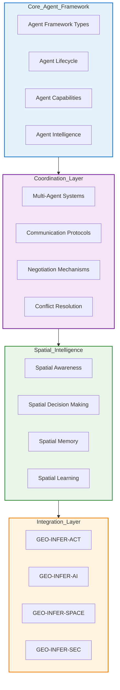
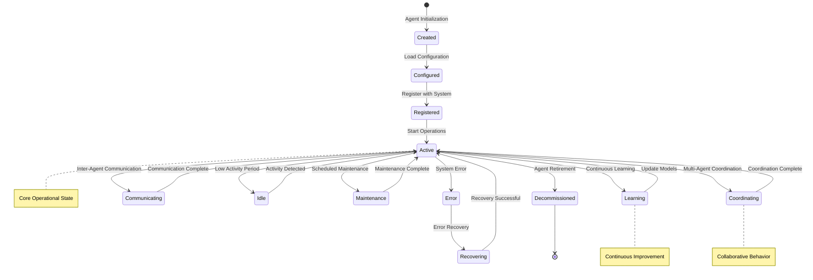

# GEO-INFER Multi-Agent Systems Architecture

## Overview

This document comprehensively describes the multi-agent systems architecture within the GEO-INFER framework. It covers the design principles, agent types, coordination mechanisms, security protocols, and integration patterns that enable intelligent, autonomous geospatial decision-making.

## Architecture Overview



## Core Agent Framework

### Agent Types

#### 1. Environmental Monitoring Agents

**Purpose**: Autonomous environmental data collection and analysis.

**Capabilities**:
- Real-time sensor data processing
- Anomaly detection and alerting
- Predictive environmental modeling
- Quality assurance and validation

**Spatial Intelligence**:
- Adaptive sampling strategies based on spatial variability
- Optimal sensor placement algorithms
- Spatial interpolation of sensor data
- Geographic boundary monitoring

```python
from geo_infer_agent.environmental import EnvironmentalMonitoringAgent

agent = EnvironmentalMonitoringAgent(
    agent_id="env_monitor_001",
    spatial_bounds=monitoring_region,
    sensors=['temperature', 'humidity', 'air_quality'],
    monitoring_frequency='real_time',
    anomaly_detection=True,
    predictive_modeling=True
)

# Agent capabilities
agent.monitor_environment()
agent.detect_anomalies()
agent.generate_alerts()
agent.optimize_sensor_placement()
```

#### 2. Infrastructure Management Agents

**Purpose**: Intelligent infrastructure monitoring and maintenance.

**Capabilities**:
- Structural health monitoring
- Predictive maintenance scheduling
- Resource allocation optimization
- Risk assessment and mitigation

**Spatial Intelligence**:
- Infrastructure network analysis
- Spatial dependency mapping
- Critical infrastructure identification
- Emergency response routing

```python
from geo_infer_agent.infrastructure import InfrastructureManagementAgent

agent = InfrastructureManagementAgent(
    agent_id="infra_mgr_001",
    infrastructure_type='transportation',
    spatial_network=road_network,
    maintenance_schedule='predictive',
    risk_assessment=True,
    resource_optimization=True
)

# Agent capabilities
agent.monitor_infrastructure_health()
agent.schedule_maintenance()
agent.optimize_resource_allocation()
agent.assess_risks()
```

#### 3. Urban Planning Agents

**Purpose**: Collaborative urban development and planning.

**Capabilities**:
- Land use analysis and optimization
- Demographic trend analysis
- Infrastructure planning coordination
- Stakeholder engagement facilitation

**Spatial Intelligence**:
- Urban growth modeling
- Spatial equity analysis
- Multi-objective optimization
- Scenario planning and visualization

```python
from geo_infer_agent.urban import UrbanPlanningAgent

agent = UrbanPlanningAgent(
    agent_id="urban_planner_001",
    planning_horizon='2050',
    stakeholder_groups=['residents', 'businesses', 'government'],
    spatial_resolution='high',
    multi_objective_optimization=True,
    scenario_planning=True
)

# Agent capabilities
agent.analyze_land_use_patterns()
agent.model_urban_growth()
agent.optimize_development_scenarios()
agent.facilitate_stakeholder_engagement()
```

#### 4. Emergency Response Agents

**Purpose**: Coordinated emergency management and response.

**Capabilities**:
- Real-time situation assessment
- Resource deployment optimization
- Multi-agency coordination
- Public communication management

**Spatial Intelligence**:
- Dynamic risk mapping
- Evacuation route optimization
- Resource allocation algorithms
- Spatial communication coverage

```python
from geo_infer_agent.emergency import EmergencyResponseAgent

agent = EmergencyResponseAgent(
    agent_id="emergency_001",
    emergency_types=['flood', 'fire', 'earthquake'],
    response_coordination='multi_agency',
    real_time_assessment=True,
    public_communication=True
)

# Agent capabilities
agent.assess_situation()
agent.optimize_resource_deployment()
agent.coordinate_response_efforts()
agent.manage_public_communication()
```

### Agent Lifecycle Management



## Multi-Agent Coordination

### Coordination Strategies

#### Hierarchical Coordination

**Structure**: Tree-based hierarchy with central coordination.

**Benefits**:
- Clear command structure
- Efficient decision making
- Resource optimization
- Accountability

```python
from geo_infer_agent.coordination import HierarchicalCoordinator

coordinator = HierarchicalCoordinator(
    hierarchy_levels=['global', 'regional', 'local'],
    coordination_frequency='real_time',
    decision_authority='distributed',
    conflict_resolution='escalation'
)

# Establish coordination hierarchy
coordinator.establish_hierarchy(agent_population)
coordinator.assign_roles()
coordinator.set_coordination_rules()
```

#### Emergent Coordination

**Structure**: Self-organizing systems with emergent behavior.

**Benefits**:
- Adaptability to changing conditions
- Resilience to agent failures
- Scalability
- Innovation through emergence

```python
from geo_infer_agent.coordination import EmergentCoordinator

coordinator = EmergentCoordinator(
    emergence_mechanisms=['stigmergy', 'self_organization'],
    feedback_loops=True,
    adaptation_rate='dynamic',
    stability_thresholds=True
)

# Enable emergent coordination
coordinator.enable_stigmergic_communication()
coordinator.set_emergence_conditions()
coordinator.monitor_system_stability()
```

#### Auction-Based Coordination

**Structure**: Market-based resource allocation.

**Benefits**:
- Efficient resource allocation
- Incentive compatibility
- Price discovery
- Scalability

```python
from geo_infer_agent.coordination import AuctionCoordinator

coordinator = AuctionCoordinator(
    auction_mechanism='combinatorial',
    bidding_strategy='truthful',
    payment_rule='vickrey_clarke_groves',
    resource_types=['computing', 'bandwidth', 'storage']
)

# Implement auction coordination
coordinator.designate_auctioneer()
coordinator.set_resource_markets()
coordinator.run_auction_rounds()
```

### Communication Protocols

#### Secure Spatial Broadcasting

**Protocol**: Encrypted broadcast within spatial bounds.

```python
from geo_infer_agent.communication import SpatialBroadcastProtocol

protocol = SpatialBroadcastProtocol(
    spatial_bounds=communication_region,
    encryption_method='aes256',
    authentication='mutual_tls',
    message_integrity='hmac_sha256'
)

# Configure spatial broadcasting
protocol.set_spatial_boundaries()
protocol.enable_encryption()
protocol.configure_authentication()
```

#### Peer-to-Peer Mesh Networks

**Protocol**: Decentralized agent communication.

```python
from geo_infer_agent.communication import PeerToPeerProtocol

protocol = PeerToPeerProtocol(
    network_topology='mesh',
    routing_algorithm='geographic',
    reliability_guarantees='best_effort',
    bandwidth_optimization=True
)

# Establish peer-to-peer network
protocol.discover_peers()
protocol.establish_connections()
protocol.optimize_routing()
```

#### Hierarchical Message Passing

**Protocol**: Structured communication through hierarchy.

```python
from geo_infer_agent.communication import HierarchicalProtocol

protocol = HierarchicalProtocol(
    hierarchy_definition=hierarchy_structure,
    message_routing='top_down_bottom_up',
    priority_levels=['emergency', 'urgent', 'normal'],
    quality_of_service=True
)

# Implement hierarchical communication
protocol.define_hierarchy()
protocol.set_message_routing()
protocol.prioritize_communication()
```

### Negotiation Mechanisms

#### Bilateral Negotiation

**Mechanism**: Direct agent-to-agent negotiation.

```python
from geo_infer_agent.negotiation import BilateralNegotiator

negotiator = BilateralNegotiator(
    negotiation_protocol='alternating_offers',
    utility_functions='custom_defined',
    time_constraints=True,
    fairness_criteria='pareto_optimal'
)

# Conduct bilateral negotiation
negotiator.define_negotiation_space()
negotiator.set_utility_functions()
negotiator.conduct_negotiation()
```

#### Multi-Party Negotiation

**Mechanism**: Complex multi-agent negotiations.

```python
from geo_infer_agent.negotiation import MultiPartyNegotiator

negotiator = MultiPartyNegotiator(
    negotiation_model='monotonic_concession',
    coalition_formation=True,
    mediator_support=True,
    consensus_mechanisms=True
)

# Manage multi-party negotiations
negotiator.identify_stakeholders()
negotiator.form_coalitions()
negotiator.facilitate_negotiation()
```

## Spatial Intelligence

### Spatial Awareness

#### Spatial Perception

**Capabilities**:
- Geographic context understanding
- Spatial relationship recognition
- Scale awareness and management
- Coordinate system handling

```python
from geo_infer_agent.spatial import SpatialPerception

perception = SpatialPerception(
    spatial_context='urban_environment',
    scale_awareness='multi_resolution',
    coordinate_systems=['wgs84', 'utm', 'local'],
    relationship_types=['containment', 'adjacency', 'proximity']
)

# Enable spatial perception
perception.analyze_spatial_context()
perception.recognize_relationships()
perception.manage_scales()
```

#### Spatial Memory

**Capabilities**:
- Long-term spatial knowledge storage
- Short-term spatial working memory
- Spatial pattern recognition
- Geographic knowledge updating

```python
from geo_infer_agent.spatial import SpatialMemory

memory = SpatialMemory(
    memory_capacity='adaptive',
    knowledge_types=['factual', 'procedural', 'episodic'],
    update_mechanisms='incremental_learning',
    retrieval_strategies='associative'
)

# Manage spatial memory
memory.store_spatial_knowledge()
memory.retrieve_spatial_patterns()
memory.update_geographic_knowledge()
```

### Spatial Decision Making

#### Bayesian Spatial Reasoning

**Approach**: Probabilistic spatial decision making.

```python
from geo_infer_agent.spatial import BayesianSpatialReasoner

reasoner = BayesianSpatialReasoner(
    uncertainty_model='bayesian_networks',
    evidence_integration='real_time',
    belief_updating='active_inference',
    decision_thresholds='adaptive'
)

# Perform Bayesian spatial reasoning
reasoner.update_beliefs(evidence)
reasoner.assess_uncertainty()
reasoner.make_spatial_decisions()
```

#### Multi-Objective Spatial Optimization

**Approach**: Balanced spatial decision making.

```python
from geo_infer_agent.spatial import MultiObjectiveSpatialOptimizer

optimizer = MultiObjectiveSpatialOptimizer(
    objectives=['efficiency', 'equity', 'sustainability'],
    optimization_algorithm='pareto_frontier',
    constraint_handling='penalty_methods',
    solution_evaluation='weighted_sum'
)

# Optimize spatial decisions
optimizer.define_objectives()
optimizer.generate_pareto_frontier()
optimizer.select_optimal_solution()
```

### Spatial Learning

#### Reinforcement Learning for Spatial Tasks

**Capabilities**:
- Spatial navigation learning
- Resource allocation optimization
- Adaptive behavior development
- Spatial strategy refinement

```python
from geo_infer_agent.spatial import SpatialReinforcementLearner

learner = SpatialReinforcementLearner(
    learning_algorithm='deep_q_learning',
    spatial_state_representation='graph_based',
    action_space='continuous_movement',
    reward_function='task_specific'
)

# Learn spatial behaviors
learner.explore_spatial_environment()
learner.optimize_navigation_strategy()
learner.adapt_to_environmental_changes()
```

#### Transfer Learning Across Spatial Domains

**Capabilities**:
- Cross-domain knowledge transfer
- Spatial analogy recognition
- Domain adaptation techniques
- Meta-learning for spatial tasks

```python
from geo_infer_agent.spatial import SpatialTransferLearner

learner = SpatialTransferLearner(
    source_domains=['urban_planning', 'environmental_monitoring'],
    target_domain='emergency_response',
    transfer_mechanism='fine_tuning',
    adaptation_strategy='domain_adversarial'
)

# Transfer spatial knowledge
learner.identify_transferable_knowledge()
learner.adapt_to_target_domain()
learner.fine_tune_spatial_models()
```

## Security and Privacy

### Agent Security Framework

#### Authentication and Authorization

```python
from geo_infer_agent.security import AgentSecurityManager

security = AgentSecurityManager(
    authentication_methods=['certificate_based', 'zero_knowledge'],
    authorization_model='attribute_based',
    audit_logging=True,
    threat_detection=True
)

# Implement agent security
security.authenticate_agents()
security.authorize_actions()
security.monitor_security_events()
```

#### Secure Communication

```python
from geo_infer_agent.security import SecureCommunicationManager

communication = SecureCommunicationManager(
    encryption_protocols=['quantum_resistant', 'post_quantum'],
    key_management='distributed',
    message_integrity='blockchain_based',
    privacy_preservation='differential_privacy'
)

# Secure agent communications
communication.establish_secure_channels()
communication.encrypt_messages()
communication.verify_message_integrity()
```

#### Privacy Protection

```python
from geo_infer_agent.security import PrivacyProtectionManager

privacy = PrivacyProtectionManager(
    privacy_techniques=['federated_learning', 'homomorphic_encryption'],
    data_minimization=True,
    consent_management=True,
    privacy_policies='gdpr_compliant'
)

# Protect agent privacy
privacy.minimize_data_collection()
privacy.implement_privacy_preserving_computation()
privacy.manage_consent_and_policies()
```

## Integration Patterns

### GEO-INFER-ACT Integration

**Pattern**: Active Inference for agent decision making.

```python
from geo_infer_agent import IntelligentAgent
from geo_infer_act import ActiveInferenceModel

# Create agent with active inference
agent = IntelligentAgent(
    agent_id="active_inference_agent",
    decision_framework='active_inference',
    spatial_awareness=True,
    learning_capability=True
)

# Integrate with ACT module
act_model = ActiveInferenceModel(
    state_space=['spatial_position', 'environmental_state', 'agent_goals'],
    observation_space=['spatial_observations', 'environmental_data'],
    precision='adaptive'
)

agent.set_decision_model(act_model)
agent.enable_free_energy_minimization()
```

### GEO-INFER-AI Integration

**Pattern**: Machine learning enhancement of agent capabilities.

```python
from geo_infer_agent import IntelligentAgent
from geo_infer_ai import AIEngine

# Create AI-enhanced agent
agent = IntelligentAgent(
    agent_id="ai_enhanced_agent",
    capabilities=['computer_vision', 'predictive_modeling', 'natural_language_processing'],
    spatial_intelligence=True,
    real_time_learning=True
)

# Integrate with AI module
ai_engine = AIEngine(
    capabilities=['deep_learning', 'reinforcement_learning', 'computer_vision'],
    hardware_acceleration=True,
    uncertainty_quantification=True
)

agent.set_ai_engine(ai_engine)
agent.enable_computer_vision()
agent.enable_predictive_modeling()
```

### GEO-INFER-SPACE Integration

**Pattern**: Backend-agnostic spatial data and analysis for agent operations with multiple dispatch support.

```python
from geo_infer_agent import MultiAgentSystem
from geo_infer_space.core.spatial_indexing import SpatialIndexingInterface
from geo_infer_space.core.analytics import SpatialAnalyticsInterface
from geo_infer_space.core.dispatcher import configure_backends

# Configure backend preferences for agent operations
configure_backends({
    'default_backends': {
        'indexing': 'h3',      # Use H3 for spatial indexing (hexagonal grids)
        'analytics': 'srai',   # Use SRAI for spatial analytics (AI-enhanced)
    }
})

# Create spatially aware MAS with multiple backend support
mas = MultiAgentSystem(
    environment='urban_environment',
    coordination_strategy='spatial_proximity',
    communication_protocol='secure_broadcast'
)

# Create backend-agnostic spatial interfaces
spatial_indexer = SpatialIndexingInterface()     # Uses H3 by default for indexing
spatial_analytics = SpatialAnalyticsInterface()  # Uses SRAI by default for analytics

# Use H3 backend explicitly for high-precision spatial operations
h3_indexer = SpatialIndexingInterface(backend='h3')
cell_h3 = h3_indexer.latlng_to_cell(37.7749, -122.4194, 9)  # San Francisco coordinates

# Use SRAI backend explicitly for AI-enhanced analytics
srai_analytics = SpatialAnalyticsInterface(backend='srai')
hotspots = srai_analytics.analyze_hotspots(spatial_data)

# Operations automatically dispatch to appropriate backends
mas.set_spatial_analyzer(spatial_analytics)
mas.enable_spatial_coordination()
mas.enable_real_time_spatial_analysis()

# Agents can switch backends dynamically based on context
def adaptive_spatial_analysis(agent, context):
    """Example: Agent adapts spatial backend based on analysis requirements."""

    if context['requires_high_precision']:
        # Use H3 for precise spatial indexing
        indexer = SpatialIndexingInterface(backend='h3')
        return indexer.latlng_to_cell(context['lat'], context['lng'], 12)

    else:
        # Use SRAI for AI-enhanced spatial analysis
        analytics = SpatialAnalyticsInterface(backend='srai')
        return analytics.analyze_hotspots(context['data'])
```

### GEO-INFER-SEC Integration

**Pattern**: Security framework for agent operations.

```python
from geo_infer_agent import IntelligentAgent
from geo_infer_sec import SecurityEngine

# Create secure agent
agent = IntelligentAgent(
    agent_id="secure_agent",
    security_enabled=True,
    privacy_preservation=True,
    audit_logging=True
)

# Integrate with SEC module
security_engine = SecurityEngine(
    authentication_methods=['multi_factor', 'biometric'],
    encryption_protocols=['quantum_resistant'],
    threat_detection='ai_based',
    compliance_frameworks=['gdpr', 'ccpa']
)

agent.set_security_engine(security_engine)
agent.enable_secure_communication()
agent.enable_privacy_preservation()
```

## Performance Optimization

### Scalable Agent Management

```python
from geo_infer_agent.performance import AgentPerformanceOptimizer

optimizer = AgentPerformanceOptimizer(
    scaling_strategy='horizontal',
    load_balancing='spatial_partitioning',
    resource_allocation='dynamic',
    monitoring_enabled=True
)

# Optimize agent performance
optimizer.scale_agent_population()
optimizer.balance_workload()
optimizer.allocate_resources()
optimizer.monitor_performance()
```

### Efficient Coordination

```python
from geo_infer_agent.performance import CoordinationPerformanceOptimizer

optimizer = CoordinationPerformanceOptimizer(
    coordination_efficiency='adaptive',
    communication_overhead='minimized',
    decision_speed='optimized',
    scalability='horizontal'
)

# Optimize coordination performance
optimizer.streamline_communication()
optimizer.parallelize_decisions()
optimizer.distribute_coordination()
```

### Spatial Intelligence Optimization

```python
from geo_infer_agent.performance import SpatialIntelligenceOptimizer

optimizer = SpatialIntelligenceOptimizer(
    spatial_indexing='h3_optimized',
    computation_parallelization='gpu_accelerated',
    memory_management='adaptive',
    caching_strategy='hierarchical'
)

# Optimize spatial intelligence
optimizer.optimize_spatial_indexing()
optimizer.enable_parallel_computation()
optimizer.manage_memory_efficiently()
```

## Use Cases

### Smart City Management

**Scenario**: Coordinated management of urban infrastructure and services.

```python
from geo_infer_agent.smart_city import SmartCityAgentSystem

# Create smart city agent system
city_system = SmartCityAgentSystem(
    city_bounds=san_francisco_bounds,
    agent_types=['traffic', 'energy', 'waste', 'security', 'health'],
    coordination_strategy='hierarchical_emergent',
    real_time_monitoring=True
)

# Deploy city management agents
traffic_agent = city_system.deploy_traffic_agent()
energy_agent = city_system.deploy_energy_agent()
security_agent = city_system.deploy_security_agent()

# Enable coordinated city management
city_system.enable_cross_domain_coordination()
city_system.monitor_city_performance()
city_system.optimize_city_operations()
```

### Environmental Monitoring Network

**Scenario**: Distributed environmental monitoring with adaptive sampling.

```python
from geo_infer_agent.environmental import EnvironmentalMonitoringNetwork

# Create environmental monitoring network
network = EnvironmentalMonitoringNetwork(
    monitoring_region=california_bounds,
    agent_density='adaptive',
    sensor_types=['air_quality', 'water_quality', 'soil_moisture', 'wildlife'],
    coordination_strategy='swarm_intelligence'
)

# Deploy monitoring agents
air_quality_agents = network.deploy_air_quality_agents()
water_quality_agents = network.deploy_water_quality_agents()
wildlife_agents = network.deploy_wildlife_agents()

# Enable adaptive monitoring
network.enable_adaptive_sampling()
network.coordinate_monitoring_efforts()
network.detect_environmental_anomalies()
```

### Emergency Response Coordination

**Scenario**: Multi-agency emergency response with spatial optimization.

```python
from geo_infer_agent.emergency import EmergencyResponseCoordinator

# Create emergency response coordinator
coordinator = EmergencyResponseCoordinator(
    emergency_types=['flood', 'fire', 'earthquake', 'hurricane'],
    agency_types=['fire', 'police', 'medical', 'national_guard'],
    coordination_strategy='auction_based',
    real_time_optimization=True
)

# Deploy emergency response agents
response_agents = coordinator.deploy_emergency_agents()

# Coordinate emergency response
coordinator.assess_situation()
coordinator.allocate_resources()
coordinator.optimize_response_routes()
coordinator.coordinate_agency_efforts()
```

## Testing and Validation

### Agent Testing Framework

```python
from geo_infer_agent.testing import AgentTestingFramework

testing = AgentTestingFramework(
    test_types=['unit', 'integration', 'performance', 'security'],
    simulation_environment='virtual',
    validation_metrics=['correctness', 'efficiency', 'robustness']
)

# Test agent functionality
testing.test_agent_decision_making()
testing.test_agent_coordination()
testing.test_agent_security()
testing.validate_agent_performance()
```

### Multi-Agent System Validation

```python
from geo_infer_agent.testing import MultiAgentSystemValidator

validator = MultiAgentSystemValidator(
    validation_scenarios=['normal_operation', 'stress_testing', 'failure_recovery'],
    performance_metrics=['throughput', 'latency', 'scalability'],
    correctness_criteria=['emergent_behavior', 'system_stability']
)

# Validate MAS functionality
validator.validate_coordination_mechanisms()
validator.test_system_resilience()
validator.assess_emergent_behavior()
```

## Future Developments

### Advanced Capabilities

1. **Quantum-Enhanced Agents**: Quantum computing for complex spatial optimization
2. **Neuromorphic Agents**: Brain-inspired computing for spatial cognition
3. **Autonomous Agent Evolution**: Self-evolving agent populations
4. **Inter-Agent Learning**: Knowledge transfer between agent populations
5. **Spatial Blockchain**: Decentralized spatial decision making

### Research Directions

1. **Spatial Collective Intelligence**: Emergent intelligence in spatial systems
2. **Human-Agent Collaboration**: Natural human-agent interaction patterns
3. **Spatial Ethics**: Ethical frameworks for autonomous spatial agents
4. **Agent Society Modeling**: Complex social dynamics in agent populations
5. **Spatial Consciousness**: Self-aware spatial intelligence

---

**This document provides a comprehensive framework for understanding and implementing multi-agent systems within the GEO-INFER ecosystem. The architecture emphasizes spatial intelligence, secure coordination, and scalable performance while maintaining integration with core GEO-INFER modules.**

