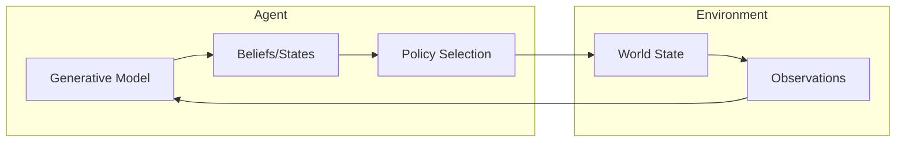

<div align="center">
  <h3><a href="../README.md">🌍 GEO-INFER Core</a></h3>
  <a href="../AGENTS.md">🤖 Agent Architecture</a> •
  <a href="../README.md#-module-overview">📦 Module Index</a> •
  <a href="./docs/">📚 Documentation</a> •
  <a href="./SKILL.md">🧠 Claude Skill</a>
</div>

---

# GEO-INFER-ACT: Active Inference Core

## Overview

**GEO-INFER-ACT** implements the Active Inference framework based on the Free Energy Principle, enabling agents to:

- **Perceive**: Update beliefs about the world through sensory observations
- **Act**: Select actions that minimize expected free energy
- **Learn**: Adapt generative models through experience
- **Plan**: Temporal planning via expected free energy minimization

## The Active Inference Framework

Active Inference unifies perception, action, and learning under a single principle: **minimizing variational free energy**. Agents maintain generative models of their environment and act to confirm their predictions while seeking information to reduce uncertainty.



## Features

### Generative Model

```python
from geo_infer_act import GenerativeModel

# Define generative model with state/observation dimensions
model = GenerativeModel(
    model_type="categorical",
    parameters={
        "n_states": 3,
        "n_observations": 3,
        "n_actions": 3,
    },
    model_id="spatial_model"
)

# Update beliefs from observations
updated = model.update_beliefs({"obs": observation_data})
```

### Active Inference Agent

```python
from geo_infer_act import ActiveInferenceModel

# Create an active inference agent
agent = ActiveInferenceModel(model_type="categorical")
agent.set_generative_model(model)

# Perception: update beliefs from observation
agent.perceive(observation)

# Action: select action minimizing expected free energy
action = agent.act()

# Complete perception-action step
beliefs, action = agent.step(observation)
```

### Free Energy Computation

```python
from geo_infer_act import FreeEnergyCalculator

# Calculate variational free energy
fe_calc = FreeEnergyCalculator()

# Categorical free energy (perception)
vfe = fe_calc.compute_categorical_free_energy(
    beliefs=posterior,
    observations=obs,
    preferences=preferences
)

# Expected free energy (action/policy selection)
efe = fe_calc.compute_expected_free_energy(
    beliefs=posterior,
    policy=candidate_policy,
    preferences=preferences
)
```

### Spatial Active Inference

```python
from geo_infer_act import SpatialActiveInferenceAgent

# Create agent on H3 hexagonal grid
spatial_agent = SpatialActiveInferenceAgent(
    h3_resolution=9,
    state_dim=4,
    obs_dim=4,
    diffusion_rate=0.1
)

# Run perception-action loop
for _ in range(100):
    observations = get_spatial_observations()  # Dict[cell_id -> np.ndarray]
    result = spatial_agent.step(observations)
    print(f"Free energy: {result['free_energy']:.3f}")
    print(f"Action: {result['action']['action']}")
```

## Core Components

| Component | Description |
|-----------|-------------|
| **Generative Model** | Probabilistic model of environment dynamics |
| **Belief Updating** | Variational inference for state estimation |
| **Policy Selection** | Action selection via EFE minimization |
| **Learning** | Model parameter adaptation |

## Mathematical Foundation

The agent minimizes the **variational free energy**:

```
F = E_q[ln q(s) - ln p(o,s)]
```

Where:

- `q(s)` is the approximate posterior over hidden states
- `p(o,s)` is the generative model (likelihood × prior)
- `o` is the observation, `s` is the hidden state

For action selection, the agent minimizes **expected free energy**:

```
G = E_q[ln q(s|π) - ln p(o,s|π)]
```

Which balances:

- **Pragmatic value**: Achieving preferred outcomes
- **Epistemic value**: Reducing uncertainty (exploration)

## Integration Points

| Module | Integration |
|--------|-------------|
| **GEO-INFER-BAYES** | Probabilistic inference |
| **GEO-INFER-SPACE** | Spatial state representations |
| **GEO-INFER-TIME** | Temporal dynamics |
| **GEO-INFER-AGENT** | Agent orchestration |

## Installation

```bash
# Install core Active Inference module
uv pip install -e "./GEO-INFER-ACT"

# With visualization tools
uv pip install -e "./GEO-INFER-ACT[viz]"
```

## Use Cases

### Environmental Active Inference

```python
from geo_infer_act.utils.geospatial_ai import EnvironmentalActiveInferenceEngine

# Engine for environmental modeling on H3 grid
engine = EnvironmentalActiveInferenceEngine(
    h3_resolution=8,
    environmental_variables=["temperature", "humidity", "vegetation_density"],
    prediction_horizon=10
)

# Update beliefs from observations
engine.observe_environment(observations, timestamp=1.0)
predictions = engine.predict_environmental_dynamics(forecast_timesteps=5)
```

### Ecological Niche Modeling

```python
from geo_infer_act.models.ecological import EcologicalModel

# Organism adapting to ecological niche via Active Inference
model = EcologicalModel()

# Run simulation steps with observations [food_idx, threat_idx]
for step in range(100):
    result = model.step(observation=[food_obs, threat_obs])
    print(f"Beliefs: {result['beliefs']}")
    print(f"Action: {result['action']}")
```

## Related Documentation

- [GEO-INFER-BAYES](../GEO-INFER-BAYES/README.md): Bayesian inference
- [GEO-INFER-AGENT](../GEO-INFER-AGENT/README.md): Agent framework
- [AGENTS.md](./AGENTS.md): Active Inference capabilities

---

**Status**: Beta - Core functionality stable

**Last Updated**: 2026-02-25

## Documentation Hub

Full framework documentation, guides, and tutorials are available in the [GEO-INFER-INTRA documentation hub](../GEO-INFER-INTRA/docs/index.md).

| Resource | Description |
|----------|-------------|
| [Getting Started](../GEO-INFER-INTRA/docs/getting_started/index.md) | Installation, first steps, quick start guides |
| [Module Overview](../GEO-INFER-INTRA/docs/modules/index.md) | All 44 modules with descriptions and use cases |
| [Integration Patterns](../GEO-INFER-INTRA/docs/integration/geo_infer_modules.md) | How modules work together |
| [Testing Guide](../GEO-INFER-INTRA/docs/developer_guide/testing_guide.md) | Testing standards, fixtures, CI integration |
| [API Standards](../GEO-INFER-INTRA/docs/developer_guide/index.md) | Code conventions and contribution guidelines |
