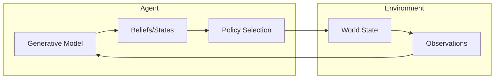

<div align="center">
  <h3><a href="../README.md">🌍 GEO-INFER Core</a></h3>
  <a href="../AGENTS.md">🤖 Agent Architecture</a> •
  <a href="../README.md#-module-overview">📦 Module Index</a> •
  <a href="./docs/">📚 Documentation</a> •
  <a href="./SKILL.md">🧠 Claude Skill</a>
</div>

---

# GEO-INFER-ACT: Active Inference Core

## Overview

**GEO-INFER-ACT** implements the Active Inference framework based on the Free Energy Principle, enabling agents to:

- **Perceive**: Update beliefs about the world through sensory observations
- **Act**: Select actions that minimize expected free energy
- **Learn**: Adapt generative models through experience
- **Plan**: Temporal planning via expected free energy minimization

## The Active Inference Framework

Active Inference unifies perception, action, and learning under a single principle: **minimizing variational free energy**. Agents maintain generative models of their environment and act to confirm their predictions while seeking information to reduce uncertainty.



## Features

### Generative Model

```python
from geo_infer_act import GenerativeModel

# Define generative model with state/observation dimensions
model = GenerativeModel(
    model_type="categorical",
    parameters={
        "state_dim": 3,
        "obs_dim": 3,
    },
    model_id="spatial_model"
)

# Update beliefs from observations
updated = model.update_beliefs({"observations": observation_data})
```

### Active Inference Agent

```python
from geo_infer_act import ActiveInferenceModel

# Create an active inference agent
agent = ActiveInferenceModel(model_type="categorical")
agent.set_generative_model(model)

# Perception: update beliefs from observation
agent.perceive(observation)

# Action: select action minimizing expected free energy
action = agent.act()

# Complete perception-action step
beliefs, action = agent.step(observation)
```

### Free Energy Computation

```python
from geo_infer_act import FreeEnergyBreakdown, FreeEnergyCalculator

# Calculate variational free energy
fe_calc = FreeEnergyCalculator()

# Categorical free energy (perception)
vfe = fe_calc.compute_categorical_free_energy(
    beliefs=posterior,
    observations=obs,
    preferences=preferences
)

# Expected free energy (action/policy selection)
efe = fe_calc.compute_expected_free_energy(
    beliefs=posterior,
    policy=candidate_policy,
    preferences=preferences
)

# Typed decomposition for diagnostics and tests
breakdown = fe_calc.compute_categorical_free_energy(
    beliefs=posterior,
    observations=obs,
    preferences=preferences,
    return_breakdown=True,
)
assert isinstance(breakdown, FreeEnergyBreakdown)
assert breakdown.free_energy == breakdown.complexity - breakdown.accuracy
```

### Policy Selection

```python
from geo_infer_act import PolicyEvaluation, PolicySelector

selector = PolicySelector(selection_mode="deterministic", random_seed=7)
result = selector.select_policy(
    beliefs=posterior,
    policies=[
        {"action": "survey", "expected_free_energy": -0.5},
        {"action": "wait", "expected_free_energy": 0.2},
    ],
    preferences=preferences,
)

assert result["policy"]["action"] == "survey"
assert isinstance(result["evaluation"], PolicyEvaluation)
```

### H3 Spatial Active Inference

```python
import numpy as np
from geo_infer_act import H3GridInferenceResult, SpatialActiveInferenceAgent
from geo_infer_space.core.spatial_indexing import SpatialIndexingInterface

indexer = SpatialIndexingInterface(backend="h3")
center = indexer.latlng_to_cell(37.7749, -122.4194, resolution=8)
cells = [center, *indexer.get_cell_neighbors(center, k=1)[:3]]

# Create agent on H3 hexagonal grid
spatial_agent = SpatialActiveInferenceAgent(
    initial_cells=cells,
    h3_resolution=8,
    state_dim=4,
    obs_dim=4,
    diffusion_rate=0.1
)

# Run perception-action loop
observations = {cell: np.array([1.0, 0.0, 0.0, 0.0]) for cell in cells}
result = spatial_agent.step(observations, return_result=True)
assert isinstance(result, H3GridInferenceResult)
assert result.spatial_consistency.cell_count == len(cells)
print(f"Free energy: {result.aggregate_free_energy:.3f}")
```

H3 callers keep the legacy dictionary return shapes by default. Pass
`return_result=True` to receive typed diagnostics:
`H3SpatialConsistency`, `H3BeliefUpdateResult`, or `H3GridInferenceResult`.
Real H3 paths use H3 v4 cells through `GEO-INFER-SPACE` when available and
direct `h3-py` v4 calls for operations SPACE does not expose.

For the complete geospatial contract, see
[Geospatial Applications](docs/geospatial_applications.md). The contract
requires real H3 v4 cell identifiers, normalized nonnegative beliefs, finite
free-energy and expected-free-energy values, manifest-referenced GIS outputs,
and schema-validated visualizations for `h3` and `spatial` runner scenarios.
For the complete public method surface and output/visualization artifact
contract, see [Method, Output, and Visualization Inventory](docs/method_inventory.md).

## Core Components

| Component | Description |
|-----------|-------------|
| **Generative Model** | Probabilistic model of environment dynamics |
| **Belief Updating** | Variational inference for state estimation |
| **Policy Selection** | Action selection via EFE minimization |
| **Learning** | Model parameter adaptation |

## Mathematical Foundation

The agent minimizes the **variational free energy**:

```
F = E_q[ln q(s) - ln p(o,s)]
```

Where:

- `q(s)` is the approximate posterior over hidden states
- `p(o,s)` is the generative model (likelihood × prior)
- `o` is the observation, `s` is the hidden state

For action selection, the agent minimizes **expected free energy**:

```
G = E_q[ln q(s|π) - ln p(o,s|π)]
```

Which balances:

- **Pragmatic value**: Achieving preferred outcomes
- **Epistemic value**: Reducing uncertainty (exploration)

## Integration Points

| Module | Integration |
|--------|-------------|
| **GEO-INFER-BAYES** | Probabilistic inference |
| **GEO-INFER-SPACE** | Spatial state representations |
| **GEO-INFER-TIME** | Temporal dynamics |
| **GEO-INFER-AGENT** | Agent orchestration |

## Scenario Runners and Outputs

ACT scripts are thin wrappers around `geo_infer_act.runners`. Use the package
CLI for repeatable configured runs:

```bash
uv run --package geo-infer-act --extra dev geo-infer-act-run \
  --scenario h3 \
  --config GEO-INFER-ACT/config/active_inference_run.yaml \
  --output-dir /tmp/geo-infer-act-h3 \
  --seed 42 \
  --timesteps 8

uv run --package geo-infer-act --extra dev geo-infer-act-examples \
  --output-dir /tmp/geo-infer-act-suite
```

Every scenario writes a versioned `manifest.json`, `data/full_history.json`,
`data/step_metrics.csv`, analyzer outputs under `analysis/`, logs under
`logs/`, and at least one visualization under `visualizations/` unless
`--no-visualizations` is set. JSON Schema contracts are packaged in
`src/geo_infer_act/schemas/`.

For `h3` and `spatial` scenarios, ACT also writes `data/h3_cells.csv`,
`data/h3_cells.geojson`, `data/h3_diagnostics.json`, static H3 visualizations,
and `visualizations/interactive_h3_map.html`.

Every visualization is traceable to the data that rendered it. PNG figures embed
ACT metadata in the image file, HTML maps embed structured JSON metadata, and
each figure has `*.metadata.json` plus `*.data.csv` or `*.data.json` sidecars.
`manifest.generated_files` records the artifact type, MIME type, SHA-256 digest,
sidecar paths, source data files, plotted metrics, description, alt text, and
image dimensions when available. The full contract is documented in
[Geospatial Applications](docs/geospatial_applications.md).

## Installation

```bash
# Install core Active Inference module
uv pip install -e "./GEO-INFER-ACT"

# With visualization tools
uv pip install -e "./GEO-INFER-ACT[viz]"
```

## Verification

```bash
uv run python GEO-INFER-TEST/validate_act_script_orchestration.py
uv run python GEO-INFER-TEST/validate_act_geospatial_contract.py
uv run python GEO-INFER-TEST/validate_h3_active_inference_contract.py
uv run python GEO-INFER-TEST/validate_active_inference_contract.py
uv run --package geo-infer-act --extra dev python -m pytest GEO-INFER-ACT/tests -q
```

## Use Cases

### Environmental Active Inference

```python
from geo_infer_act.utils.geospatial_ai import EnvironmentalActiveInferenceEngine

# Engine for environmental modeling on H3 grid
engine = EnvironmentalActiveInferenceEngine(
    h3_resolution=8,
    environmental_variables=["temperature", "humidity", "vegetation_density"],
    prediction_horizon=10
)

# Update beliefs from observations
engine.observe_environment(observations, timestamp=1.0)
predictions = engine.predict_environmental_dynamics(forecast_timesteps=5)
```

### Ecological Niche Modeling

```python
from geo_infer_act.models.ecological import EcologicalModel

# Organism adapting to ecological niche via Active Inference
model = EcologicalModel()

# Run simulation steps with observations [food_idx, threat_idx]
for step in range(100):
    result = model.step(observation=[food_obs, threat_obs])
    print(f"Beliefs: {result['beliefs']}")
    print(f"Action: {result['action']}")
```

## Related Documentation

- [GEO-INFER-BAYES](../GEO-INFER-BAYES/README.md): Bayesian inference
- [GEO-INFER-AGENT](../GEO-INFER-AGENT/README.md): Agent framework
- [AGENTS.md](./AGENTS.md): Active Inference capabilities

---

**Status**: Beta - Core functionality stable

**Last Updated**: 2026-02-25

## Documentation Hub

Full framework documentation, guides, and tutorials are available in the [GEO-INFER-INTRA documentation hub](../GEO-INFER-INTRA/docs/index.md).

| Resource | Description |
|----------|-------------|
| [Getting Started](../GEO-INFER-INTRA/docs/getting_started/index.md) | Installation, first steps, quick start guides |
| [Module Overview](../GEO-INFER-INTRA/docs/modules/index.md) | All 44 modules with descriptions and use cases |
| [Integration Patterns](../GEO-INFER-INTRA/docs/integration/geo_infer_modules.md) | How modules work together |
| [Testing Guide](../GEO-INFER-INTRA/docs/developer_guide/testing_guide.md) | Testing standards, fixtures, CI integration |
| [API Standards](../GEO-INFER-INTRA/docs/developer_guide/index.md) | Code conventions and contribution guidelines |
