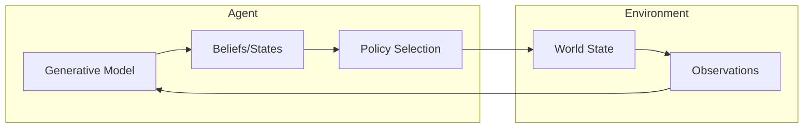

<div align="center">
  <h3><a href="../README.md">🌍 GEO-INFER Core</a></h3>
  <a href="../AGENTS.md">🤖 Agent Architecture</a> •
  <a href="../README.md#-module-overview">📦 Module Index</a> •
  <a href="./docs/">📚 Documentation</a>
</div>

---

# GEO-INFER-ACT: Active Inference Core

## Overview

**GEO-INFER-ACT** implements the Active Inference framework based on the Free Energy Principle, enabling agents to:

- **Perceive**: Update beliefs about the world through sensory observations
- **Act**: Select actions that minimize expected free energy
- **Learn**: Adapt generative models through experience
- **Plan**: Temporal planning via expected free energy minimization

## The Active Inference Framework

Active Inference unifies perception, action, and learning under a single principle: **minimizing variational free energy**. Agents maintain generative models of their environment and act to confirm their predictions while seeking information to reduce uncertainty.



## Features

### Generative Model

```python
from geo_infer_act import GenerativeModel

# Define generative model
model = GenerativeModel(
    hidden_states=["location", "weather", "activity"],
    observations=["gps", "temperature", "movement"],
    actions=["move_north", "move_south", "stay"]
)

# Set transition dynamics
model.set_transition_matrix(A=likelihood_matrix)
model.set_transition_matrix(B=transition_matrix)

# Set prior preferences
model.set_preferences(C=preference_vector)
```

### Active Inference Agent

```python
from geo_infer_act import ActiveInferenceAgent

# Create agent
agent = ActiveInferenceAgent(
    generative_model=model,
    learning_rate=0.1,
    planning_horizon=5
)

# Perception: update beliefs from observation
agent.perceive(observation)

# Action: select action minimizing expected free energy
action = agent.act()

# Learning: update model parameters
agent.learn()
```

### Free Energy Computation

```python
from geo_infer_act import FreeEnergyCalculator

# Calculate variational free energy
fe_calc = FreeEnergyCalculator()

# Variational free energy (perception)
vfe = fe_calc.variational_free_energy(
    observation=obs,
    beliefs=posterior,
    generative_model=model
)

# Expected free energy (action selection)
efe = fe_calc.expected_free_energy(
    policy=candidate_policy,
    beliefs=posterior,
    preferences=preferences
)
```

### Spatial Active Inference

```python
from geo_infer_act import SpatialActiveInferenceAgent

# Agent with spatial awareness
spatial_agent = SpatialActiveInferenceAgent(
    spatial_model=h3_grid_model,
    resolution=9,
    planning_horizon=10
)

# Navigate to goal
spatial_agent.set_goal(destination_cell)

while not spatial_agent.at_goal():
    observation = environment.observe()
    spatial_agent.perceive(observation)
    action = spatial_agent.act()
    environment.step(action)
```

## Core Components

| Component | Description |
|-----------|-------------|
| **Generative Model** | Probabilistic model of environment dynamics |
| **Belief Updating** | Variational inference for state estimation |
| **Policy Selection** | Action selection via EFE minimization |
| **Learning** | Model parameter adaptation |

## Mathematical Foundation

The agent minimizes the **variational free energy**:

```
F = E_q[ln q(s) - ln p(o,s)]
```

Where:

- `q(s)` is the approximate posterior over hidden states
- `p(o,s)` is the generative model (likelihood × prior)
- `o` is the observation, `s` is the hidden state

For action selection, the agent minimizes **expected free energy**:

```
G = E_q[ln q(s|π) - ln p(o,s|π)]
```

Which balances:

- **Pragmatic value**: Achieving preferred outcomes
- **Epistemic value**: Reducing uncertainty (exploration)

## Integration Points

| Module | Integration |
|--------|-------------|
| **GEO-INFER-BAYES** | Probabilistic inference |
| **GEO-INFER-SPACE** | Spatial state representations |
| **GEO-INFER-TIME** | Temporal dynamics |
| **GEO-INFER-AGENT** | Agent orchestration |

## Installation

```bash
# Install core Active Inference module
uv pip install -e "./GEO-INFER-ACT"

# With visualization tools
uv pip install -e "./GEO-INFER-ACT[viz]"
```

## Use Cases

### Environmental Monitoring Agent

```python
from geo_infer_act import EnvironmentalMonitorAgent

# Agent that actively seeks information
monitor = EnvironmentalMonitorAgent(
    sensors=["air_quality", "temperature"],
    coverage_goal=study_area
)

# Agent autonomously navigates to reduce uncertainty
monitor.run(max_steps=1000)
print(f"Coverage: {monitor.coverage}%")
print(f"Uncertainty reduced: {monitor.uncertainty_reduction}%")
```

### Resource Foraging Agent

```python
from geo_infer_act import ForagingAgent

# Agent that balances exploration and exploitation
forager = ForagingAgent(
    resource_model=resource_prior,
    exploration_weight=0.3
)

# Run foraging behavior
resources = forager.forage(environment, time_steps=500)
```

## Related Documentation

- [GEO-INFER-BAYES](../GEO-INFER-BAYES/README.md): Bayesian inference
- [GEO-INFER-AGENT](../GEO-INFER-AGENT/README.md): Agent framework
- [AGENTS.md](./AGENTS.md): Active Inference capabilities

---

**Status**: Beta - Core functionality stable

**Last Updated**: 2026-02-24
