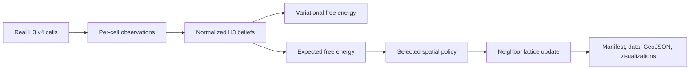

# Active Inference Overview

## Introduction

Active Inference is a unifying framework for understanding perception, learning, and action in biological and artificial agents. It is based on the **Free Energy Principle** developed by Karl Friston, which proposes that all adaptive systems minimize variational free energy.

## Core Concepts

### 1. The Free Energy Principle

All living systems maintain their existence by minimizing surprise (negative log probability of observations). Since surprise cannot be computed directly, agents minimize an upper bound called **variational free energy**.

```
F = E_q[log q(s) - log p(o,s)]
```

Where:

- `q(s)` - Approximate posterior (beliefs about hidden states)
- `p(o,s)` - Generative model (how states generate observations)
- `o` - Observations
- `s` - Hidden states

### 2. Perception as Inference

Perception is the process of updating beliefs to minimize free energy:

```python
# Perception loop
observation = environment.observe()
beliefs = agent.perceive(observation)
```

The agent maintains a **generative model** of how the world works and inverts this model to infer hidden states from observations.

### 3. Action as Inference

Rather than maximizing reward, agents select actions that minimize **expected free energy**:

```
G = E_q[log q(s|π) - log p(o,s|π)]
```

This naturally balances:

- **Pragmatic value**: Achieving preferred outcomes
- **Epistemic value**: Reducing uncertainty (exploration)

### 4. Learning as Model Updating

Learning involves updating the parameters of the generative model based on experience, reducing prediction errors over time.

## Active Inference Loop

```mermaid
graph LR
    subgraph Agent
        GM[Generative Model]
        B[Beliefs q(s)]
        P[Policy Selection]
    end
    
    subgraph World
        S[States]
        O[Observations]
    end
    
    O -->|Perception| B
    B -->|Planning| P
    P -->|Action| S
    S --> O
    B -.->|Learning| GM
```

## Key Advantages

| Feature | Description |
|---------|-------------|
| **Unified Framework** | Perception, action, and learning under one principle |
| **Natural Exploration** | Epistemic value drives curiosity |
| **Robust Behavior** | Handles uncertainty naturally |
| **Biologically Plausible** | Grounded in neuroscience |

## Geospatial Applications

Active Inference is particularly suited for geospatial agents because:

1. **Spatial Uncertainty**: Environments have inherent uncertainty that agents must navigate
2. **Exploration-Exploitation**: Agents must balance surveying new areas vs. exploiting known resources
3. **Multi-Scale Reasoning**: H3 hierarchies map naturally to hierarchical generative models
4. **Adaptive Behavior**: Agents can adapt to changing environments without reprogramming

See [Geospatial Applications](./geospatial_applications.md) for the current H3
v4 method inventory, runner output contract, and Mermaid diagrams covering the
geospatial architecture, H3 perception-action sequence, manifest pipeline, and
validation flow. The same contract documents how PNG/HTML figures embed ACT
metadata and how `*.metadata.json` plus plotted-data sidecars trace each
visualization back to its source data and run configuration.



## Code & Example References

### Where VFE/EFE Are Calculated

| Component | Location | Purpose |
|-----------|----------|---------|
| **VFE Calculator** | [`core/free_energy.py`](../src/geo_infer_act/core/free_energy.py) | Core VFE computation |
| **EFE for Policy** | [`core/policy_selection.py`](../src/geo_infer_act/core/policy_selection.py) | Action selection via EFE |
| **Spatial VFE** | [`core/spatial_agent.py`](../src/geo_infer_act/core/spatial_agent.py) | VFE across H3 cells |
| **Math Utilities** | [`utils/math.py`](../src/geo_infer_act/utils/math.py) | Standalone VFE/EFE functions |

### Examples Demonstrating Active Inference

| Example | Key Concepts |
|---------|--------------|
| [`spatial_inference_demo.py`](../examples/spatial_inference_demo.py) | Spatial VFE, belief propagation, EFE action selection |
| [`modern_active_inference.py`](../examples/modern_active_inference.py) | Hierarchical models, multi-agent VFE |
| [`h3_active_inference.py`](../examples/h3_active_inference.py) | H3 geospatial VFE, environment simulation |
| [`simple_model.py`](../examples/simple_model.py) | Basic perception-action loop |

## Further Reading

- [Free Energy Principle](./free_energy_principle.md)
- [Mathematical Framework](./mathematical_framework.md)
- [Geospatial Applications](./geospatial_applications.md)

## References

See [references.md](./references.md) for academic citations.

---

**Last Updated**: 2026-05-18
