# Geospatial Applications of Active Inference

GEO-INFER-ACT treats H3 geospatial Active Inference as a first-class contract:
real `h3>=4.5.0,<5` cells, `inferactively-pymdp==1.0.3` categorical belief and
policy inference, normalized per-cell beliefs, finite free-energy and
negative-EFE diagnostics, GIS-ready outputs, and visualizations that are
referenced from each run manifest.

## Geospatial Active Inference Architecture

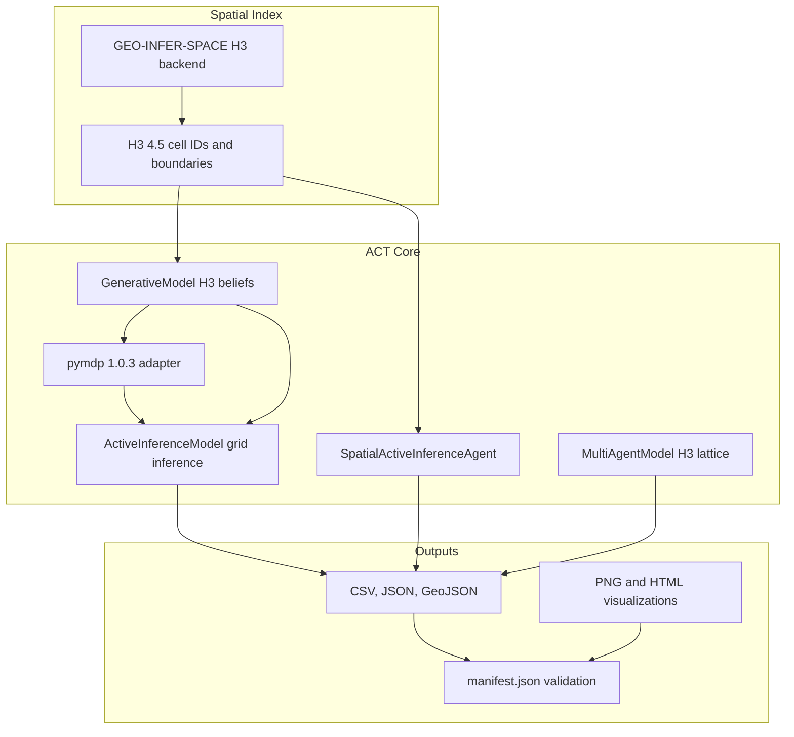

## H3 Perception-Action Sequence

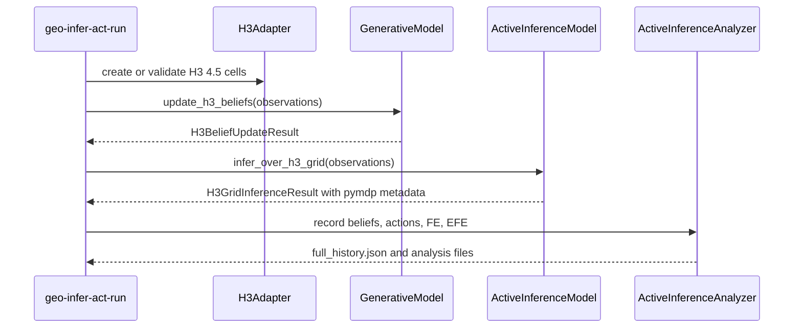

## H3 Result and Schema Contracts

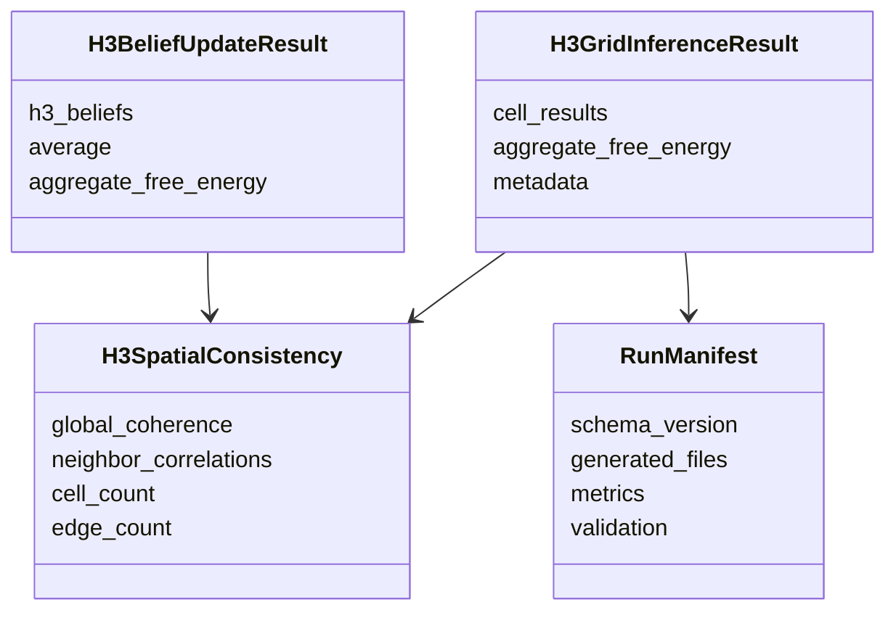

## Spatial Belief Propagation and Neighbor Diffusion


## Runner Output Manifest Pipeline

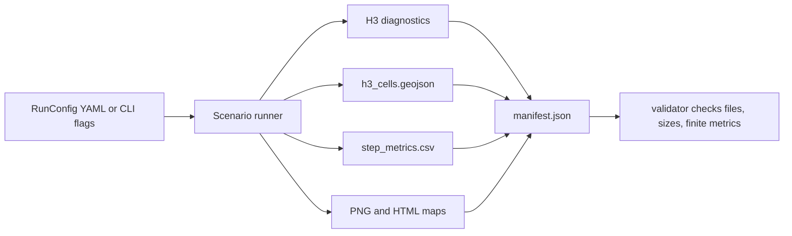

## Multi-Agent H3 Lattice Coordination

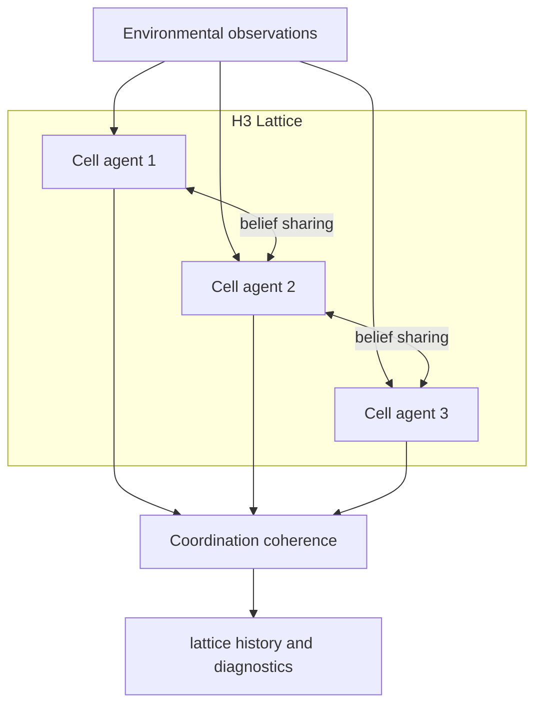

## Validation Flow

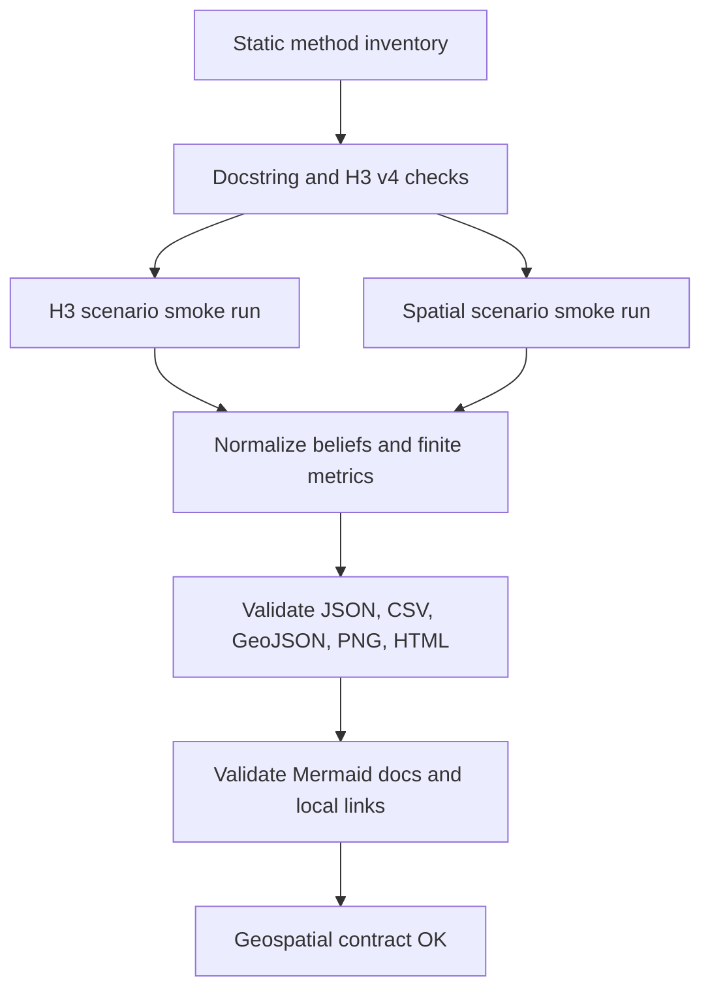

## Method Validation Gates

Every public geospatial method follows the same gate sequence before returning
data to callers: validate cell identity, normalize probability vectors, compute
finite diagnostics, and expose either the backward-compatible dictionary result
or the typed result object.

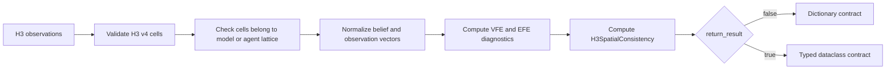

## Visualization and Schema Traceability

Geospatial visualizations are not standalone side effects. Each generated map or
chart is referenced by `manifest.json`, and the manifest records the schema
version, scenario, metrics, and validation status for the run.

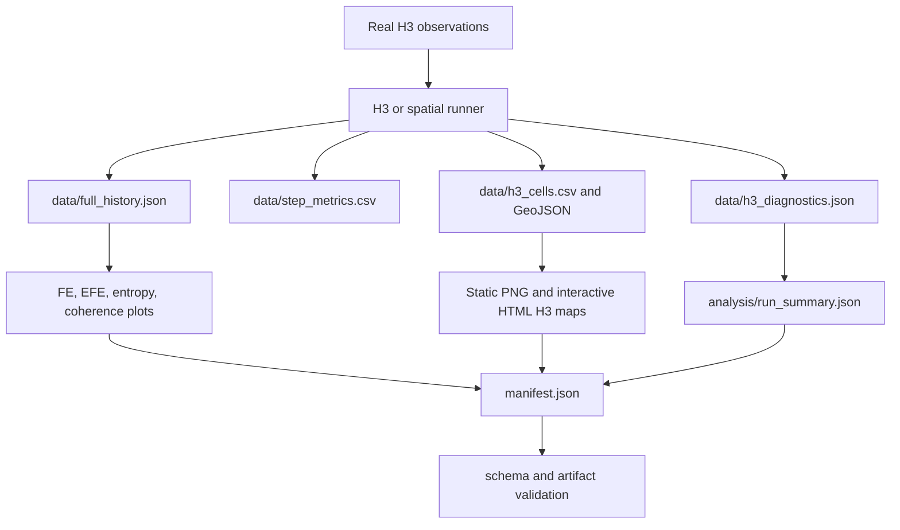

## Figure Artifact Metadata Pipeline

Every Active Inference figure is written through the package runner artifact
writer. The runner embeds a compact metadata record in the visualization file,
writes a JSON metadata sidecar, writes the exact plotted data to a CSV or JSON
sidecar, and then enriches `manifest.json` with the figure digest and sidecar
links.

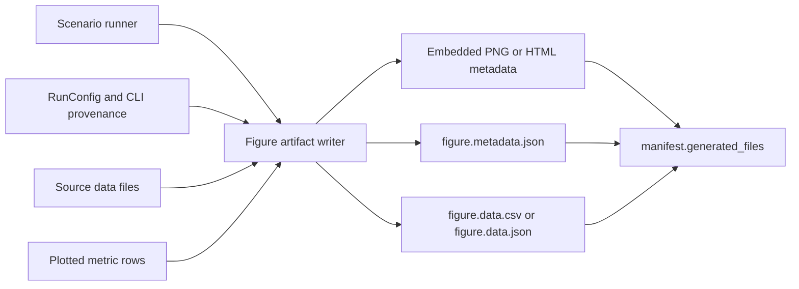

## Figure Sidecar Traceability

The sidecar contract is intentionally redundant so downstream tools can audit
figures without rerunning the scenario. PNG artifacts carry
`geo_infer_act_metadata` in the image metadata. HTML maps carry a
`<script type="application/json" id="geo-infer-act-figure-metadata">` block.
Both embedded records match the JSON sidecar for schema version, scenario, and
figure identity.

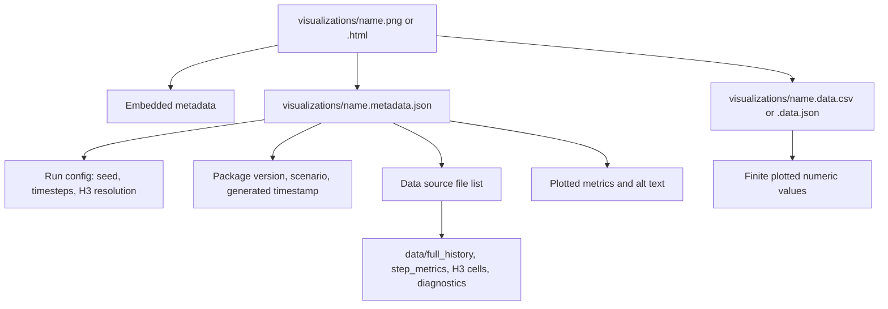

## Manifest Visualization Validation

`manifest.generated_files` keeps the previous `path` and `size_bytes` fields and
adds stable artifact metadata for every generated file. Visualization entries
also require `figure_metadata_path`, `figure_data_path`, `width_px` and
`height_px` when available, `data_sources`, `plotted_metrics`, `description`,
and `alt_text`.

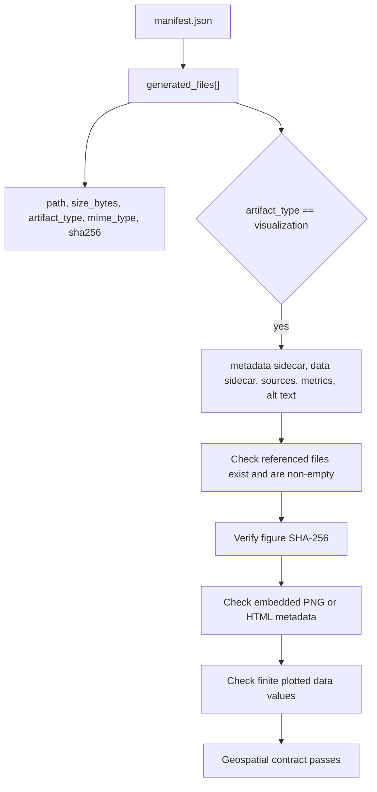

## Canonical APIs

| API | Purpose | Return contract |
| --- | --- | --- |
| `GenerativeModel.enable_h3_spatial(...)` | Build an H3-indexed spatial model | Populates valid H3 cells and neighbor graph |
| `GenerativeModel.update_h3_beliefs(..., return_result=True)` | Update per-cell beliefs | `H3BeliefUpdateResult` |
| `ActiveInferenceModel.apply_to_h3(..., return_result=True)` | Apply the active model to H3 observations | `H3BeliefUpdateResult` |
| `ActiveInferenceModel.infer_over_h3_grid(..., return_result=True)` | Score each H3 cell with one inference step | `H3GridInferenceResult` |
| `ActiveInferenceModel.trace_over_h3_grid(...)` | Build flat H3 research diagnostics | `SpatialInferenceTrace` |
| `ActiveInferenceModel.trace_over_nested_h3_grid(...)` | Build nested H3 research diagnostics with parent aggregates | `SpatialInferenceTrace` |
| `SpatialActiveInferenceAgent.step(..., return_result=True)` | Run spatial perception and action | `H3GridInferenceResult` |
| `SpatialActiveInferenceAgent.trace_step(...)` | Build trace diagnostics from a spatial-agent step | `SpatialInferenceTrace` |
| `MultiAgentModel.simulate_h3_lattice(...)` | Run distributed H3-cell agents | Per-timestep cell diagnostics |
| `geo_infer_act.runners.run_scenario(...)` | Run configured H3 or spatial workflows | `ScenarioRunResult` with `manifest.json` |

## Method Contracts

| Method | Required input | Validation and normalization | Diagnostics produced |
| --- | --- | --- | --- |
| `GenerativeModel.enable_h3_spatial` | GeoJSON-like boundary and H3 resolution | Requires non-empty real H3 cell set and builds a first-order H3 neighbor graph | Cell count, H3 resolution, graph edge count |
| `GenerativeModel.update_h3_beliefs` | Mapping of H3 cell to observation vector | Rejects invalid or out-of-model cells; normalizes posterior beliefs | `aggregate_free_energy`, global coherence, neighbor correlation |
| `ActiveInferenceModel.apply_to_h3` | H3 observations plus spatial generative model | Delegates to the canonical generative-model H3 update contract | `H3BeliefUpdateResult` in typed mode |
| `ActiveInferenceModel.infer_over_h3_grid` | H3 observation grid | Validates every H3 cell; restores original agent state after scoring | Per-cell `ActiveInferenceStepResult`, aggregate FE, selected policies |
| `ActiveInferenceModel.trace_over_h3_grid` | H3 observation grid and optional previous beliefs | Reuses a supplied grid result or runs the typed grid scorer | Per-cell, per-edge, and per-level `SpatialInferenceTrace` diagnostics |
| `ActiveInferenceModel.trace_over_nested_h3_grid` | Finest-resolution nested H3 observations | Requires an enabled nested hierarchy and parent aggregate beliefs | Parent/child residuals, cross-level consistency, and nested level diagnostics |
| `SpatialActiveInferenceAgent.spatial_perception` | Observations on the agent H3 lattice | Rejects unknown cells; normalizes beliefs after local and neighbor updates | Spatial free energy and belief history |
| `SpatialActiveInferenceAgent.step` | H3 lattice observations | Runs perception, EFE action selection, and typed consistency aggregation | `H3GridInferenceResult` in typed mode |
| `SpatialActiveInferenceAgent.trace_step` | Spatial-agent observations and optional grid result | Reuses the typed step result to avoid a second pymdp update | `SpatialInferenceTrace` with policy, flux, and coherence diagnostics |
| `MultiAgentModel.simulate_h3_lattice` | Timesteps and observation generator | Normalizes each cell observation and coordinates neighboring agents | Per-timestep beliefs, observations, FE, coordination history |
| `EnvironmentalActiveInferenceEngine.compute_spatial_priors` | Environmental variable and state count | Converts spatial autocorrelation into normalized per-cell priors | H3 cell prior distributions for downstream ACT models |

## Runnable H3 Workflow

```python
from pathlib import Path

from geo_infer_act.runners import RunConfig, run_scenario

result = run_scenario(
    RunConfig(
        scenario="h3",
        output_dir=Path("/tmp/geo-infer-act-h3"),
        seed=42,
        timesteps=4,
        h3_resolution=8,
        h3_ring_size=1,
        visualizations=True,
    )
)

print(result.manifest_path)
print(result.metrics["cell_count"])
```

The same contract applies to `scenario="spatial"`, which runs
`SpatialActiveInferenceAgent` on real H3 cells.

## Diagnostic Semantics

| Diagnostic | Meaning | Expected invariant |
| --- | --- | --- |
| `aggregate_free_energy` | Mean free-energy diagnostic over observed H3 cells | Finite float |
| `expected_free_energy` | Policy score balancing pragmatic and epistemic terms | Finite float |
| `belief_entropy` | Entropy of each normalized belief vector | Finite and nonnegative |
| `policy_entropy` | Entropy of the pymdp action posterior | Finite and nonnegative |
| `posterior_delta` | Absolute-sum change from the previous timestep's belief for the same cell | Finite and nonnegative |
| `belief_flux_divergence` | Neighbor-weighted entropy-gradient proxy for belief flow | Finite float |
| `local_coherence` | Similarity between a cell belief and same-resolution neighbors | Finite value between 0 and 1 for normal H3 paths |
| `cross_level_consistency` | Agreement between child belief and parent aggregate belief | Finite and nonnegative in nested mode |
| `global_coherence` | Cross-cell belief agreement summary | Bounded between 0 and 1 |
| `neighbor_correlations` | Agreement across H3 graph edges | Finite correlation-like value |
| `cell_count` | Count of valid real H3 cells in the run | Matches CSV and GeoJSON feature counts |
| `edge_count` | Undirected H3 neighbor edges in the active lattice | Nonnegative integer |

## Output Contract

Geospatial scenarios write the standard ACT runner outputs plus H3-specific
artifacts:

| Path | Content |
| --- | --- |
| `manifest.json` | Schema version, run config, metrics, generated files, validation status |
| `data/full_history.json` | Analyzer step history with beliefs, observations, actions, FE, EFE |
| `data/step_metrics.csv` | Timestep metrics including FE, EFE, entropy, coherence |
| `data/h3_cells.csv` | Cell centroid, resolution, final FE, EFE, entropy, action |
| `data/h3_cells.geojson` | Polygon FeatureCollection for GIS tools |
| `data/h3_diagnostics.json` | Per-timestep spatial consistency and aggregate FE |
| `data/pymdp_h3_diagnostics.json` | Per-cell pymdp version, posterior, negative EFE, VFE, entropy |
| `data/pymdp_policy_posteriors.csv` | CSV form of pymdp policy posterior and negative-EFE rows |
| `data/spatial_inference_trace.json` | JSON-safe per-cell, per-edge, per-level spatial trace |
| `data/spatial_research_statistics.json` | Run-level summaries, temporal slopes, policy switches, graph statistics, and nested residual summaries |
| `data/h3_cell_diagnostics.csv` | Flattened H3 cell trace diagnostics with lat/lng centroids |
| `data/h3_edge_diagnostics.csv` | Same-resolution H3 edge belief-distance diagnostics |
| `data/h3_hierarchy.csv` | Nested H3 parent-child closure rows |
| `data/nested_h3_diagnostics.json` | Nested per-timestep summaries and consistency diagnostics |
| `data/nested_h3_cell_diagnostics.csv` | Nested cell trace diagnostics including aggregate parent cells |
| `data/nested_h3_parent_child_diagnostics.csv` | Nested parent/child consistency and residual rows |
| `data/nested_h3_level_diagnostics.csv` | Per-resolution entropy, FE, policy entropy, flux, and coherence |
| `analysis/run_summary.json` | Summary metrics for dashboards and reports |
| `visualizations/h3_cell_metric_map.png` | Static H3 cell metric map |
| `visualizations/free_energy_evolution.png` | FE and EFE evolution |
| `visualizations/belief_entropy_coherence.png` | Entropy and coherence trend |
| `visualizations/interactive_h3_map.html` | Interactive cell map |
| `visualizations/pymdp_policy_free_energy.html` | pymdp VFE, negative-EFE, and action-confidence trend |
| `visualizations/h3_belief_flux_map.html` | Interactive belief-flux and posterior-delta map |
| `visualizations/h3_policy_surface.html` | Timestep-by-cell selected-action confidence surface |
| `visualizations/h3_policy_transitions.html` | Stacked selected-action counts by timestep |
| `visualizations/h3_spatial_autocorrelation.html` | H3 adjacency, edge-distance, and flux-balance diagnostics |
| `visualizations/h3_entropy_free_energy_phase.html` | Cell-level entropy/free-energy phase-space view |
| `visualizations/spatial_inference_research_report.html` | Research report linking statistics, trace data, and visualizations |
| `visualizations/nested_h3_level_map.html` | Nested per-resolution summary table |
| `visualizations/nested_h3_hierarchy_map.html` | Real-H3 parent/child boundary map with residuals |
| `visualizations/nested_h3_parent_child_residuals.html` | Nested parent-child cross-level residual chart |
| `visualizations/*.metadata.json` | Figure schema version, package version, scenario, run config, data sources, plotted metrics, alt text, digest, and dimensions |
| `visualizations/*.data.csv` / `*.data.json` | Exact finite rows or payload used to render the figure |

Each `generated_files` entry includes `artifact_type`, `mime_type`, and
`sha256`. Visualization entries additionally include the metadata sidecar path,
plotted-data sidecar path, data source paths, plotted metric names, a
description, and alt text. Static PNGs embed the same ACT metadata payload in
the image metadata; HTML maps embed it as structured JSON in the document head.

## Research Profile And Gallery

Research-profile runs are opt-in through
`RunConfig.parameters["research_profile"] = True` or the shared runner flag
`--research-profile`. This profile keeps real H3 cells and
`inferactively-pymdp==1.0.3`, but uses deterministic offline spatial fields plus
action-conditioned transition and preference matrices so policy posterior,
entropy, coherence, and belief-flux diagnostics do not collapse to uniform rows.

Generate the four-run gallery with:

```bash
uv run python GEO-INFER-ACT/examples/spatial_active_inference_gallery.py
```

The gallery writes flat H3, nested H3, flat spatial-agent, and nested
spatial-agent runs under
`GEO-INFER-ACT/examples/output/spatial_active_inference_gallery/` by default.
Use `uv run` for these commands; system Python may contain a legacy pymdp
distribution and is not the supported ACT/H3 runtime.

## Verification

From the repository root:

```bash
uv run python GEO-INFER-TEST/validate_act_geospatial_contract.py
uv run python GEO-INFER-TEST/validate_h3_active_inference_contract.py
uv run --package geo-infer-act --extra dev geo-infer-act-run \
  --scenario h3 \
  --output-dir /tmp/geo-infer-act-h3 \
  --seed 42 \
  --timesteps 4
```

## Integration With GEO-INFER Modules

| Module | Integration |
| --- | --- |
| `GEO-INFER-SPACE` | H3 indexing, hierarchy, boundary, and neighborhood semantics |
| `GEO-INFER-BAYES` | Probabilistic inference foundations |
| `GEO-INFER-AGENT` | Agent orchestration using ACT contracts |
| `GEO-INFER-SIM` | Scenario simulation around ACT agents |

## Further Reading

- [Active Inference Overview](./active_inference_overview.md)
- [Free Energy Principle](./free_energy_principle.md)
- [Mathematical Framework](./mathematical_framework.md)
- [References](./references.md)

**Last Updated**: 2026-05-19
