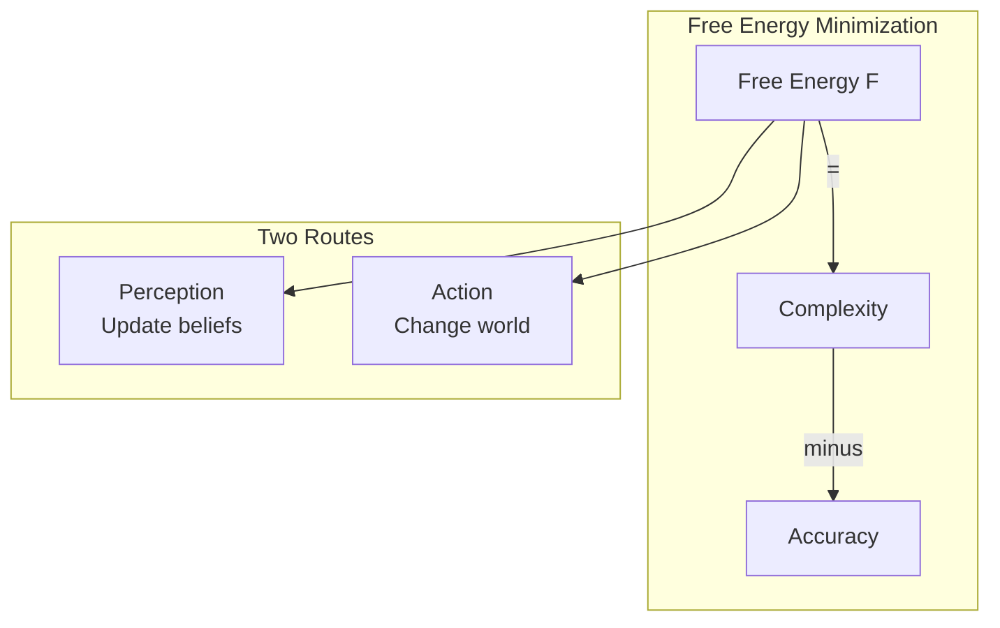
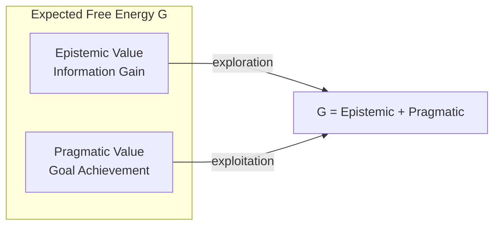
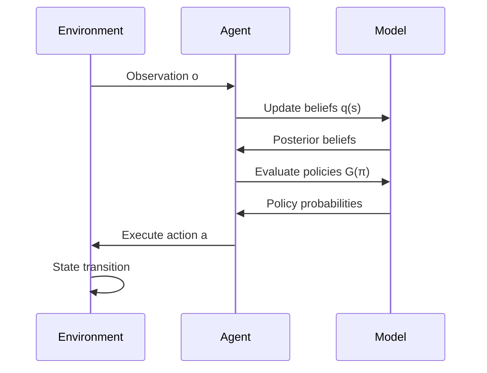
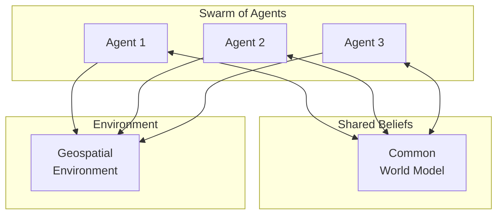
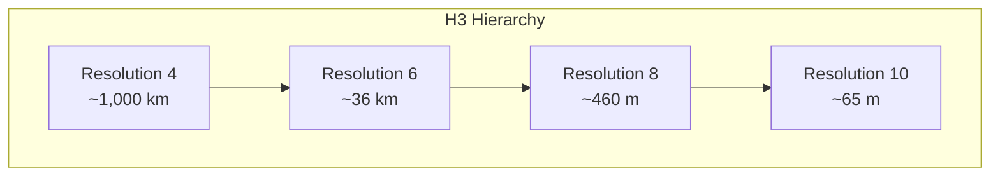

# Active Inference Diagrams

## Overview

This document provides visual diagrams explaining Active Inference concepts and their implementation in GEO-INFER agents.

## The Free Energy Principle



## Agent Architecture

```mermaid
graph LR
    subgraph Agent
        GM[Generative<br>Model]
        B[Beliefs<br>q(s)]
        PE[Policy<br>Evaluator]
        L[Learner]
    end
    
    subgraph Environment
        S[States]
        O[Observations]
    end
    
    O -->|perceive| B
    B -->|plan| PE
    PE -->|act| S
    S --> O
    O -.->|learn| L
    L -.-> GM
```

## Generative Model Structure

```mermaid
graph TD
    subgraph "Generative Model p(o,s)"
        D[Prior p(s₀)]
        B[Transitions p(s'|s,a)]
        A[Likelihood p(o|s)]
        C[Preferences p(o)]
    end
    
    D --> |initial state| B
    B --> |state evolution| A
    A --> |observations| C
```

## Expected Free Energy Components



## Perception-Action Loop



## Multi-Agent Coordination



## Hierarchical State Space (H3)



## Belief Update Dynamics

```mermaid
graph LR
    subgraph "Belief Update"
        PRIOR[Prior Beliefs<br>q(s)]
        OBS[Observation o]
        LIK[Likelihood<br>p(o|s)]
        POST[Posterior<br>q(s|o)]
    end
    
    PRIOR --> |×| LIK
    OBS --> LIK
    LIK --> |normalize| POST
```

---

**Last Updated**: 2026-02-24
