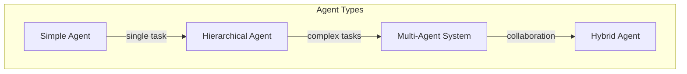
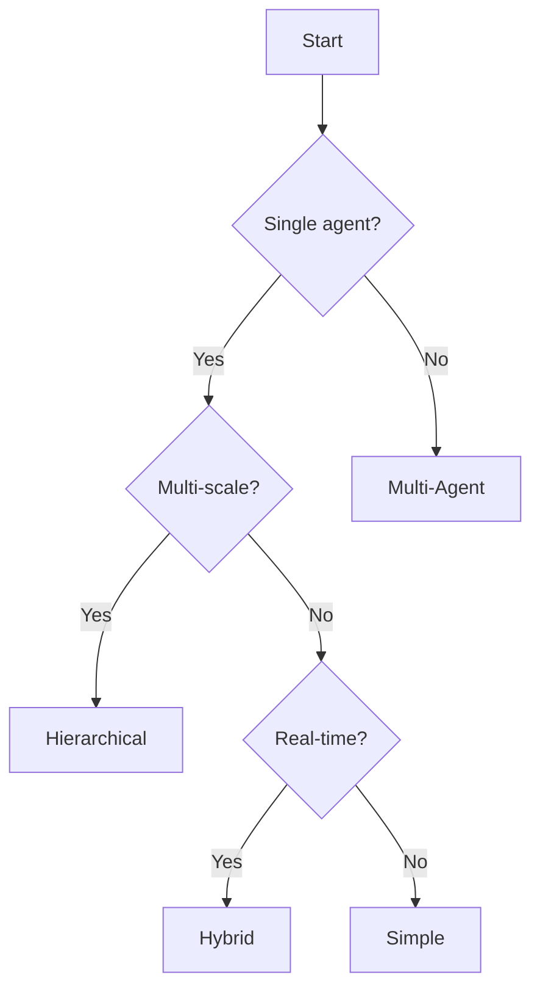

# Agent Architectures

## Introduction

This document describes the different agent architectures available in GEO-INFER and when to use each one.

## Architecture Overview



## 1. Simple Agent

### Description

A single agent with one generative model optimizing for a specific objective.

### Use Cases

- Single sensor monitoring
- Point-to-point navigation
- Simple data collection

### Implementation

```python
from geo_infer_agent import SimpleAgent

agent = SimpleAgent(
    model=pollution_model,
    objective="minimize_uncertainty"
)

while not done:
    obs = environment.observe()
    agent.perceive(obs)
    action = agent.act()
    environment.step(action)
```

## 2. Hierarchical Agent

### Description

Agent with multiple levels of abstraction, enabling multi-scale reasoning.

### Use Cases

- Regional to local planning
- Multi-resolution mapping
- Complex mission planning

### Implementation

```python
from geo_infer_agent import HierarchicalAgent

agent = HierarchicalAgent(
    levels={
        "strategic": RegionalModel(resolution=4),
        "tactical": LocalModel(resolution=8),
        "operational": SiteModel(resolution=12)
    }
)

# Top-down planning
plan = agent.plan_hierarchically(goal=mission_objective)
```

## 3. Multi-Agent System

### Description

Multiple coordinated agents working together.

### Use Cases

- Fleet coordination
- Distributed sensing
- Collaborative mapping

### Implementation

```python
from geo_infer_agent import MultiAgentSystem

mas = MultiAgentSystem(
    agents=[agent1, agent2, agent3],
    coordination="decentralized",
    communication="broadcast"
)

# Coordinate on shared objective
mas.run(objective="complete_coverage", region=study_area)
```

## 4. Hybrid Agent

### Description

Combines reactive and deliberative components.

### Use Cases

- Real-time + planning
- Safety-critical systems
- Complex environments

### Implementation

```python
from geo_infer_agent import HybridAgent

agent = HybridAgent(
    reactive_layer=ObstacleAvoidance(),
    deliberative_layer=MissionPlanner(),
    arbitration="priority"
)
```

## Architecture Comparison

| Architecture | Complexity | Scalability | Use Case |
|--------------|------------|-------------|----------|
| Simple | Low | Single | Basic tasks |
| Hierarchical | Medium | Multi-scale | Complex missions |
| Multi-Agent | High | Distributed | Team operations |
| Hybrid | Medium | Adaptive | Real-time + planning |

## Selecting an Architecture



---

**Last Updated**: 2026-02-24
