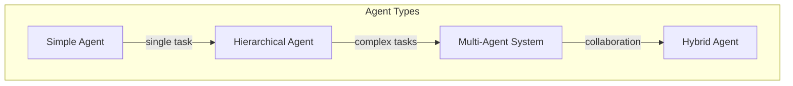
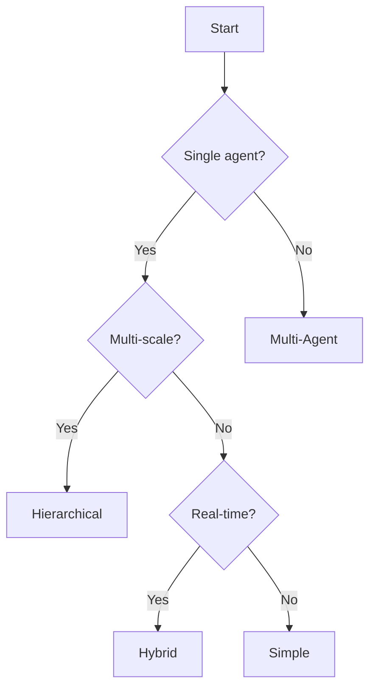

# Agent Architectures

## Introduction

This document describes the different agent architectures available in GEO-INFER and when to use each one.

## Architecture Overview



## 1. Simple Agent

### Description

A single agent with one generative model optimizing for a specific objective.

### Use Cases

- Single sensor monitoring
- Point-to-point navigation
- Simple data collection

### Implementation

```python
from geo_infer_agent import ActiveInferenceAgent

agent = ActiveInferenceAgent(
    agent_id="simple-01",
    config={"name": "uncertainty_minimizer"},
)

while not done:
    obs = await agent.perceive()
    agent.update_beliefs(obs)
    action = await agent.act({"type": "step"})
    environment.step(action)
```

## 2. Hierarchical Agent

### Description

Agent with multiple levels of abstraction, enabling multi-scale reasoning.

### Use Cases

- Regional to local planning
- Multi-resolution mapping
- Complex mission planning

### Implementation

```python
from geo_infer_agent import AgentRegistry

# No dedicated hierarchical-agent class exists; compose levels by
# registering one agent per scale and delegating between them.
registry = AgentRegistry()
strategic_id = await registry.create_agent(
    agent_type="active_inference",
    config={"name": "regional_planner"},
)
operational_id = await registry.create_agent(
    agent_type="rule_based",
    config={"name": "site_executor"},
)
await registry.start_agent(strategic_id)
await registry.start_agent(operational_id)
```

## 3. Multi-Agent System

### Description

Multiple coordinated agents working together.

### Use Cases

- Fleet coordination
- Distributed sensing
- Collaborative mapping

### Implementation

```python
from geo_infer_agent import AgentRegistry, MessagingService

registry = AgentRegistry()
messaging = MessagingService()

agent_ids = [
    await registry.create_agent(
        agent_type="hybrid",
        config={"name": f"fleet_agent_{i}"},
        region=study_area_geojson,
    )
    for i in range(3)
]
for agent_id in agent_ids:
    await registry.start_agent(agent_id)

# Coordinate on a shared channel
await messaging.broadcast_message(
    from_agent_id=agent_ids[0],
    content={"objective": "complete_coverage"},
    channel="coordination",
)
```

## 4. Hybrid Agent

### Description

Combines reactive and deliberative components.

### Use Cases

- Real-time + planning
- Safety-critical systems
- Complex environments

### Implementation

```python
from geo_infer_agent import HybridAgent

agent = HybridAgent(
    agent_id="hybrid-01",
    config={"name": "field_agent"},
)
```

## Architecture Comparison

| Architecture | Complexity | Scalability | Use Case |
|--------------|------------|-------------|----------|
| Simple | Low | Single | Basic tasks |
| Hierarchical | Medium | Multi-scale | Complex missions |
| Multi-Agent | High | Distributed | Team operations |
| Hybrid | Medium | Adaptive | Real-time + planning |

## Selecting an Architecture



---

**Last Updated**: 2026-02-24
