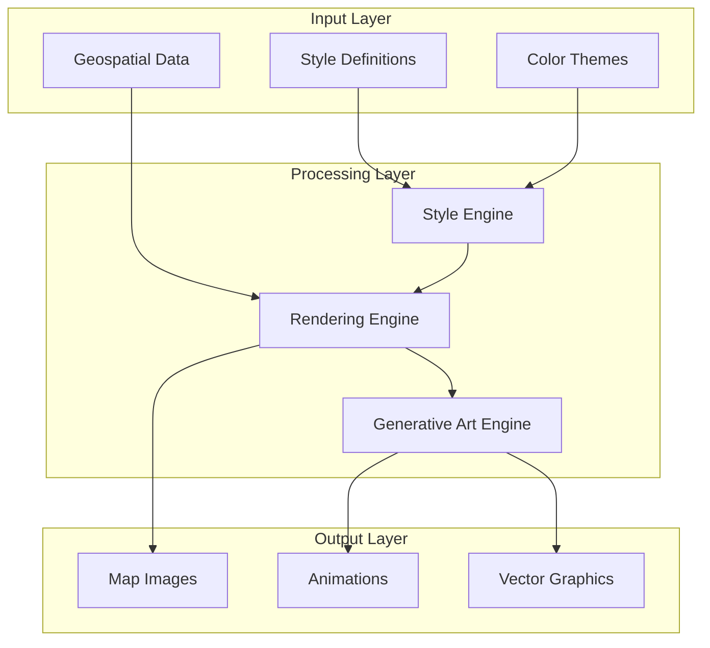

# GEO-INFER-ART Architecture

## Overview

This document describes the architecture of the GEO-INFER-ART visualization and cartographic design module.

## System Architecture



## Core Components

### 1. Rendering Engine

Handles the low-level rendering of geospatial features:

```python
from geo_infer_art import GeoArt

geo_art = GeoArt.load_geojson("boundaries.geojson")
geo_art.apply_style(style="blueprint", title="Study area")
geo_art.save("map.png", dpi=300)
```

### 2. Style Engine

Applies cartographic styles:

```python
from geo_infer_art import MapStyle

style = MapStyle(name="blueprint", theme="technical")
```

### 3. Generative Art Engine

Creates algorithmic visualizations:

```python
from geo_infer_art import GenerativeMap

gen = GenerativeMap.from_elevation(
    region="alps",
    resolution=512,
    abstraction_level=0.6,
    style="contour",
)
```

## Data Flow

1. **Input**: GeoJSON, Shapefiles, Rasters
2. **Transform**: Project, simplify, clip
3. **Style**: Apply colors, strokes, fills
4. **Render**: Generate pixels/vectors
5. **Output**: PNG, SVG, MP4

## Extension Points

| Extension | Purpose |
|-----------|---------|
| Renderers | Add new backends |
| Styles | Custom style formats |
| Filters | Post-processing effects |

---

**Last Updated**: 2026-02-24
