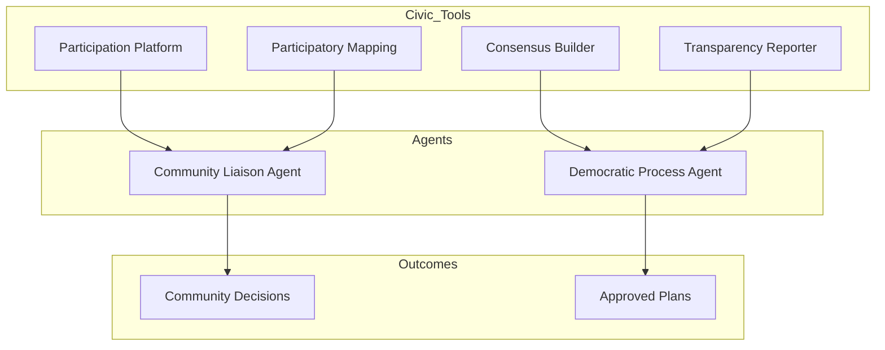

# GEO-INFER-CIV: Agent Capabilities

<div align="center">
  <h3><a href="../README.md">🌍 GEO-INFER Core</a></h3>
  <a href="../AGENTS.md">🤖 Agent Architecture</a> •
  <a href="../README.md#-module-overview">📦 Module Index</a> •
  <a href="./README.md">📚 Module Documentation</a>
</div>

---

## Overview

The **GEO-INFER-CIV** module provides civic engagement and participatory planning capabilities, enabling agents to facilitate community input, democratic participation, and collaborative decision-making in geospatial contexts.

## Agent Capabilities

### 1. Community Engagement

```python
from geo_infer_civ import ParticipationPlatform

# Agent facilitates community input
platform = ParticipationPlatform()

feedback = platform.collect_input(
    topic=planning_proposal,
    methods=["survey", "map_comments", "forum"],
    duration_days=30,
    languages=["en", "es", "zh"]
)

print(f"Responses collected: {feedback.total_responses}")
print(f"Sentiment: {feedback.overall_sentiment}")
print(f"Key themes: {feedback.extracted_themes}")
```

### 2. Consensus Building

```python
from geo_infer_civ import ConsensusBuilder

# Collaborative decision-making
consensus = ConsensusBuilder()

agreement = consensus.build(
    stakeholders=community_groups,
    alternatives=planning_options,
    criteria=evaluation_criteria,
    method="multi_criteria_analysis"
)

print(f"Consensus reached: {agreement.consensus_level}%")
print(f"Preferred alternative: {agreement.top_choice}")
print(f"Areas of disagreement: {agreement.disagreements}")
```

### 3. Transparency Reporting

```python
from geo_infer_civ import TransparencyReporter

# Generate accountability reports
reporter = TransparencyReporter()

report = reporter.generate(
    project="downtown_redevelopment",
    period=("2025-01-01", "2025-12-31"),
    metrics=["budget", "timeline", "community_input"]
)

print(f"Budget utilization: {report.budget_used}%")
print(f"Community input incorporated: {report.input_addressed}%")
```

### 4. Participatory Mapping

```python
from geo_infer_civ import ParticipatoryMapper

# Enable community map contributions
mapper = ParticipatoryMapper()

community_map = mapper.create_session(
    topic="neighborhood_improvements",
    base_layers=["streets", "parcels", "zoning"],
    contribution_types=["point", "polygon", "comment"]
)

# Aggregate community input
aggregated = mapper.aggregate_contributions(
    session=community_map,
    clustering=True
)

print(f"Contributions: {aggregated.contribution_count}")
print(f"Hot spots: {aggregated.identified_hotspots}")
```

## Implementation Status

### Currently Implemented

| Feature | Status | Description |
|---------|--------|-------------|
| **Participation Platform** | ✅ Ready | Community engagement tools |
| **Feedback Collector** | ✅ Ready | Structured input collection |
| **Consensus Builder** | ✅ Ready | Collaborative decision support |
| **Transparency Reporter** | ✅ Ready | Public accountability tools |
| **Participatory Mapping** | ✅ Ready | Community map contributions |

### Aspirational/Planned Features

| Feature | Priority | Description |
|---------|----------|-------------|
| **CommunityLiaisonAgent** | 🔮 High | Automated community interaction |
| **DemocraticProcessAgent** | 🔮 High | Voting and consensus facilitation |
| **SentimentAnalysisAgent** | 🔮 Medium | Public opinion tracking |

## Integration with Agent Framework



## Use Cases

### 1. Neighborhood Planning

```python
from geo_infer_civ import NeighborhoodPlanner

planner = NeighborhoodPlanner(area="oak_district")

# Run participatory planning process
process = planner.run_process(
    phases=["visioning", "alternatives", "selection"],
    engagement_methods=["workshop", "online", "popup"],
    timeline_months=6
)

print(f"Participants: {process.total_participants}")
print(f"Community priorities: {process.identified_priorities}")
```

### 2. Budget Allocation

```python
from geo_infer_civ import ParticipatoryBudgeting

pb = ParticipatoryBudgeting(
    jurisdiction="city_of_metropolis",
    budget=5_000_000,
    categories=["parks", "streets", "safety", "arts"]
)

# Run voting process
results = pb.conduct_voting(
    proposals=community_proposals,
    voting_period_days=14
)

print(f"Winning projects: {results.funded_projects}")
```

---

This AGENTS.md documents how GEO-INFER-CIV provides civic engagement capabilities for the agent ecosystem.

**Last Updated**: 2026-01-26
