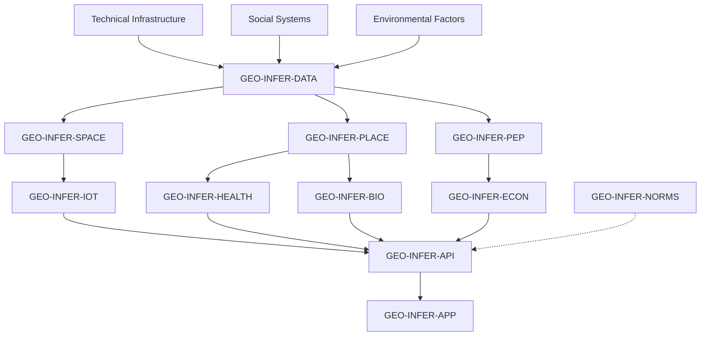

# Area Study Template

A multi-disciplinary template for doing place-based analysis that combines technical infrastructure, social systems, and environmental factors into a unified workflow.

## Prerequisites

- **Python**: 3.11+
- **uv**: recommended (`uv pip`, `uv run`)

## Modules used

### Primary (required)

- `GEO-INFER-SPACE`: spatial analysis + H3 v4 indexing
- `GEO-INFER-DATA`: ingestion + validation + data access
- `GEO-INFER-PLACE`: place-based context + local boundaries
- `GEO-INFER-PEP`: people/community analytics
- `GEO-INFER-IOT`: sensor ingestion + streaming
- `GEO-INFER-BIO`: biodiversity/ecosystem indicators
- `GEO-INFER-HEALTH`: spatial health indicators

### Supporting (optional)

- `GEO-INFER-TIME`: time series + forecasting
- `GEO-INFER-AG`: land use / agriculture overlays
- `GEO-INFER-ECON`: economic indicators
- `GEO-INFER-RISK`: hazard/vulnerability overlays
- `GEO-INFER-API`: integration endpoints
- `GEO-INFER-APP`: dashboards / UI
- `GEO-INFER-NORMS`: governance + consent constraints

## Architecture overview



## Quick start

```bash
uv pip install -e ./GEO-INFER-SPACE -e ./GEO-INFER-DATA -e ./GEO-INFER-PLACE -e ./GEO-INFER-PEP
uv pip install -e ./GEO-INFER-IOT -e ./GEO-INFER-BIO -e ./GEO-INFER-HEALTH
```

## Suggested workflow

- **Define study boundary**: administrative boundary, custom polygon, or H3 cells.
- **Configure sources**: census/demographics, IoT streams, environmental layers, health indicators.
- **Run integration**: align all sources to a shared spatial index (H3) + consistent CRS.
- **Validate outputs**: data quality checks + completeness checks + range checks.
- **Review + iterate**: add community feedback loops via `GEO-INFER-PEP` and governance constraints via `GEO-INFER-NORMS`.

