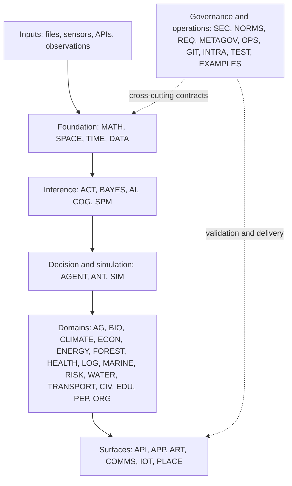

# GEO-INFER Architecture

GEO-INFER is a 44-module Python workspace. Modules are independently owned
packages connected through explicit imports, shared data conventions, and
contract validators. The categories below describe responsibility; they are not
an assertion that every module has a strict one-way dependency.

## Layered view



## Repository boundaries

- `GEO-INFER-*/src/` owns importable behavior.
- `GEO-INFER-*/tests/` owns focused behavioral, integration, and performance
  verification.
- `GEO-INFER-*/examples/` demonstrates orchestration and should remain thin.
- `GEO-INFER-INTRA/docs/` owns cross-module concepts, tutorials, and workflow
  guidance.
- `GEO-INFER-TEST/` owns repository-wide test execution and executable
  contracts.
- The root `pyproject.toml`, `uv.lock`, and `.python-version` define the
  shared environment contract.

## Canonical data flow

```
```text
source data
  -> DATA ingestion/validation
  -> SPACE indexing and geometry + TIME alignment
  -> MATH/SPM/BAYES estimation or ACT belief updates
  -> AGENT/ANT/SIM decisions and scenario evaluation
  -> domain module result
  -> API/APP/ART visualization or persisted artifact
```

Every boundary should make its coordinate system, units, missing-value policy,
randomness, and output schema explicit. H3-based workflows use real H3 v4
cells and should validate resolution and cell-count budgets before expansion.

## Core contracts

### Active Inference

`GEO-INFER-ACT` is the canonical implementation for typed free-energy,
categorical belief updates, expected-free-energy policy evaluation, and spatial
or nested-H3 diagnostics. BAYES and MATH may provide supporting mathematics;
they should not introduce incompatible Active Inference result shapes.

### Spatial indexing

`GEO-INFER-SPACE` owns backend dispatch and H3 v4 convenience functions. Use
`latlng_to_cell`, `cell_to_latlng`, `grid_disk`, and related v4 names. Nested
H3 closure and aggregation are owned by `NestedH3Grid` and are opt-in.

### Validation

`GEO-INFER-TEST` enforces repository structure, documentation freshness, test
inventories, no-skips/no-warnings policy, model finiteness and reproducibility,
and H3/Active Inference contracts. A local green module test is not equivalent
to a green repository gate.

## Further reading

- [Module catalog](../modules/index.md)
- [Integration patterns](../integration/index.md)
- [Testing guide](../developer_guide/testing_guide.md)
- [Active Inference guide](../active_inference_guide.md)
- [H3 v4 guide](../geospatial/data_formats/h3/index.md)
