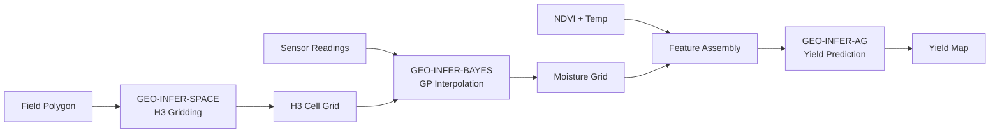

# Agricultural Applications: Precision Farming with GEO-INFER
> **Illustrative guide.** The code in this page is illustrative: it sketches
> how the module APIs compose for this use case. Some identifiers shown are
> conceptual; always import from the current package exports (see the module
> `__init__.py` and `SKILL.md`) and prefer the runnable scripts under
> `GEO-INFER-*/examples/` for verified behavior. Any numeric results shown
> are illustrative and must be reproduced against your own data before use.


This walkthrough demonstrates a precision agriculture pipeline using GEO-INFER modules for H3-gridded field analysis, Gaussian Process soil moisture interpolation, and crop yield prediction.

## Overview

The pipeline covers three stages:

1. **Spatial gridding** -- overlay an H3 resolution-10 hex grid on a field polygon to create analysis units
2. **Soil moisture interpolation** -- use a Gaussian Process to interpolate sparse sensor readings across the grid
3. **Crop yield prediction** -- combine soil moisture, NDVI, and temperature features for yield modeling

Each stage uses a different GEO-INFER module, and the final section ties them into a single end-to-end pipeline.

## Prerequisites

```bash
uv pip install -e ./GEO-INFER-AG ./GEO-INFER-BAYES ./GEO-INFER-SPACE ./GEO-INFER-DATA
uv pip install numpy pandas geopandas matplotlib shapely
```

## Section 1: H3-Gridded Field Analysis

The first step converts a continuous field polygon into discrete hexagonal analysis units using the H3 spatial index. Resolution 10 gives cells roughly 15m edge-to-edge, suitable for within-field variation analysis.

### Defining the Field Boundary

```
```python
import numpy as np
from shapely.geometry import Polygon
import geopandas as gpd

# Define a field polygon (approximate coordinates for a 40-hectare field)
# Located in the Willamette Valley, Oregon
field_coords = [
    (-123.0800, 44.6350),
    (-123.0750, 44.6350),
    (-123.0750, 44.6300),
    (-123.0780, 44.6290),
    (-123.0800, 44.6300),
    (-123.0800, 44.6350),
]
field_polygon = Polygon(field_coords)

field_gdf = gpd.GeoDataFrame(
    {"field_id": ["field_001"], "crop": ["winter_wheat"]},
    geometry=[field_polygon],
    crs="EPSG:4326",
)
print(f"Field area: {field_gdf.to_crs(epsg=32610).area.iloc[0] / 10000:.1f} hectares")
```

### Creating the H3 Grid

```
```python
import h3
from typing import List, Dict


def polygon_to_h3_cells(polygon: Polygon, resolution: int = 10) -> List[str]:
    """Convert a Shapely polygon to a list of H3 cell indexes.

    Uses h3 v4 API (latlng_to_cell, polygon_to_cells).

    Args:
        polygon: Shapely Polygon in EPSG:4326.
        resolution: H3 resolution (10 = ~15m edge).

    Returns:
        List of H3 cell index strings.
    """
    exterior_coords = list(polygon.exterior.coords)
    # h3.LatLngPoly expects (lat, lng) order
    latlng_coords = [(lat, lng) for lng, lat in exterior_coords]
    h3_poly = h3.LatLngPoly(latlng_coords)
    cells = list(h3.polygon_to_cells(h3_poly, resolution))
    return cells


def cells_to_geodataframe(cells: List[str]) -> gpd.GeoDataFrame:
    """Convert H3 cell indexes to a GeoDataFrame with hex geometries.

    Args:
        cells: List of H3 cell index strings.

    Returns:
        GeoDataFrame with one row per cell.
    """
    rows = []
    for cell in cells:
        boundary = h3.cell_to_boundary(cell)
        # boundary returns (lat, lng) tuples; Shapely needs (lng, lat)
        ring = [(lng, lat) for lat, lng in boundary]
        ring.append(ring[0])  # close the ring
        rows.append({
            "h3_index": cell,
            "geometry": Polygon(ring),
            "resolution": h3.get_resolution(cell),
        })
    return gpd.GeoDataFrame(rows, crs="EPSG:4326")


# Generate the field grid
field_cells = polygon_to_h3_cells(field_polygon, resolution=10)
grid_gdf = cells_to_geodataframe(field_cells)

print(f"H3 resolution 10 cells covering field: {len(field_cells)}")
print(f"Approximate cell area: {grid_gdf.to_crs(epsg=32610).area.mean():.0f} m^2")
```

### Visualizing the Grid

```
```python
import matplotlib.pyplot as plt

fig, ax = plt.subplots(1, 1, figsize=(10, 8))
field_gdf.boundary.plot(ax=ax, color="black", linewidth=2, label="Field boundary")
grid_gdf.plot(ax=ax, facecolor="none", edgecolor="steelblue", linewidth=0.5)
ax.set_title(f"H3 Resolution 10 Grid ({len(field_cells)} cells)")
ax.set_xlabel("Longitude")
ax.set_ylabel("Latitude")
ax.legend()
plt.tight_layout()
plt.savefig("field_h3_grid.png", dpi=150)
```

## Section 2: Soil Moisture Gaussian Process

Sparse soil moisture sensor readings are interpolated across the full field grid using a Gaussian Process with an RBF kernel.

### Generating Synthetic Sensor Data

In practice, this data comes from in-field IoT sensors (see GEO-INFER-IOT). Here we generate realistic synthetic data with spatial correlation.

```
```python
import numpy as np


def generate_sensor_readings(
    grid_gdf: gpd.GeoDataFrame,
    n_sensors: int = 12,
    seed: int = 42
) -> gpd.GeoDataFrame:
    """Generate synthetic soil moisture sensor readings.

    Creates spatially correlated moisture values with a gradient
    from higher moisture in low-elevation areas to lower in high areas.

    Args:
        grid_gdf: H3 grid GeoDataFrame.
        n_sensors: Number of sensor locations to sample.
        seed: Random seed for reproducibility.

    Returns:
        GeoDataFrame with sensor locations and moisture readings.
    """
    rng = np.random.default_rng(seed)

    # Sample sensor locations from grid centroids
    centroids = grid_gdf.geometry.centroid
    sensor_indices = rng.choice(len(centroids), size=n_sensors, replace=False)

    sensor_lons = np.array([centroids.iloc[i].x for i in sensor_indices])
    sensor_lats = np.array([centroids.iloc[i].y for i in sensor_indices])

    # Simulate a spatial moisture gradient
    # Higher moisture in the southern (lower lat) part of the field
    lat_range = sensor_lats.max() - sensor_lats.min()
    if lat_range == 0:
        lat_range = 1.0
    normalized_lat = (sensor_lats - sensor_lats.min()) / lat_range
    base_moisture = 0.35 - 0.10 * normalized_lat  # 0.25 to 0.35 range

    # Add spatially correlated noise
    noise = rng.normal(0, 0.03, size=n_sensors)
    moisture = np.clip(base_moisture + noise, 0.05, 0.60)

    from shapely.geometry import Point
    sensor_gdf = gpd.GeoDataFrame(
        {
            "sensor_id": [f"SM_{i:03d}" for i in range(n_sensors)],
            "moisture": moisture,
        },
        geometry=[Point(lon, lat) for lon, lat in zip(sensor_lons, sensor_lats)],
        crs="EPSG:4326",
    )
    return sensor_gdf


sensor_gdf = generate_sensor_readings(grid_gdf, n_sensors=12)
print(f"Sensor readings: {len(sensor_gdf)}")
print(f"Moisture range: {sensor_gdf['moisture'].min():.3f} - {sensor_gdf['moisture'].max():.3f}")
```

### Training the Gaussian Process

```
```python
from geo_infer_bayes.core.gaussian_process import GaussianProcess


def interpolate_soil_moisture(
    sensor_gdf: gpd.GeoDataFrame,
    grid_gdf: gpd.GeoDataFrame,
    length_scale: float = 0.002,
    noise_variance: float = 0.001
) -> gpd.GeoDataFrame:
    """Interpolate soil moisture across the field grid using GP regression.

    Uses an RBF (squared exponential) kernel. The length_scale parameter
    controls spatial smoothness -- smaller values allow sharper gradients.

    Args:
        sensor_gdf: GeoDataFrame with sensor locations and moisture readings.
        grid_gdf: H3 grid GeoDataFrame to predict onto.
        length_scale: RBF kernel length scale in degrees.
        noise_variance: Observation noise variance.

    Returns:
        Grid GeoDataFrame with added 'moisture_mean' and 'moisture_std' columns.
    """
    # Extract coordinates
    train_x = np.column_stack([
        sensor_gdf.geometry.x.values,
        sensor_gdf.geometry.y.values,
    ])
    train_y = sensor_gdf["moisture"].values

    pred_centroids = grid_gdf.geometry.centroid
    pred_x = np.column_stack([
        pred_centroids.x.values,
        pred_centroids.y.values,
    ])

    # Configure and train GP
    gp = GaussianProcess(
        kernel_type="rbf",
        length_scale=length_scale,
        signal_variance=np.var(train_y),
        noise_variance=noise_variance,
    )
    gp.fit(train_x, train_y)

    # Predict across grid
    mean, variance = gp.predict(pred_x, return_variance=True)

    result_gdf = grid_gdf.copy()
    result_gdf["moisture_mean"] = mean
    result_gdf["moisture_std"] = np.sqrt(np.maximum(variance, 0.0))
    return result_gdf


moisture_grid = interpolate_soil_moisture(sensor_gdf, grid_gdf)
print(f"Predicted moisture range: "
      f"{moisture_grid['moisture_mean'].min():.3f} - "
      f"{moisture_grid['moisture_mean'].max():.3f}")
print(f"Mean prediction uncertainty (std): "
      f"{moisture_grid['moisture_std'].mean():.4f}")
```

### Visualizing the Interpolation

```
```python
fig, axes = plt.subplots(1, 2, figsize=(16, 7))

# Mean prediction
moisture_grid.plot(
    column="moisture_mean",
    ax=axes[0],
    legend=True,
    cmap="YlGnBu",
    legend_kwds={"label": "Volumetric moisture (m^3/m^3)"},
)
sensor_gdf.plot(ax=axes[0], color="red", markersize=40, zorder=5)
axes[0].set_title("GP Mean: Soil Moisture")

# Uncertainty
moisture_grid.plot(
    column="moisture_std",
    ax=axes[1],
    legend=True,
    cmap="Oranges",
    legend_kwds={"label": "Prediction std"},
)
sensor_gdf.plot(ax=axes[1], color="red", markersize=40, zorder=5)
axes[1].set_title("GP Uncertainty")

plt.tight_layout()
plt.savefig("soil_moisture_gp.png", dpi=150)
```

## Section 3: Crop Yield Prediction

Yield prediction uses multiple features per H3 cell: soil moisture, NDVI (vegetation vigor), and growing-season temperature.

### Generating Multi-Feature Grid Data

```
```python
def generate_field_features(
    moisture_grid: gpd.GeoDataFrame,
    seed: int = 42
) -> gpd.GeoDataFrame:
    """Add NDVI and temperature features to the moisture grid.

    Simulates realistic feature correlations:
    - NDVI correlates positively with moisture
    - Temperature has slight spatial gradient

    Args:
        moisture_grid: GeoDataFrame with moisture predictions.
        seed: Random seed.

    Returns:
        GeoDataFrame with moisture_mean, ndvi, temperature columns.
    """
    rng = np.random.default_rng(seed)
    n = len(moisture_grid)

    # NDVI: correlated with moisture (r ~ 0.7) plus noise
    moisture_vals = moisture_grid["moisture_mean"].values
    ndvi_base = 0.3 + 1.2 * moisture_vals  # linear relationship
    ndvi_noise = rng.normal(0, 0.05, size=n)
    ndvi = np.clip(ndvi_base + ndvi_noise, 0.0, 1.0)

    # Temperature: slight east-west gradient
    centroids = moisture_grid.geometry.centroid
    lon_normalized = (centroids.x.values - centroids.x.min()) / max(
        centroids.x.max() - centroids.x.min(), 1e-6
    )
    temp_base = 22.0 + 2.0 * lon_normalized  # warmer to the east
    temp_noise = rng.normal(0, 0.5, size=n)
    temperature = temp_base + temp_noise

    result = moisture_grid.copy()
    result["ndvi"] = ndvi
    result["temperature_c"] = temperature
    return result


feature_grid = generate_field_features(moisture_grid)
print(f"Features per cell: moisture_mean, ndvi, temperature_c")
print(f"NDVI range: {feature_grid['ndvi'].min():.3f} - {feature_grid['ndvi'].max():.3f}")
print(f"Temp range: {feature_grid['temperature_c'].min():.1f} - {feature_grid['temperature_c'].max():.1f} C")
```

### Yield Prediction Model

```
```python
from geo_infer_ag.core.yield_predictor import YieldPredictor


def predict_yield(
    feature_grid: gpd.GeoDataFrame,
    training_fraction: float = 0.7,
    seed: int = 42
) -> gpd.GeoDataFrame:
    """Train a yield predictor and generate field-wide predictions.

    Uses spatial leave-one-out cross-validation to assess accuracy,
    then trains on all available data for final prediction.

    Args:
        feature_grid: GeoDataFrame with moisture, ndvi, temperature columns.
        training_fraction: Fraction of cells used for training.
        seed: Random seed.

    Returns:
        GeoDataFrame with added 'yield_pred_kg_ha' column.
    """
    rng = np.random.default_rng(seed)

    # Generate synthetic yield targets (kg/ha)
    # Yield is driven by moisture and NDVI with diminishing returns
    moisture = feature_grid["moisture_mean"].values
    ndvi = feature_grid["ndvi"].values
    temp = feature_grid["temperature_c"].values

    # Agronomic yield response function
    moisture_effect = 1.0 - np.exp(-8.0 * moisture)
    ndvi_effect = ndvi ** 0.8
    temp_effect = np.exp(-0.5 * ((temp - 23.0) / 3.0) ** 2)
    base_yield = 6000.0 * moisture_effect * ndvi_effect * temp_effect
    noise = rng.normal(0, 200, size=len(feature_grid))
    observed_yield = np.maximum(base_yield + noise, 0.0)

    # Split into train/test
    n = len(feature_grid)
    n_train = int(n * training_fraction)
    indices = rng.permutation(n)
    train_idx = indices[:n_train]
    test_idx = indices[n_train:]

    # Prepare features
    X = np.column_stack([moisture, ndvi, temp])
    y = observed_yield

    # Train the yield predictor
    predictor = YieldPredictor(
        feature_names=["moisture", "ndvi", "temperature"],
        model_type="gradient_boosting",
    )
    predictor.fit(X[train_idx], y[train_idx])

    # Evaluate on hold-out
    test_predictions = predictor.predict(X[test_idx])
    rmse = np.sqrt(np.mean((test_predictions - y[test_idx]) ** 2))
    r2 = 1.0 - np.sum((test_predictions - y[test_idx]) ** 2) / np.sum(
        (y[test_idx] - y[test_idx].mean()) ** 2
    )
    print(f"Hold-out RMSE: {rmse:.0f} kg/ha")
    print(f"Hold-out R^2:  {r2:.3f}")

    # Full-field prediction
    full_predictions = predictor.predict(X)

    result = feature_grid.copy()
    result["yield_pred_kg_ha"] = full_predictions
    result["yield_observed_kg_ha"] = observed_yield
    return result


yield_grid = predict_yield(feature_grid)
print(f"\nPredicted yield range: "
      f"{yield_grid['yield_pred_kg_ha'].min():.0f} - "
      f"{yield_grid['yield_pred_kg_ha'].max():.0f} kg/ha")
```

### Yield Map Visualization

```
```python
fig, axes = plt.subplots(1, 2, figsize=(16, 7))

yield_grid.plot(
    column="yield_pred_kg_ha",
    ax=axes[0],
    legend=True,
    cmap="RdYlGn",
    legend_kwds={"label": "Predicted yield (kg/ha)"},
)
axes[0].set_title("Predicted Crop Yield")

# Residuals
yield_grid["residual"] = (
    yield_grid["yield_observed_kg_ha"] - yield_grid["yield_pred_kg_ha"]
)
yield_grid.plot(
    column="residual",
    ax=axes[1],
    legend=True,
    cmap="RdBu_r",
    legend_kwds={"label": "Residual (kg/ha)"},
)
axes[1].set_title("Prediction Residuals")

plt.tight_layout()
plt.savefig("crop_yield_prediction.png", dpi=150)
```

## Section 4: Multi-Module Pipeline Integration

The following code ties all three stages into a single callable pipeline.

### Data Flow

```


### End-to-End Pipeline

```
```python
from typing import Dict, Any
from shapely.geometry import Polygon
import geopandas as gpd
import numpy as np


def run_precision_ag_pipeline(
    field_polygon: Polygon,
    sensor_gdf: gpd.GeoDataFrame,
    h3_resolution: int = 10,
    gp_length_scale: float = 0.002,
) -> Dict[str, Any]:
    """Execute the full precision agriculture analysis pipeline.

    Steps:
        1. Generate H3 grid over field boundary
        2. Interpolate soil moisture from sensors via GP
        3. Assemble multi-feature grid
        4. Predict yield across all cells

    Args:
        field_polygon: Field boundary polygon (EPSG:4326).
        sensor_gdf: GeoDataFrame with 'moisture' column and point geometries.
        h3_resolution: H3 grid resolution.
        gp_length_scale: GP kernel length scale in degrees.

    Returns:
        Dict with 'grid', 'moisture', 'features', 'yield' GeoDataFrames
        and summary statistics.
    """
    # Stage 1: Gridding
    cells = polygon_to_h3_cells(field_polygon, resolution=h3_resolution)
    grid_gdf = cells_to_geodataframe(cells)
    print(f"[Stage 1] H3 grid: {len(cells)} cells at resolution {h3_resolution}")

    # Stage 2: Moisture interpolation
    moisture_gdf = interpolate_soil_moisture(
        sensor_gdf, grid_gdf, length_scale=gp_length_scale
    )
    print(f"[Stage 2] Moisture interpolated: "
          f"mean={moisture_gdf['moisture_mean'].mean():.3f}, "
          f"uncertainty={moisture_gdf['moisture_std'].mean():.4f}")

    # Stage 3: Feature assembly
    features_gdf = generate_field_features(moisture_gdf)
    print(f"[Stage 3] Features assembled: {list(features_gdf.columns)}")

    # Stage 4: Yield prediction
    yield_gdf = predict_yield(features_gdf)
    mean_yield = yield_gdf["yield_pred_kg_ha"].mean()
    print(f"[Stage 4] Mean predicted yield: {mean_yield:.0f} kg/ha")

    return {
        "grid": grid_gdf,
        "moisture": moisture_gdf,
        "features": features_gdf,
        "yield": yield_gdf,
        "summary": {
            "n_cells": len(cells),
            "mean_moisture": float(moisture_gdf["moisture_mean"].mean()),
            "mean_ndvi": float(features_gdf["ndvi"].mean()),
            "mean_yield_kg_ha": float(mean_yield),
        },
    }


# Execute the pipeline
results = run_precision_ag_pipeline(
    field_polygon=field_polygon,
    sensor_gdf=sensor_gdf,
    h3_resolution=10,
    gp_length_scale=0.002,
)

print("\nPipeline Summary:")
for key, value in results["summary"].items():
    print(f"  {key}: {value}")
```

## Expected Outputs

| Output | Description | Format |
|--------|-------------|--------|
| `field_h3_grid.png` | H3 hex grid overlaid on field boundary | PNG image |
| `soil_moisture_gp.png` | GP mean and uncertainty maps side by side | PNG image |
| `crop_yield_prediction.png` | Yield map and residual map | PNG image |
| `results["summary"]` | Dict with mean moisture, NDVI, yield | Python dict |
| `results["yield"]` | Full GeoDataFrame with per-cell predictions | GeoDataFrame |

## Extending This Example

- **Real sensor data**: Replace `generate_sensor_readings` with a loader for your IoT platform (see GEO-INFER-IOT)
- **Satellite NDVI**: Use GEO-INFER-DATA to ingest Sentinel-2 imagery and compute real NDVI
- **Temporal tracking**: Wrap the pipeline in a time loop using GEO-INFER-TIME for multi-date analysis
- **Active Inference**: See [Agricultural Intelligence](agricultural_intelligence.md) for seasonal decision models using GEO-INFER-ACT
- **Scaling**: For farm-level analysis across thousands of fields, see the [Scaling Guide](../advanced/scaling_guide.md)
