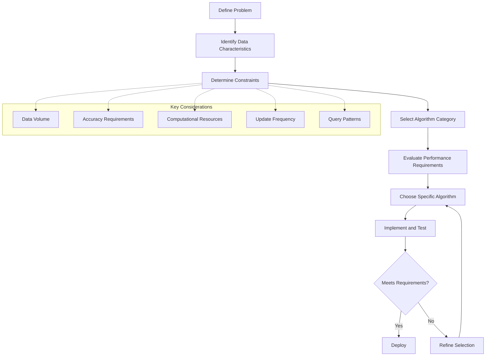

# Geospatial Algorithms

This section provides information about computational algorithms and methods
for geospatial data processing, analysis, and modeling, and how they map onto
the GEO-INFER framework.

## Contents

- [Spatial Indexing](spatial_indexing.md) — algorithms for efficient spatial
  queries and data organization (including H3 v4).
- [Geometric Algorithms](geometric_algorithms.md) — computational geometry in
  geospatial applications.
- [Spatial Analysis](../analysis/index.md) — analysis methods built on these
  algorithms.
- [Spatial Concepts](../concepts/index.md) — coordinate systems, scale, and
  data models.

## Core Algorithm Categories

### Spatial Indexing

Techniques for organizing spatial data to enable efficient queries:

- **R-Trees** — tree structure using minimum bounding rectangles (see
  [Spatial Indexing](spatial_indexing.md)).
- **Quadtrees / Octrees** — hierarchical spatial subdivision (see
  [Spatial Indexing](spatial_indexing.md#quadtrees-2d-and-octrees-3d)).
- **H3 Indexing** — hexagonal hierarchical system, the native GEO-INFER grid
  (see the [H3 guide](../data_formats/h3/index.md)).
- **Space-filling Curves** — linearizing multidimensional space (see
  [Spatial Indexing](spatial_indexing.md)).
- **Grid-based Systems** — regular and irregular grids (see
  [Spatial Indexing](spatial_indexing.md#grid-based-indexing)).

### Computational Geometry

Algorithms for geometric operations:

- **Point-in-Polygon** — determining if a point lies within a polygon.
- **Line Intersection** — finding intersections between line segments.
- **Polygon Overlay** — computing geometric unions, intersections, etc.
- **Voronoi Diagrams** — partitioning space based on distance to points.
- **Delaunay Triangulation** — triangulating a set of points.
- **Convex Hull** — finding the smallest convex set containing points.
- **Douglas-Peucker Algorithm** — line simplification.
- **Buffer Generation** — creating zones of specified distance.

### Network Analysis

Algorithms for graph and network operations:

- **Shortest Path** — Dijkstra's, A*, Bellman-Ford algorithms.
- **Traveling Salesperson** — finding optimal routes through multiple points.
- **Network Flow** — modeling flow through a network.
- **Location-Allocation** — optimizing facility locations.
- **Route Optimization** — finding optimal paths with constraints.
- **Isochrone Generation** — areas reachable within time/distance.

### Spatial Interpolation

Methods for estimating continuous surfaces:

- **Inverse Distance Weighting (IDW)** — weighted average based on distance.
- **Kriging** — geostatistical method using spatial correlation.
- **Spline** — piecewise polynomial interpolation.
- **Natural Neighbor** — area-based interpolation method.
- **Trend Surface Analysis** — polynomial regression for trend fitting.
- **Triangulated Irregular Network (TIN)** — interpolation based on
  triangulation.

### Terrain Analysis

Algorithms for digital elevation model (DEM) processing:

- **Slope and Aspect Calculation** — surface derivatives.
- **Viewshed Analysis** — visibility determination.
- **Flow Direction and Accumulation** — hydrological modeling.
- **Watershed Delineation** — identifying drainage basins.
- **Terrain Classification** — identifying landforms and features.
- **Solar Radiation Analysis** — modeling sun exposure.

### Spatial Statistics

Statistical methods with spatial components:

- **Spatial Autocorrelation** — Moran's I, Geary's C.
- **Hot Spot Analysis** — Getis-Ord Gi*.
- **Spatial Regression** — models accounting for spatial dependence.
- **Kernel Density Estimation** — non-parametric density estimation.
- **Cluster Analysis** — identifying spatial clusters.
- **Point Pattern Analysis** — analyzing point distributions.

The GEO-INFER-MATH module implements the spatial statistics primitives; see
the [MATH module page](../../modules/geo-infer-math.md).

### Machine Learning in Geospatial

ML applications for spatial data:

- **Spatial Classification** — land cover classification, feature extraction.
- **Spatial Clustering** — identifying spatial patterns and groupings.
- **Spatial Regression** — modeling relationships with spatial dependency.
- **Deep Learning** — convolutional neural networks for geospatial imagery.
- **Object Detection** — feature identification in satellite/aerial imagery.
- **Semantic Segmentation** — pixel-level classification of images.

## Algorithm Selection Process

## Implementation in GEO-INFER

The GEO-INFER framework implements many of these algorithms in the SPACE and
MATH modules:

- **`geo_infer_space`** — H3 v4 indexing (`latlng_to_cell`, `cell_to_latlng`,
  `polygon_to_cells`), geometric operations, and spatial analytics interfaces;
  see the [SPACE module page](../../modules/geo-infer-space.md).
- **`geo_infer_math`** — spatial statistics (Moran's I, Geary's C, Getis-Ord,
  entropy, and related primitives); see the [MATH module page](../../modules/geo-infer-math.md).

Run `GEO-INFER-*/examples` for runnable scripts using these APIs.

## Algorithm Complexity

Understanding the computational complexity of geospatial algorithms is
critical for scalable applications:

| Algorithm Type | Time Complexity | Space Complexity | Parallelizable | Example |
|---------------|-----------------|------------------|---------------|---------|
| Point-in-Polygon | O(n) | O(1) | Partially | Ray casting algorithm |
| R-Tree Search | O(log n) | O(n) | Partially | Spatial database query |
| Kriging | O(n³) | O(n²) | Yes | Geostatistical interpolation |
| Shortest Path | O(E + V log V) | O(V) | Partially | Dijkstra's with priority queue |
| Viewshed | O(n²) | O(n) | Yes | Line-of-sight analysis |
| K-means Clustering | O(k·n·i) | O(n + k) | Yes | Spatial clustering |

*Where n = number of points/features, V = vertices, E = edges, k = clusters,
i = iterations.*

## Integration with Workflows

Geospatial algorithms can be incorporated into GEO-INFER workflows: as
individual processing nodes, as part of analysis chains, within custom Python
functions, or through external service connections. See the
[Workflow System](../../workflows/index.md) documentation for details on
integrating these algorithms into processing chains.

## Related Resources

- [Spatial Analysis](../analysis/index.md)
- [Workflow System](../../workflows/index.md)
- [Examples gallery](../../examples_gallery.md)
- [Performance Optimization](../../advanced/performance_optimization.md)
- [API Reference](../../api/reference.md)
