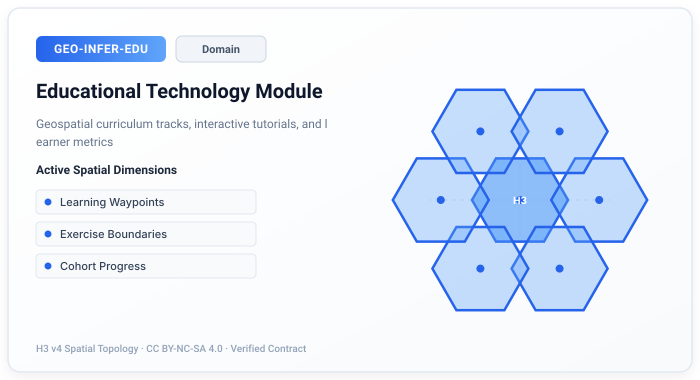

# GEO-INFER-EDU: Educational Technology Module
> **Illustrative example notice.** This page contains historical or
> conceptual integration sketches. Names such as `SpatialAnalyzer` and
> domain-specific facade classes are not public GEO-INFER exports in the
> current checkout; verify imports against each module's `src/` package
> and use the module README/tests for executable examples.
> **Purpose**: Geospatial education, curriculum development, and learning experiences
>
> This module provides educational capabilities including curriculum design, interactive exercises, progress tracking, and integration with Active Inference principles.
## Overview
Note: Code examples are illustrative; see `GEO-INFER-EDU/examples` for runnable scripts.
### Links
- Module README: ../../GEO-INFER-EDU/README.md
- Modules Overview: ../modules/index.md
GEO-INFER-EDU implements educational technology for geospatial applications. It provides:
- **Curriculum Design**: Standards-aligned geospatial curriculum generation
- **Interactive Exercises**: Hands-on learning activities with spatial data
- **Progress Tracking**: Learning analytics, assessment, and competency tracking
- **Resource Recommendations**: Personalized learning paths and adaptive content
- **Professional Development**: Continuing education and certification for GIS professionals
### Pedagogical Foundations
#### Active Learning Theory
The module implements active learning principles:
```
Retention = f(engagement, practice, feedback)
```
Where learning effectiveness is maximized through hands-on spatial exercises with immediate feedback.
#### Competency-Based Progression
Skills are organized into competency frameworks:
```
Competency = Knowledge + Skills + Context
```
Enabling structured progression from foundational to geospatial concepts.
## Core Features
### 1. Curriculum Design
**Purpose**: Generate standards-aligned geospatial curricula.
```python
from geo_infer_edu import CurriculumDesigner
# Initialize curriculum designer
designer = CurriculumDesigner(
standards=['bok', 'gistbok', 'ngss'],
pedagogical_approach='constructivist',
assessment_framework='competency_based'
)
# Design curriculum
curriculum = designer.design(
topic='geospatial_analysis',
level='intermediate',
duration='8_weeks',
learning_objectives=[
'Perform spatial analysis using H3 indexing',
'Apply Active Inference to spatial problems',
'Integrate multiple data sources for analysis'
]
)
# Generate module sequence
modules = designer.generate_modules(
curriculum=curriculum,
module_count=8,
hours_per_module=4,
includes=['lecture', 'lab', 'assessment']
)
# Align with standards
alignment = designer.align_with_standards(
curriculum=curriculum,
target_standards=['bok_spatial_analysis', 'bok_gis_design'],
coverage_report=True
)
# Create learning pathway
pathway = designer.create_learning_pathway(
learner_profile=student_background,
target_competencies=desired_skills,
available_time='10_hours_week',
optimization='efficiency'
)
```
### 2. Interactive Exercises
**Purpose**: Create engaging hands-on learning activities.
```python
from geo_infer_edu import ExerciseGenerator
# Initialize exercise generator
generator = ExerciseGenerator(
exercise_types=['mapping', 'analysis', 'coding', 'problem_solving'],
difficulty_scaling='adaptive',
feedback_mode='immediate'
)
# Create spatial analysis exercises
exercises = generator.create(
concepts=['spatial_analysis', 'remote_sensing', 'geostatistics'],
format='interactive_map',
difficulty='progressive',
include_hints=True
)
# Generate coding exercises
coding_exercises = generator.create_coding_exercises(
topic='h3_spatial_indexing',
language='python',
framework='geo_infer',
test_cases=True,
starter_code=True
)
# Create problem-based learning scenarios
pbl_scenarios = generator.create_pbl_scenario(
context='urban_planning',
problem='optimize_fire_station_locations',
data_provided=['population_density', 'road_network', 'existing_stations'],
expected_deliverables=['analysis_report', 'optimal_locations', 'justification']
)
# Generate assessment items
assessment = generator.create_assessment(
learning_objectives=module_objectives,
item_types=['multiple_choice', 'practical', 'project'],
difficulty_distribution={'easy': 0.3, 'medium': 0.5, 'hard': 0.2},
rubrics=True
)
```
### 3. Progress Tracking
**Purpose**: Monitor learner progress and provide analytics.
```python
from geo_infer_edu import ProgressTracker
# Initialize progress tracker
tracker = ProgressTracker(
competency_framework='geospatial_bok',
analytics_level='detailed',
privacy_compliance='ferpa'
)
# Track learner progress
progress = tracker.track_progress(
learner_id=student_id,
activity_log=learning_activities,
assessments=completed_assessments
)
# Generate competency report
competency_report = tracker.generate_competency_report(
learner_id=student_id,
competencies=['spatial_analysis', 'cartography', 'programming'],
visualization='radar_chart'
)
# Identify knowledge gaps
gaps = tracker.identify_gaps(
learner_progress=progress,
required_competencies=course_requirements,
recommendations=True
)
# Learning analytics dashboard
analytics = tracker.generate_analytics(
cohort=class_roster,
metrics=['completion_rate', 'assessment_scores', 'time_on_task', 'engagement'],
aggregation='weekly',
visualization='dashboard'
)
# Predict at-risk learners
at_risk = tracker.identify_at_risk(
cohort=class_roster,
risk_indicators=['low_engagement', 'declining_scores', 'missed_deadlines'],
intervention_recommendations=True
)
```
### 4. Personalized Learning
**Purpose**: Adapt learning experiences to individual needs.
```python
from geo_infer_edu import PersonalizedLearning
# Initialize personalized learning engine
personalization = PersonalizedLearning(
adaptation_method='knowledge_tracing',
recommendation_algorithm='collaborative_filtering',
learning_styles=['visual', 'kinesthetic', 'reading']
)
# Create personalized pathway
pathway = personalization.create_pathway(
learner_profile=student_assessment,
learning_goals=target_competencies,
constraints={'time': '20_hours', 'deadline': '2024-03-01'},
optimization='mastery'
)
# Recommend resources
recommendations = personalization.recommend_resources(
learner_id=student_id,
current_topic='spatial_statistics',
resource_types=['video', 'tutorial', 'exercise', 'reading'],
difficulty='appropriate'
)
# Adaptive content delivery
adaptive_content = personalization.deliver_adaptive_content(
learner_id=student_id,
topic='geostatistics',
format_preference=student_preferences,
mastery_level=current_mastery
)
# Spaced repetition for retention
review_schedule = personalization.schedule_review(
learner_id=student_id,
mastered_topics=completed_topics,
retention_model='forgetting_curve',
review_frequency='optimal'
)
```
### 5. Professional Development
**Purpose**: Support continuing education for GIS professionals.
```python
from geo_infer_edu import ProfessionalDevelopment
# Initialize professional development module
pro_dev = ProfessionalDevelopment(
certification_bodies=['gisp', 'esri', 'osgeo'],
credit_tracking=True,
competency_framework='professional'
)
# Track continuing education
ce_log = pro_dev.track_continuing_education(
professional_id=user_id,
activities=professional_activities,
credits_earned=credit_hours
)
# Generate certification pathway
certification = pro_dev.create_certification_pathway(
target_certification='gisp',
current_qualifications=user_credentials,
timeline='12_months'
)
# Skill gap analysis for career
career_analysis = pro_dev.analyze_career_skills(
current_skills=user_skills,
target_role='geospatial_data_scientist',
job_market_data=skills_demand,
recommendations=True
)
# Portfolio development
portfolio = pro_dev.develop_portfolio(
projects=completed_projects,
competencies_demonstrated=skill_evidence,
format='professional_portfolio'
)
```
## API Reference
### CurriculumDesigner
Curriculum design and generation.
```python
class CurriculumDesigner:
def __init__(self, standards, pedagogical_approach='constructivist',
assessment_framework='competency_based'):
"""
Initialize curriculum designer.
Args:
standards (list): Educational standards to align with
pedagogical_approach (str): Teaching methodology
assessment_framework (str): Assessment approach
"""
def design(self, topic, level, duration, learning_objectives):
"""Design curriculum for specified parameters."""
def generate_modules(self, curriculum, module_count, hours_per_module, includes):
"""Generate learning modules from curriculum."""
def align_with_standards(self, curriculum, target_standards, coverage_report):
"""Align curriculum with educational standards."""
```
### ExerciseGenerator
Interactive exercise creation.
```python
class ExerciseGenerator:
def __init__(self, exercise_types, difficulty_scaling='adaptive',
feedback_mode='immediate'):
"""
Initialize exercise generator.
Args:
exercise_types (list): Types of exercises to generate
difficulty_scaling (str): Difficulty adjustment method
feedback_mode (str): Feedback delivery mode
"""
def create(self, concepts, format, difficulty, include_hints):
"""Create exercises for specified concepts."""
def create_coding_exercises(self, topic, language, framework, test_cases, starter_code):
"""Generate coding exercises with tests."""
def create_assessment(self, learning_objectives, item_types, difficulty_distribution, rubrics):
"""Create assessment items with rubrics."""
```
### ProgressTracker
Learning progress monitoring.
```python
class ProgressTracker:
def __init__(self, competency_framework='geospatial_bok',
analytics_level='detailed', privacy_compliance='ferpa'):
"""
Initialize progress tracker.
Args:
competency_framework (str): Competency framework to use
analytics_level (str): Detail level for analytics
privacy_compliance (str): Privacy standard to comply with
"""
def track_progress(self, learner_id, activity_log, assessments):
"""Track individual learner progress."""
def generate_competency_report(self, learner_id, competencies, visualization):
"""Generate competency achievement report."""
def identify_at_risk(self, cohort, risk_indicators, intervention_recommendations):
"""Identify learners at risk of failure."""
```
## Use Cases
### 1. University GIS Course
**Problem**: Design and deliver an undergraduate GIS course.
```python
from geo_infer_edu import CurriculumDesigner, ExerciseGenerator, ProgressTracker
# Design course curriculum
designer = CurriculumDesigner(standards=['bok'])
curriculum = designer.design(
topic='introduction_to_gis',
level='undergraduate',
duration='16_weeks',
learning_objectives=[
'Understand fundamental GIS concepts',
'Perform basic spatial analysis',
'Create cartographic products'
]
)
# Generate weekly labs
generator = ExerciseGenerator()
labs = [generator.create(
concepts=week_concepts,
format='interactive_lab',
difficulty='progressive'
) for week_concepts in curriculum.weekly_topics]
# Track class progress
tracker = ProgressTracker()
class_analytics = tracker.generate_analytics(
cohort=enrolled_students,
metrics=['completion_rate', 'lab_scores', 'engagement'],
visualization='instructor_dashboard'
)
# Adapt content for struggling students
at_risk = tracker.identify_at_risk(cohort=enrolled_students)
for student in at_risk:
intervention = tracker.recommend_intervention(
learner_id=student,
intervention_types=['tutoring', 'additional_exercises', 'office_hours']
)
```
### 2. Corporate Training Program
**Problem**: Train employees in geospatial data analysis.
```python
from geo_infer_edu import CurriculumDesigner, PersonalizedLearning, ProgressTracker
# Design corporate training
designer = CurriculumDesigner(standards=['industry_skills'])
training = designer.design(
topic='geospatial_data_analysis',
level='professional',
duration='4_weeks',
learning_objectives=[
'Analyze spatial patterns in business data',
'Create location intelligence reports',
'Integrate GIS with business workflows'
]
)
# Create personalized learning paths
personalization = PersonalizedLearning()
for employee in training_cohort:
pathway = personalization.create_pathway(
learner_profile=employee.skill_assessment,
learning_goals=job_requirements,
constraints={'time': '5_hours_week'}
)
# Track completion for HR
tracker = ProgressTracker()
completion_report = tracker.generate_completion_report(
cohort=training_cohort,
required_competencies=training.competencies,
certification_criteria=passing_threshold
)
```
### 3. K-12 Geography Education
**Problem**: Integrate geospatial technology into K-12 geography curriculum.
```python
from geo_infer_edu import CurriculumDesigner, ExerciseGenerator
# Design age-appropriate curriculum
designer = CurriculumDesigner(standards=['ngss', 'c3_framework'])
k12_curriculum = designer.design(
topic='geographic_information_systems',
level='middle_school',
duration='1_semester',
learning_objectives=[
'Read and create maps',
'Understand spatial relationships',
'Use technology for geographic inquiry'
]
)
# Generate engaging activities
generator = ExerciseGenerator()
activities = generator.create(
concepts=['map_reading', 'spatial_patterns', 'local_geography'],
format='gamified',
difficulty='age_appropriate',
engagement_features=['badges', 'leaderboard', 'achievements']
)
# Create project-based assessment
project = generator.create_pbl_scenario(
context='community_mapping',
problem='map_safe_routes_to_school',
grade_level='6-8',
cross_curricular=['math', 'social_studies', 'technology']
)
```
## Integration with Other Modules
### GEO-INFER-APP Integration
```python
from geo_infer_edu import ExerciseGenerator
from geo_infer_app import WebApplication
# Create interactive learning applications
generator = ExerciseGenerator()
app = WebApplication()
# Build learning platform
learning_platform = app.create_learning_platform(
exercises=generator.create_exercise_library(),
progress_tracking=True,
authentication='single_sign_on'
)
```
### GEO-INFER-EXAMPLES Integration
```python
from geo_infer_edu import CurriculumDesigner
from geo_infer_examples import ExampleLibrary
# Integrate examples into curriculum
designer = CurriculumDesigner()
examples = ExampleLibrary()
# Link curriculum to runnable examples
curriculum_with_examples = designer.link_examples(
curriculum=course_curriculum,
examples=examples.get_by_topic(),
integration='embedded'
)
```
### GEO-INFER-SPACE Integration
```python
from geo_infer_edu import ExerciseGenerator
from geo_infer_space import SpatialAnalyzer
# Create spatial analysis exercises
generator = ExerciseGenerator()
spatial = SpatialAnalyzer()
# Generate exercises using real spatial analysis
exercises = generator.create_spatial_exercises(
analyzer=spatial,
topics=['clustering', 'interpolation', 'h3_indexing'],
datasets=educational_datasets
)
```
## Troubleshooting
### Common Issues
**Content difficulty mismatch:**
```python
# Calibrate difficulty levels
generator.calibrate_difficulty(
learner_responses=historical_responses,
method='item_response_theory'
)
# Adjust adaptive algorithm
personalization.tune_adaptation(
sensitivity=0.5,
difficulty_step=0.1
)
```
**Progress tracking gaps:**
```python
# Enable offline activity tracking
tracker.enable_offline_sync(
sync_interval='on_connection'
)
# Integrate external LMS
tracker.integrate_lms(
platform='canvas',
sync='bidirectional'
)
```
## Performance Optimization
```python
# Cache learning content
generator.enable_content_caching(cache_size=1000)
# Optimize recommendation queries
personalization.enable_index(
indices=['learner_profile', 'resource_topic']
)
# Batch analytics processing
tracker.batch_analytics(
batch_size=100,
schedule='hourly'
)
```
## Related Documentation
### Related Modules
- **[GEO-INFER-APP](../modules/geo-infer-app.md)** - Interactive learning interfaces
- **[GEO-INFER-EXAMPLES](../modules/geo-infer-examples.md)** - Sample datasets and tutorials
- **[GEO-INFER-SPACE](../modules/geo-infer-space.md)** - Core spatial concepts
- **[GEO-INFER-DATA](../modules/geo-infer-data.md)** - Educational datasets
---
**Ready to get started?** Check out the **[Curriculum Design Tutorial](../getting_started/index.md)** or explore **[Interactive Exercise Examples](../examples_gallery.md)**!

## 🗺️ Interactive Spatial Preview

Pre-rendered spatial snapshot for **GEO-INFER-EDU** (*Educational Technology Module*). Reproducible preview cards are generated by `geo_infer_intra.core.documentation.visual_preview`.

| Preview | Widget |
| --- | --- |
|  | [Interactive map](previews/geo-infer-edu_preview.html) · [PNG](previews/geo-infer-edu_preview.png) |

> **Reproducible contract:** each map ships as `geo-infer-edu_preview.html`, `geo-infer-edu_preview.svg`, `geo-infer-edu_preview.png`, and `geo-infer-edu_preview.manifest.json` beneath `previews/`. The receipt records geometry provenance and artifact SHA-256 hashes. Values are illustrative, not observations.