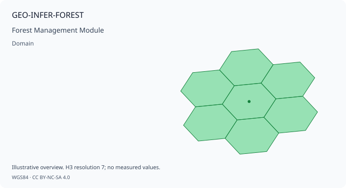

# GEO-INFER-FOREST: Forest Management Module

> **Illustrative example notice.** This page contains historical or
> conceptual integration sketches. Names such as `SpatialAnalyzer` and
> domain-specific facade classes are not public GEO-INFER exports in the
> current checkout; verify imports against each module's `src/` package
> and use the module README/tests for executable examples.

> **Purpose**: Forest monitoring, deforestation detection, and sustainable forestry
>
> This module provides forest management capabilities including health monitoring, biomass estimation, fire risk assessment, and integration with Active Inference principles.

## Overview
Note: Code examples are illustrative; see `GEO-INFER-FOREST/examples` for runnable scripts.

### Links
- Module README: ../../GEO-INFER-FOREST/README.md - Modules Overview: ../modules/index.md GEO-INFER-FOREST implements forest analysis for geospatial applications. It provides:

- **Forest Health Monitoring**: Vegetation indices, condition assessment, and stress detection - **Deforestation Detection**: Change detection, early warning alerts, and degradation mapping - **Biomass Estimation**: Above-ground carbon stocks and carbon sequestration rates - **Fire Risk Assessment**: Wildfire probability modeling and fuel load mapping - **Sustainable Forestry**: Harvest planning, regeneration monitoring, and certification support

### Mathematical Foundations

#### Vegetation Index Calculations
The module uses normalized difference indices:

```
 NDVI = (NIR - Red) / (NIR + Red) EVI = 2.5 * (NIR - Red) / (NIR + 6*Red - 7.5*Blue + 1) NBR = (NIR - SWIR) / (NIR + SWIR)
```
 #### Biomass Estimation Above-ground biomass estimated using allometric equations:
```
 AGB = a * DBH^b * H^c
```
 Where: - `AGB` is above-ground biomass - `DBH` is diameter at breast height - `H` is tree height - `a, b, c` are species-specific coefficients ## Core Features ### 1. Forest Health Analysis **Purpose**: Monitor forest health and detect stress conditions.
```python
 from geo_infer_forest import ForestHealthAnalyzer # Initialize forest health analyzer analyzer = ForestHealthAnalyzer( sensor_type='sentinel2', indices=['ndvi', 'evi', 'nbr', 'ndmi', 'chlorophyll'], baseline_period=('2015-01-01', '2020-12-31'), cloud_mask=True ) # Assess forest health status health_status = analyzer.assess( imagery=satellite_data, indices=['ndvi', 'evi', 'nbr'], baseline=reference_period, include_uncertainty=True ) # Detect forest stress stress_detection = analyzer.detect_stress( current_imagery=recent_images, baseline_imagery=reference_images, stress_types=['drought', 'pest', 'disease'], sensitivity=0.8 ) # Calculate vegetation phenology phenology = analyzer.calculate_phenology( time_series=ndvi_time_series, metrics=['green_up', 'peak', 'senescence', 'dormancy'], method='timesat' ) # Generate forest health maps health_map = analyzer.generate_health_map( region=forest_boundary, resolution=10, # meters classification=['healthy', 'stressed', 'declining', 'dead'] )
```
 ### 2. Deforestation Detection **Purpose**: Detect and monitor forest loss and degradation.
```python
 from geo_infer_forest import DeforestationDetector # Initialize deforestation detector detector = DeforestationDetector( algorithm='bfast', temporal_resolution='monthly', minimum_mapping_unit=0.5, # hectares alert_system=True ) # Detect deforestation changes = detector.detect( current=recent_imagery, baseline=historical_imagery, method='bfast', confidence_threshold=0.9 ) # Near-real-time alerts alerts = detector.generate_alerts( monitoring_region=protected_areas, alert_frequency='weekly', notification_channels=['email', 'dashboard'], alert_threshold='high_confidence' ) # Map forest degradation degradation = detector.map_degradation( imagery_series=landsat_series, degradation_types=['selective_logging', 'fragmentation', 'fire_damage'], severity_classes=['low', 'moderate', 'severe'] ) # Calculate deforestation rates rates = detector.calculate_rates( change_maps=historical_changes, time_periods=['2010-2015', '2015-2020', '2020-2025'], aggregation_units=administrative_boundaries )
```
 ### 3. Biomass and Carbon Estimation **Purpose**: Estimate forest biomass and carbon stocks.
```python
 from geo_infer_forest import BiomassEstimator # Initialize biomass estimator estimator = BiomassEstimator( method='lidar_sar_fusion', allometric_equations='default', uncertainty_quantification=True ) # Estimate above-ground biomass agb = estimator.estimate_biomass( lidar_data=als_point_cloud, sar_data=alos_palsar, optical_data=sentinel2, forest_type=forest_type_map, include_uncertainty=True ) # Calculate carbon stocks carbon = estimator.calculate_carbon( biomass=agb, carbon_fraction=0.47, pools=['above_ground', 'below_ground', 'dead_wood', 'litter', 'soil'] ) # Model carbon sequestration sequestration = estimator.model_sequestration( forest_age=stand_age_map, growth_curves=regional_growth_curves, management_scenarios=['business_as_usual', 'conservation', 'restoration'] ) # Generate carbon maps carbon_map = estimator.generate_carbon_map( region=forest_extent, resolution=30, output_format='geotiff' )
```
 ### 4. Fire Risk Assessment **Purpose**: Assess and predict wildfire risk.
```
python from geo_infer_forest import FireRiskModeler # Initialize fire risk modeler fire_modeler = FireRiskModeler( fuel_model='scott_burgan', weather_integration=True, ignition_model='human_lightning_combined' ) # Assess fire risk risk = fire_modeler.assess_risk( region=forest_area, weather_conditions=current_weather, fuel_moisture=live_dead_fuel_moisture, topography=dem_data, time_horizon='7_days' ) # Model fire behavior behavior = fire_modeler.model_behavior( ignition_point=ignition_location, fuel_map=fuel_type_map, weather=weather_forecast, simulation_hours=72, spread_model='farsite' ) # Map fuel loads fuel_map = fire_modeler.map_fuel_loads( vegetation_data=landcover_map, lidar_data=canopy_height, fuel_classification='fbps' # Fire Behavior Prediction System ) # Generate fire weather index fwi = fire_modeler.calculate_fire_weather_index( temperature=temp_data, humidity=rh_data, wind=wind_data, precipitation=precip_data, method='canadian_fwi' )
```
 ### 5. Sustainable Forestry Planning **Purpose**: Plan and monitor sustainable forest management.
```
python from geo_infer_forest import SustainableForestryPlanner # Initialize forestry planner planner = SustainableForestryPlanner( certification_standard='fsc', planning_horizon_years=50, rotation_optimization=True ) # Optimize harvest planning harvest_plan = planner.optimize_harvest( forest_inventory=stand_data, growth_projections=yield_tables, constraints=['annual_allowable_cut', 'adjacency', 'wildlife_corridors'], objectives=['timber_volume', 'carbon_retention', 'biodiversity'] ) # Monitor regeneration regeneration = planner.monitor_regeneration( harvest_areas=harvested_stands, imagery_series=post_harvest_imagery, success_criteria={'stem_density': 1000, 'height': 1.5} ) # Assess biodiversity biodiversity = planner.assess_biodiversity( forest_structure=lidar_metrics, species_observations=wildlife_data, habitat_models=species_models, indices=['shannon', 'simpson', 'structural_complexity'] ) # Generate certification reports report = planner.generate_certification_report( management_unit=forest_unit, standard='fsc', indicators=['hcv_areas', 'buffer_zones', 'regeneration_success'] )
```
 ## API Reference ### ForestHealthAnalyzer Forest health monitoring and analysis.
```
python class ForestHealthAnalyzer: def __init__(self, sensor_type='sentinel2', indices=None, baseline_period=None, cloud_mask=True): """ Initialize forest health analyzer. Args: sensor_type (str): Satellite sensor type indices (list): Vegetation indices to calculate baseline_period (tuple): Baseline reference period cloud_mask (bool): Enable cloud masking """ def assess(self, imagery, indices, baseline, include_uncertainty): """Assess forest health from satellite imagery.""" def detect_stress(self, current_imagery, baseline_imagery, stress_types, sensitivity): """Detect forest stress conditions.""" def calculate_phenology(self, time_series, metrics, method): """Calculate vegetation phenology metrics."""
```
 ### DeforestationDetector Deforestation and forest change detection.
```
python class DeforestationDetector: def __init__(self, algorithm='bfast', temporal_resolution='monthly', minimum_mapping_unit=0.5, alert_system=True): """ Initialize deforestation detector. Args: algorithm (str): Detection algorithm ('bfast', 'landtrendr', 'ccdc') temporal_resolution (str): Temporal resolution for monitoring minimum_mapping_unit (float): Minimum detectable area in hectares alert_system (bool): Enable alert system """ def detect(self, current, baseline, method, confidence_threshold): """Detect deforestation between time periods.""" def generate_alerts(self, monitoring_region, alert_frequency, notification_channels, alert_threshold): """Generate near-real-time deforestation alerts."""
```
 ### BiomassEstimator Forest biomass and carbon estimation.
```
python class BiomassEstimator: def __init__(self, method='lidar_sar_fusion', allometric_equations='default', uncertainty_quantification=True): """ Initialize biomass estimator. Args: method (str): Estimation method allometric_equations (str): Allometric equation set to use uncertainty_quantification (bool): Enable uncertainty estimation """ def estimate_biomass(self, lidar_data, sar_data, optical_data, forest_type, include_uncertainty): """Estimate above-ground biomass.""" def calculate_carbon(self, biomass, carbon_fraction, pools): """Calculate carbon stocks from biomass."""
```
 ## Use Cases ### 1. REDD+ MRV System **Problem**: Implement a Measurement, Reporting, and Verification system for REDD+.
```
python from geo_infer_forest import DeforestationDetector, BiomassEstimator from geo_infer_climate import CarbonAccountant # Set up deforestation monitoring detector = DeforestationDetector(algorithm='bfast') deforestation = detector.detect( current=recent_imagery, baseline=reference_period, method='bfast' ) # Estimate emission factors estimator = BiomassEstimator() carbon_stocks = estimator.calculate_carbon( biomass=agb_map, pools=['above_ground', 'below_ground'] ) # Calculate emissions from deforestation accountant = CarbonAccountant() emissions = accountant.calculate_deforestation_emissions( deforestation_map=deforestation, carbon_map=carbon_stocks, emission_factors='ipcc_tier2' ) # Generate REDD+ report report = accountant.generate_redd_report( activity_data=deforestation, emission_factors=emissions, reference_level=baseline_emissions, reporting_format='unfccc' )
```
 ### 2. Wildfire Risk Management **Problem**: Develop wildfire risk management system.
```
python from geo_infer_forest import FireRiskModeler, ForestHealthAnalyzer from geo_infer_risk import RiskAssessor # Assess fire risk fire_modeler = FireRiskModeler() fire_risk = fire_modeler.assess_risk( region=wildland_urban_interface, weather_conditions=current_weather, fuel_moisture=fuel_moisture_data ) # Identify high-risk areas high_risk_areas = fire_risk[fire_risk['risk_level'] == 'extreme'] # Plan fuel treatments treatment_plan = fire_modeler.plan_fuel_treatments( high_risk_areas=high_risk_areas, treatment_types=['prescribed_burn', 'mechanical', 'chemical'], budget=available_budget, optimization_objective='risk_reduction' ) # Monitor treatment effectiveness effectiveness = fire_modeler.monitor_treatment( treated_areas=completed_treatments, pre_treatment=before_imagery, post_treatment=after_imagery )
```
 ### 3. Forest Certification Compliance **Problem**: Monitor and verify compliance with forest certification standards.
```
python from geo_infer_forest import SustainableForestryPlanner, DeforestationDetector from geo_infer_bio import BiodiversityAssessor # Monitor protected areas detector = DeforestationDetector() hcv_monitoring = detector.monitor_protected_areas( protected_areas=high_conservation_value, monitoring_frequency='monthly', alert_enabled=True ) # Assess biodiversity indicators bio_assessor = BiodiversityAssessor() biodiversity_status = bio_assessor.assess( monitoring_plots=biodiversity_plots, species_data=occurrence_data, habitat_quality=habitat_maps ) # Generate compliance report planner = SustainableForestryPlanner(certification_standard='fsc') compliance = planner.assess_compliance( management_unit=certified_forest, indicators=['deforestation', 'biodiversity', 'water_protection'], thresholds=fsc_criteria )
```
 ## Integration with Other Modules ### GEO-INFER-SPACE Integration
```
python from geo_infer_forest import ForestHealthAnalyzer from geo_infer_space import SpatialAnalyzer # Combine forest and spatial analysis forest_analyzer = ForestHealthAnalyzer() spatial_analyzer = SpatialAnalyzer() # Spatial aggregation by H3 cells forest_metrics_h3 = spatial_analyzer.aggregate_by_h3( data=forest_health_data, resolution=8, metrics=['mean_ndvi', 'deforestation_area', 'biomass'] ) # Analyze spatial patterns patterns = spatial_analyzer.spatial_autocorrelation( data=forest_metrics_h3, variable='deforestation_area' )
```
 ### GEO-INFER-BIO Integration
```
python from geo_infer_forest import ForestHealthAnalyzer from geo_infer_bio import BiodiversityModeler # Link forest structure to biodiversity forest_analyzer = ForestHealthAnalyzer() bio_modeler = BiodiversityModeler() # Generate habitat suitability habitat = bio_modeler.model_habitat( species='spotted_owl', forest_structure=lidar_metrics, forest_type=forest_classification )
```
 ## Troubleshooting ### Common Issues **Cloud contamination in imagery:**
```
python # Apply cloud masking analyzer.set_cloud_masking( algorithm='fmask', cloud_probability_threshold=0.2, shadow_detection=True ) # Use composite imagery composite = analyzer.create_composite( imagery_collection=image_series, method='medoid', time_window='seasonal' )
```
 **Inaccurate biomass estimates:**
```
python # Calibrate with field data estimator.calibrate( field_plots=ground_truth, validation_split=0.2, method='machine_learning' ) # Use local allometric equations estimator.set_allometric_equations( equations=local_equations, species_groups=forest_types )
```
 ## Performance Optimization
```
python # Enable parallel processing analyzer.enable_parallel_processing(n_workers=8) # Use chunked processing for large areas for tile in analyzer.tile_region(forest_extent, tile_size=10000): results = analyzer.process_tile(tile) # Enable GPU acceleration estimator.enable_gpu_acceleration(gpu_memory_gb=8)
```
 ## Related Documentation ### Related Modules - **[GEO-INFER-SPACE](../modules/geo-infer-space.md)** - Spatial forest mapping - **[GEO-INFER-TIME](../modules/geo-infer-time.md)** - Temporal change detection - **[GEO-INFER-BIO](../modules/geo-infer-bio.md)** - Forest biodiversity - **[GEO-INFER-CLIMATE](../modules/geo-infer-climate.md)** - Climate impacts - **[GEO-INFER-RISK](../modules/geo-infer-risk.md)** - Wildfire risk --- **Ready to get started?** Check out the **[Forest Monitoring Tutorial](../getting_started/index.md)** or explore **[Deforestation Alert Examples](../examples_gallery.md)**!

## 🗺️ Interactive Spatial Preview

Pre-rendered spatial snapshot for **GEO-INFER-FOREST** (*Forest Management Module*). Reproducible preview cards are generated by `geo_infer_intra.core.documentation.visual_preview`.

| Preview | Widget |
| --- | --- |
|  | [Interactive map](previews/geo-infer-forest_preview.html) · [PNG](previews/geo-infer-forest_preview.png) |

> **Reproducible contract:** each map ships as `geo-infer-forest_preview.html`, `geo-infer-forest_preview.svg`, `geo-infer-forest_preview.png`, and `geo-infer-forest_preview.manifest.json` beneath `previews/`. The receipt records geometry provenance and artifact SHA-256 hashes. Values are illustrative, not observations.