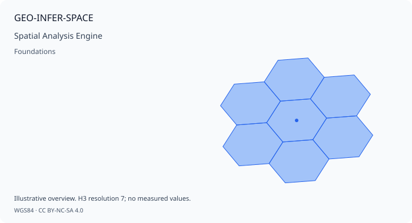

# GEO-INFER-SPACE

GEO-INFER-SPACE provides geospatial primitives and backend dispatch for the
GEO-INFER workspace. The maintained implementation is under
`GEO-INFER-SPACE/src/geo_infer_space/`.

## Public package surface

The package exports these interfaces and helpers from `geo_infer_space`:

- `SpatialIndexingInterface`
- `GeometricOperationsInterface`
- `SpatialAnalyticsInterface`
- `latlng_to_cell`, `cell_to_latlng`, and `polygon_to_cells`
- `get_backend_dispatcher` and `configure_backends`
- `UnsupportedSpatialOperationError`
- Optional `PlaceAnalyzer`, `SpatialUtils`, and `GISManager` imports (these are
  `None` when their optional dependencies are unavailable)

The H3 implementation uses the native H3 v4 API. Keep H3 cell IDs real and
validate resolution and coordinate order at module boundaries.

## Basic H3 indexing

```python
import geo_infer_space as space

cell = space.latlng_to_cell(37.7749, -122.4194, resolution=9)
lat, lng = space.cell_to_latlng(cell)
print(cell, lat, lng)
```

For a GeoJSON-like polygon, use the package helper:

```python
from geo_infer_space import polygon_to_cells

cells = polygon_to_cells(
    {
        "type": "Polygon",
        "coordinates": [[
            [-122.42, 37.77],
            [-122.41, 37.77],
            [-122.41, 37.78],
            [-122.42, 37.78],
            [-122.42, 37.77],
        ]],
    },
    resolution=9,
)
```

## Interfaces and backends

`SpatialIndexingInterface`, `GeometricOperationsInterface`, and
`SpatialAnalyticsInterface` define backend-neutral operations. The dispatcher
selects configured implementations and raises
`UnsupportedSpatialOperationError` when an operation is not available.
`UnifiedH3Backend`, nested H3 utilities, and the backend protocols live in the
module's `core/`, `backends/`, and `nested/` packages.

Do not use `SpatialAnalyzer`: it is not a public class in the current package.
Older INTRA pages may contain historical, non-executable examples using that
name; use the exports above and the source-backed module tests instead.

## Verification

From the repository root:

```bash
uv sync --package geo-infer-space
uv run python GEO-INFER-TEST/run_unified_tests.py --module SPACE
uv run python GEO-INFER-TEST/validate_h3_active_inference_contract.py
```

See the [SPACE module README](../../../GEO-INFER-SPACE/README.md), the
[H3 data-format guide](../geospatial/data_formats/h3/index.md), and the
[SRAI reference provenance note](../../../GEO-INFER-SPACE/docs/references/srai_full_reference.md)
for further details.

## 🗺️ Interactive Spatial Preview

Pre-rendered spatial snapshot for **GEO-INFER-SPACE** (*Spatial Analysis Engine*). Reproducible preview cards are generated by `geo_infer_intra.core.documentation.visual_preview`.

| Preview | Widget |
| --- | --- |
|  | [Interactive map](previews/geo-infer-space_preview.html) · [PNG](previews/geo-infer-space_preview.png) |

> **Reproducible contract:** each map ships as `geo-infer-space_preview.html`, `geo-infer-space_preview.svg`, `geo-infer-space_preview.png`, and `geo-infer-space_preview.manifest.json` beneath `previews/`. The receipt records geometry provenance and artifact SHA-256 hashes. Values are illustrative, not observations.