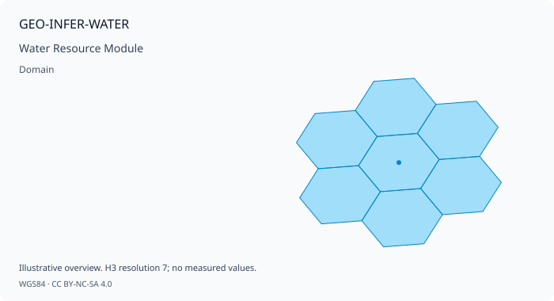

# GEO-INFER-WATER: Water Resource Module
> **Illustrative example notice.** This page contains historical or
> conceptual integration sketches. Names such as `SpatialAnalyzer` and
> domain-specific facade classes are not public GEO-INFER exports in the
> current checkout; verify imports against each module's `src/` package
> and use the module README/tests for executable examples.
> **Purpose**: Water quality monitoring, watershed modeling, and flood risk assessment
>
> This module provides water resource management capabilities including quality assessment, hydrological modeling, distribution optimization, and integration with Active Inference principles.
## Overview
Note: Code examples are illustrative; see `GEO-INFER-WATER/examples` for runnable scripts.
### Links
- Module README: ../../GEO-INFER-WATER/README.md
- Modules Overview: ../modules/index.md
GEO-INFER-WATER implements water resource analysis for geospatial applications. It provides:
- **Water Quality Monitoring**: Real-time quality assessment and contamination detection
- **Watershed Modeling**: Hydrological simulation, runoff prediction, and flow routing
- **Flood Risk Assessment**: Inundation mapping, early warning, and damage estimation
- **Distribution Optimization**: Network efficiency, leak detection, and demand management
- **Groundwater Analysis**: Aquifer modeling, recharge estimation, and sustainability
### Mathematical Foundations
#### Hydrological Modeling
The module uses the water balance equation:
```
ΔS = P - ET - Q - G
```
Where:
- `ΔS` is change in storage
- `P` is precipitation
- `ET` is evapotranspiration
- `Q` is surface runoff
- `G` is groundwater recharge
#### Flood Routing
Flood routing uses the Muskingum method:
```
O₂ = C₀I₂ + C₁I₁ + C₂O₁
```
Where:
- `O` is outflow, `I` is inflow
- `C₀, C₁, C₂` are routing coefficients
## Core Features
### 1. Water Quality Analysis
**Purpose**: Monitor and assess water quality across monitoring networks.
```python
from geo_infer_water import WaterQualityAnalyzer
# Initialize water quality analyzer
analyzer = WaterQualityAnalyzer(
parameters=['ph', 'dissolved_oxygen', 'turbidity', 'temperature',
'conductivity', 'nitrate', 'phosphate'],
standards='drinking_water',
alert_thresholds={'ph': (6.5, 8.5), 'dissolved_oxygen': (6.0, None)}
)
# Assess water quality from sensors
quality = analyzer.assess(
sensors=water_sensors,
parameters=['ph', 'dissolved_oxygen', 'turbidity'],
standards='drinking_water',
include_uncertainty=True
)
# Detect contamination events
contamination = analyzer.detect_contamination(
data=sensor_readings,
method='anomaly_detection',
sensitivity=0.95,
real_time=True
)
# Calculate water quality index
wqi = analyzer.calculate_water_quality_index(
data=quality_data,
method='nsfwqi',
weights='standard'
)
# Generate quality trend analysis
trends = analyzer.analyze_trends(
historical_data=quality_history,
parameters=['dissolved_oxygen', 'nitrate'],
statistical_tests=['mann_kendall', 'seasonal_kendall']
)
```
### 2. Watershed Modeling
**Purpose**: Simulate hydrological processes and predict runoff.
```python
from geo_infer_water import WatershedModeler
# Initialize watershed modeler
modeler = WatershedModeler(
model_type='distributed',
temporal_resolution='hourly',
spatial_resolution=30, # meters
processes=['infiltration', 'runoff', 'evapotranspiration', 'routing']
)
# Simulate watershed runoff
runoff = modeler.simulate(
watershed=catchment_boundary,
precipitation=rainfall_data,
land_cover=land_use_map,
soil_properties=soil_data,
simulation_period=('2023-01-01', '2023-12-31')
)
# Delineate watershed from DEM
watershed = modeler.delineate_watershed(
dem=elevation_data,
pour_point=outlet_location,
snap_distance=100
)
# Calculate time of concentration
tc = modeler.time_of_concentration(
watershed=watershed,
method='kirpich',
channel_characteristics=stream_network
)
# Route flood through channel network
routed_flow = modeler.route_flow(
inflow_hydrograph=upstream_flow,
channel_network=stream_segments,
method='muskingum_cunge'
)
```
### 3. Flood Risk Assessment
**Purpose**: Assess flood hazards and generate risk maps.
```python
from geo_infer_water import FloodModeler
# Initialize flood modeler
flood_modeler = FloodModeler(
hydraulic_model='hec_ras',
terrain_resolution=1, # meter
uncertainty_quantification=True
)
# Generate flood inundation map
inundation = flood_modeler.model_inundation(
discharge=design_flood,
terrain=dem_data,
channel_geometry=cross_sections,
return_period=100
)
# Assess flood damage
damage = flood_modeler.estimate_damage(
inundation_map=inundation,
assets=building_footprints,
depth_damage_curves=damage_functions,
exposure_data=property_values
)
# Generate flood early warning
warning = flood_modeler.generate_warning(
current_conditions=real_time_data,
forecast_precipitation=weather_forecast,
warning_thresholds=flood_stages
)
# Calculate flood frequency
frequency = flood_modeler.flood_frequency_analysis(
annual_maxima=historical_peaks,
distribution='gumbel',
return_periods=[10, 25, 50, 100, 500]
)
```
### 4. Distribution Network Optimization
**Purpose**: Optimize water distribution networks for efficiency.
```python
from geo_infer_water import DistributionOptimizer
# Initialize distribution optimizer
optimizer = DistributionOptimizer(
network_model='epanet',
optimization_algorithm='genetic_algorithm',
objectives=['pressure', 'energy', 'water_age']
)
# Optimize pump scheduling
schedule = optimizer.optimize_pumping(
network=water_network,
demand_pattern=daily_demand,
electricity_tariff=time_of_use_rates,
constraints=['min_pressure', 'tank_levels']
)
# Detect leaks
leaks = optimizer.detect_leaks(
network=water_network,
flow_data=meter_readings,
pressure_data=pressure_sensors,
method='minimum_night_flow'
)
# Optimize network design
design = optimizer.optimize_design(
demand_nodes=consumption_points,
supply_sources=water_sources,
objectives=['cost', 'reliability', 'resilience'],
constraints=design_constraints
)
```
### 5. Groundwater Analysis
**Purpose**: Model groundwater systems and assess sustainability.
```python
from geo_infer_water import GroundwaterModeler
# Initialize groundwater modeler
gw_modeler = GroundwaterModeler(
model_type='modflow',
layer_structure=aquifer_layers,
boundary_conditions=gw_boundaries
)
# Model groundwater flow
flow_solution = gw_modeler.simulate(
aquifer=aquifer_properties,
stresses={'wells': pumping_wells, 'recharge': recharge_zones},
time_periods=simulation_periods
)
# Estimate recharge
recharge = gw_modeler.estimate_recharge(
precipitation=rainfall_data,
land_cover=land_use,
soil_properties=soil_data,
method='water_table_fluctuation'
)
# Assess aquifer sustainability
sustainability = gw_modeler.assess_sustainability(
current_extraction=pumping_rates,
safe_yield=aquifer_yield,
water_levels=monitoring_wells,
trend_analysis=True
)
```
## API Reference
### WaterQualityAnalyzer
Core water quality analysis class.
```python
class WaterQualityAnalyzer:
def __init__(self, parameters, standards='drinking_water', alert_thresholds=None,
real_time_monitoring=False):
"""
Initialize water quality analyzer.
Args:
parameters (list): Water quality parameters to monitor
standards (str): Water quality standards to apply
alert_thresholds (dict): Custom alert thresholds
real_time_monitoring (bool): Enable real-time monitoring
"""
def assess(self, sensors, parameters, standards, include_uncertainty):
"""Assess water quality from sensor data."""
def detect_contamination(self, data, method, sensitivity, real_time):
"""Detect contamination events using anomaly detection."""
def calculate_water_quality_index(self, data, method, weights):
"""Calculate composite water quality index."""
def analyze_trends(self, historical_data, parameters, statistical_tests):
"""Analyze water quality trends over time."""
```
### WatershedModeler
Hydrological watershed modeling.
```python
class WatershedModeler:
def __init__(self, model_type='distributed', temporal_resolution='hourly',
spatial_resolution=30, processes=None):
"""
Initialize watershed modeler.
Args:
model_type (str): Model type ('lumped', 'distributed', 'semi_distributed')
temporal_resolution (str): Temporal resolution
spatial_resolution (float): Spatial resolution in meters
processes (list): Hydrological processes to simulate
"""
def simulate(self, watershed, precipitation, land_cover, soil_properties, simulation_period):
"""Run watershed simulation."""
def delineate_watershed(self, dem, pour_point, snap_distance):
"""Delineate watershed from DEM."""
def route_flow(self, inflow_hydrograph, channel_network, method):
"""Route flow through channel network."""
```
### FloodModeler
Flood hazard modeling and risk assessment.
```python
class FloodModeler:
def __init__(self, hydraulic_model='hec_ras', terrain_resolution=1,
uncertainty_quantification=True):
"""
Initialize flood modeler.
Args:
hydraulic_model (str): Hydraulic model to use
terrain_resolution (float): Terrain resolution in meters
uncertainty_quantification (bool): Enable uncertainty quantification
"""
def model_inundation(self, discharge, terrain, channel_geometry, return_period):
"""Generate flood inundation map."""
def estimate_damage(self, inundation_map, assets, depth_damage_curves, exposure_data):
"""Estimate flood damage to assets."""
def generate_warning(self, current_conditions, forecast_precipitation, warning_thresholds):
"""Generate flood early warning."""
```
## Use Cases
### 1. Integrated Water Resource Management
**Problem**: Manage water resources across a river basin with competing demands.
```python
from geo_infer_water import WatershedModeler, GroundwaterModeler
from geo_infer_climate import ClimateProjector
# Model surface water availability
surface_modeler = WatershedModeler()
surface_water = surface_modeler.simulate(
watershed=river_basin,
precipitation=historical_precip,
scenarios=['current', 'drought', 'wet']
)
# Model groundwater availability
gw_modeler = GroundwaterModeler()
groundwater = gw_modeler.simulate(
aquifer=basin_aquifer,
stresses={'pumping': current_extraction}
)
# Project future water availability
projector = ClimateProjector()
future_climate = projector.project(
region=river_basin,
time_periods=['2030-2050'],
variables=['precipitation', 'temperature']
)
# Optimize water allocation
allocation = optimizer.allocate_water(
supply={'surface': surface_water, 'groundwater': groundwater},
demands={'agriculture': ag_demand, 'municipal': city_demand, 'environmental': eflow},
priorities=['drinking_water', 'environmental', 'agriculture']
)
```
### 2. Real-Time Flood Monitoring
**Problem**: Monitor flood conditions and provide early warnings.
```python
from geo_infer_water import FloodModeler, WaterQualityAnalyzer
from geo_infer_iot import SensorNetwork
# Set up real-time monitoring
sensor_network = SensorNetwork()
flood_modeler = FloodModeler()
# Configure real-time data ingestion
sensor_network.configure(
sensors=stream_gauges,
parameters=['stage', 'discharge', 'velocity'],
sampling_interval='5min',
alert_enabled=True
)
# Real-time flood forecasting
def real_time_forecast(current_data, weather_forecast):
# Update hydrological model
forecast = flood_modeler.generate_warning(
current_conditions=current_data,
forecast_precipitation=weather_forecast,
warning_thresholds=flood_stages
)
# Generate inundation forecast
if forecast['warning_level'] >= 'moderate':
inundation_forecast = flood_modeler.forecast_inundation(
initial_conditions=current_data,
precipitation_forecast=weather_forecast,
lead_time_hours=72
)
return forecast, inundation_forecast
```
### 3. Drinking Water Quality Monitoring
**Problem**: Ensure safe drinking water through continuous monitoring.
```python
from geo_infer_water import WaterQualityAnalyzer, DistributionOptimizer
from geo_infer_health import HealthRiskAssessor
# Monitor drinking water quality
quality_analyzer = WaterQualityAnalyzer(
parameters=['residual_chlorine', 'turbidity', 'e_coli', 'lead'],
standards='who_drinking_water'
)
# Real-time quality monitoring
quality_status = quality_analyzer.monitor_continuous(
sensors=quality_monitors,
alert_enabled=True,
alert_recipients=['water_utility', 'health_department']
)
# Detect contamination
contamination_alert = quality_analyzer.detect_contamination(
data=real_time_readings,
method='cusum',
sensitivity=0.99
)
# Assess health risk
health_assessor = HealthRiskAssessor()
health_risk = health_assessor.assess_water_risk(
contaminant_levels=quality_status,
exposure_population=service_area_population,
consumption_rates=water_consumption_data
)
```
## Integration with Other Modules
### GEO-INFER-SPACE Integration
```python
from geo_infer_water import WatershedModeler
from geo_infer_space import SpatialAnalyzer
# Combine water and spatial analysis
watershed_modeler = WatershedModeler()
spatial_analyzer = SpatialAnalyzer()
# Delineate watershed with spatial tools
watershed = spatial_analyzer.watershed_delineation(
dem=elevation_data,
outlet=basin_outlet,
flow_direction_method='d8'
)
# Calculate spatial runoff patterns
runoff_patterns = watershed_modeler.spatial_runoff(
watershed=watershed,
land_cover=land_use,
curve_numbers=cn_lookup
)
```
### GEO-INFER-CLIMATE Integration
```python
from geo_infer_water import FloodModeler
from geo_infer_climate import ClimateProjector
# Assess climate impacts on flooding
flood_modeler = FloodModeler()
projector = ClimateProjector()
# Project future precipitation extremes
future_precip = projector.project(
region=watershed,
variables=['precipitation_extreme'],
scenarios=['ssp245', 'ssp585']
)
# Model future flood risk
future_floods = flood_modeler.project_future_floods(
current_conditions=baseline_hydrology,
climate_projections=future_precip,
return_periods=[50, 100]
)
```
## Troubleshooting
### Common Issues
**Model instability:**
```python
# Adjust time step for stability
modeler.set_time_step(
method='adaptive',
courant_number=0.5
)
# Check boundary conditions
modeler.validate_boundaries(
boundary_conditions=bc_data,
check_types=['continuity', 'head_gradient']
)
```
**Inaccurate runoff predictions:**
```python
# Calibrate model parameters
calibrated_params = modeler.calibrate(
observed_discharge=gauged_flow,
parameters=['cn', 'manning_n', 'infiltration'],
method='shuffled_complex_evolution'
)
# Validate model performance
validation = modeler.validate(
observed=validation_data,
metrics=['nse', 'rmse', 'pbias']
)
```
## Performance Optimization
```python
# Enable parallel processing for large watersheds
modeler.enable_parallel_processing(n_workers=8)
# Use GPU acceleration for hydraulic modeling
flood_modeler.enable_gpu_acceleration(
gpu_memory_gb=8
)
# Cache intermediate results
modeler.enable_caching(cache_path='/tmp/water_cache')
```
## Related Documentation
### Related Modules
- **[GEO-INFER-SPACE](../modules/geo-infer-space.md)** - Spatial watershed delineation
- **[GEO-INFER-TIME](../modules/geo-infer-time.md)** - Temporal flow forecasting
- **[GEO-INFER-CLIMATE](../modules/geo-infer-climate.md)** - Climate impacts on water
- **[GEO-INFER-RISK](../modules/geo-infer-risk.md)** - Flood and drought risk
- **[GEO-INFER-IOT](../modules/geo-infer-iot.md)** - Sensor networks
---
**Ready to get started?** Check out the **[Water Quality Monitoring Tutorial](../getting_started/index.md)** or explore **[Flood Risk Examples](../examples_gallery.md)**!

## 🗺️ Interactive Spatial Preview

Pre-rendered spatial snapshot for **GEO-INFER-WATER** (*Water Resource Module*). Reproducible preview cards are generated by `geo_infer_intra.core.documentation.visual_preview`.

| Preview | Widget |
| --- | --- |
|  | Leaflet HTMLMap · SVG vector · PNG raster |

> **Reproducible contract:** each map ships as `geo-infer-water_preview.html`, `geo-infer-water_preview.svg`, `geo-infer-water_preview.png`, and `geo-infer-water_preview.manifest.json` beneath `previews/`. The receipt records an input SHA-256 and artifact accessibility checks.
