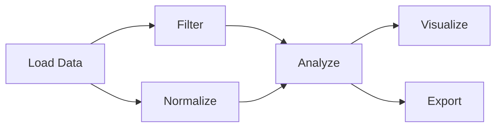

# Workflow System

This page describes how multi-step geospatial analyses are structured in
GEO-INFER: workflow patterns, orchestration modules, and where runnable
pipelines live. The framework composes module APIs (SPACE, TIME, ACT, DATA,
and domain modules) into processing chains rather than shipping a separate
workflow runtime.

## Workflow Concepts

A workflow is a directed acyclic graph (DAG) of processing steps:

- **Nodes** represent processing steps or operations (load, transform,
  analyze, visualize, export).
- **Edges** represent data flow between nodes.
- **Parameters** control the behavior of nodes.

Example pipeline shape:

## Workflow Patterns in the Repository

- [Active Inference Workflows](active_inference_workflows.md) — end-to-end
  active inference process patterns (generative model, belief updating, EFE,
  policy selection) mapped onto the ACT, SPACE, TIME, and AGENT modules.
- [Integration Guide](../integration/index.md) — how modules compose across
  boundaries.
- [Module Integration Guide](../guides/MODULE_INTEGRATION_GUIDE.md) —
  cross-module workflow wiring.
- [Examples gallery](../examples_gallery.md) — runnable pipeline examples.
- [GEO-INFER-EXAMPLES](../../../GEO-INFER-EXAMPLES/README.md) — the examples
  module, the thin orchestration surface for cross-module workflows.

## Orchestration Modules

- **GEO-INFER-AGENT** (`geo_infer_agent`) — intelligent agents for geospatial
  decision-making, perception, and action (Active Inference, BDI, and
  reinforcement learning architectures). See the
  [AGENT module page](../modules/geo-infer-agent.md).
- **GEO-INFER-ACT** (`geo_infer_act`) — Active Inference models and runners,
  including H3 spatial inference. See the
  [ACT module page](../modules/geo-infer-act.md).
- **GEO-INFER-EXAMPLES** (`geo_infer_examples`) — integration examples and
  sample datasets.

## Best Practices

- **Modular design** — create reusable workflow components.
- **Parameterization** — make workflows configurable through parameters.
- **Error handling** — implement proper error handling and recovery.
- **Documentation** — document workflows and their components.
- **Testing** — test workflows with different inputs and parameters.
- **Version control** — maintain workflow versions.
- **Monitoring** — monitor execution for performance issues.
- **Resource management** — efficiently manage computational resources.

## Related Resources

- [Geospatial Algorithms](../geospatial/algorithms/index.md)
- [SPACE integration](../integration/geo_infer_modules.md)
- [Performance Optimization](../advanced/performance_optimization.md)
