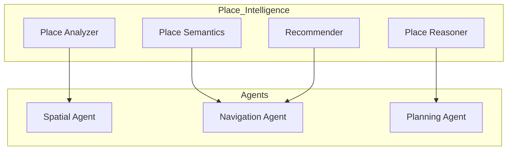

# GEO-INFER-PLACE: Agent Capabilities

<div align="center">
  <h3><a href="../README.md">🌍 GEO-INFER Core</a></h3>
  <a href="../AGENTS.md">🤖 Agent Architecture</a> •
  <a href="../README.md#-module-overview">📦 Module Index</a> •
  <a href="./README.md">📚 Module Documentation</a>
</div>

---

## Overview

The **GEO-INFER-PLACE** module provides place-based intelligence for agents, enabling understanding of locations as meaningful spaces with social, cultural, and functional characteristics beyond pure geometry.

## Agent Capabilities

### 1. Place Understanding

```python
from geo_infer_place import PlaceAnalyzer

# Analyze place characteristics
analyzer = PlaceAnalyzer()

# Get rich place information
place_info = analyzer.analyze(
    location={"lat": 37.7749, "lon": -122.4194},
    context_radius=500  # meters
)

print(f"Place type: {place_info.primary_type}")  # e.g., "urban_commercial"
print(f"Amenities: {place_info.nearby_amenities}")
print(f"Character: {place_info.neighborhood_character}")
print(f"Activity patterns: {place_info.temporal_activity}")
```

### 2. Place-Based Reasoning

```python
from geo_infer_place import PlaceReasoner

# Reason about place suitability
reasoner = PlaceReasoner()

# Find suitable locations for activity
suitable_places = reasoner.find_suitable(
    activity="outdoor_dining",
    requirements={
        "foot_traffic": "high",
        "noise_level": "moderate",
        "weather_protection": True
    }
)

for place in suitable_places:
    print(f"{place.name}: Score {place.suitability_score}")
```

### 3. Place Semantics

```python
from geo_infer_place import PlaceSemantics

# Understand place meaning
semantics = PlaceSemantics()

# Get semantic representation of place
meaning = semantics.interpret(
    place_name="Fisherman's Wharf",
    city="San Francisco"
)

print(f"Cultural significance: {meaning.cultural_significance}")
print(f"Associated activities: {meaning.activities}")
print(f"Visitor demographics: {meaning.visitor_types}")
```

### 4. Place Recommendation

```python
from geo_infer_place import PlaceRecommender

# Get personalized place recommendations
recommender = PlaceRecommender()

# Recommend places based on preferences
recommendations = recommender.recommend(
    user_preferences={
        "interests": ["art", "coffee", "quiet"],
        "mobility": "walking",
        "budget": "moderate"
    },
    current_location=user_location,
    time_of_day="afternoon"
)

for rec in recommendations:
    print(f"{rec.name}: {rec.reason}")
```

## Implementation Status

### Currently Implemented

| Feature | Status | Description |
|---------|--------|-------------|
| **Place Analysis** | ✅ Ready | Rich place characterization |
| **Place Reasoning** | ✅ Ready | Suitability analysis |
| **Place Semantics** | ✅ Ready | Meaning understanding |
| **Geocoding** | ✅ Ready | Place name resolution |
| **POI Integration** | ✅ Ready | Points of interest data |

### Aspirational/Planned Features

| Feature | Priority | Description |
|---------|----------|-------------|
| **PlaceExplorerAgent** | 🔮 High | Autonomous place discovery |
| **PlaceNarratorAgent** | 🔮 Medium | Generate place descriptions |
| **LocalExpertAgent** | 🔮 Medium | Location-specific expertise |

## Integration with Agent Framework



## Use Cases

### 1. Location-Aware Agent Behavior

```python
from geo_infer_place import PlaceContext
from geo_infer_agent import BaseAgent

class PlaceAwareAgent(BaseAgent):
    def __init__(self):
        super().__init__()
        self.place_context = PlaceContext()
    
    def act_in_context(self, location):
        # Understand current place context
        context = self.place_context.get(location)
        
        # Adapt behavior to place
        if context.is_quiet_zone:
            self.reduce_activity_level()
        elif context.is_commercial_area:
            self.enable_commercial_features()
        
        return self.act()
```

### 2. Urban Planning Place Analysis

```python
from geo_infer_place import PlaceEvaluator

evaluator = PlaceEvaluator()

# Evaluate neighborhood for development
evaluation = evaluator.evaluate_for_development(
    neighborhood="mission_district",
    development_type="affordable_housing"
)

print(f"Community fit: {evaluation.community_fit_score}")
print(f"Infrastructure readiness: {evaluation.infrastructure_score}")
print(f"Recommendations: {evaluation.recommendations}")
```

---

This AGENTS.md documents how GEO-INFER-PLACE provides place-based intelligence for agents.

**Last Updated**: 2026-01-26
