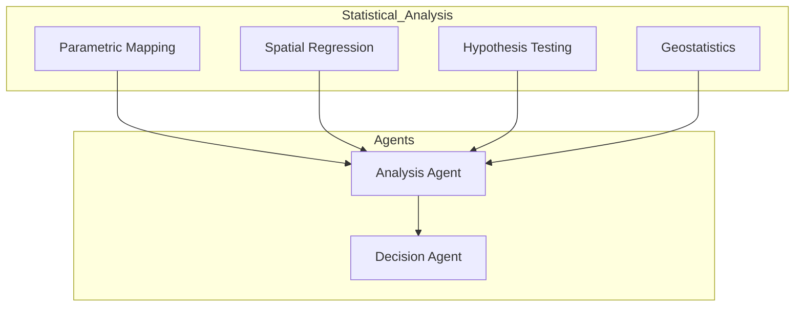

# GEO-INFER-SPM: Agent Capabilities

<div align="center">
  <h3><a href="../README.md">🌍 GEO-INFER Core</a></h3>
  <a href="../AGENTS.md">🤖 Agent Architecture</a> •
  <a href="../README.md#-module-overview">📦 Module Index</a> •
  <a href="./README.md">📚 Module Documentation</a>
</div>

---

## Overview

The **GEO-INFER-SPM** (Statistical Parametric Mapping) module provides advanced statistical analysis capabilities for agents, enabling spatial statistics, parametric mapping, and hypothesis testing on geospatial data.

## Agent Capabilities

### 1. Statistical Parametric Mapping

```python
from geo_infer_spm import ParametricMapper

# Create statistical maps
mapper = ParametricMapper()

# Perform SPM analysis
result = mapper.analyze(
    spatial_data=population_density,
    hypothesis="hotspot_detection",
    significance_level=0.05,
    correction="bonferroni"
)

print(f"Significant clusters: {result.clusters}")
print(f"P-values: {result.p_values}")
print(f"Effect sizes: {result.effect_sizes}")
```

### 2. Spatial Regression

```python
from geo_infer_spm import SpatialRegressor

# Perform spatial regression
regressor = SpatialRegressor()

# Fit spatial model
model = regressor.fit(
    y=housing_prices,
    X=predictor_features,
    spatial_weights=neighborhood_weights,
    model_type="spatial_lag"
)

print(f"Coefficients: {model.coefficients}")
print(f"Spatial autocorrelation: {model.rho}")
print(f"R-squared: {model.r_squared}")
```

### 3. Hypothesis Testing

```python
from geo_infer_spm import SpatialHypothesisTester

# Test spatial hypotheses
tester = SpatialHypothesisTester()

# Test for clustering
clustering_result = tester.test_clustering(
    points=crime_locations,
    null_hypothesis="complete_spatial_randomness",
    test="ripley_k"
)

print(f"Clustering detected: {clustering_result.is_significant}")
print(f"K-statistic: {clustering_result.k_value}")
```

### 4. Geostatistics

```python
from geo_infer_spm import Geostatistics

# Perform geostatistical analysis
geo = Geostatistics()

# Variogram modeling
variogram = geo.compute_variogram(
    data=soil_samples,
    model="spherical",
    max_distance=5000
)

# Kriging interpolation
interpolated = geo.krige(
    data=soil_samples,
    variogram=variogram,
    target_grid=prediction_grid
)
```

## Implementation Status

### Currently Implemented

| Feature | Status | Description |
|---------|--------|-------------|
| **Parametric Mapping** | ✅ Ready | Statistical significance maps |
| **Spatial Regression** | ✅ Ready | Lag/error models |
| **Hypothesis Testing** | ✅ Ready | Multiple test types |
| **Geostatistics** | ✅ Ready | Variograms, kriging |
| **Cluster Analysis** | ✅ Ready | DBSCAN, K-means spatial |

### Aspirational/Planned Features

| Feature | Priority | Description |
|---------|----------|-------------|
| **StatisticalAnalystAgent** | 🔮 High | Auto-select analysis methods |
| **ModelSelectorAgent** | 🔮 Medium | Optimal model selection |
| **ResultInterpreterAgent** | 🔮 Medium | Natural language results |

## Integration with Agent Framework



## Use Cases

### 1. Environmental Analysis Agent

```python
from geo_infer_spm import EnvironmentalAnalyzer

analyzer = EnvironmentalAnalyzer()

# Analyze pollution patterns
analysis = analyzer.analyze_pollution(
    measurements=air_quality_data,
    spatial_extent=city_boundary,
    temporal_range=("2025-01-01", "2025-12-31")
)

print(f"Hotspots: {analysis.hotspots}")
print(f"Trends: {analysis.temporal_trends}")
print(f"Risk areas: {analysis.risk_zones}")
```

### 2. Epidemiological Analysis

```python
from geo_infer_spm import DiseaseMapper

mapper = DiseaseMapper()

# Map disease patterns
mapping = mapper.analyze(
    cases=disease_cases,
    population=population_data,
    risk_factors=environmental_factors
)

print(f"Relative risk: {mapping.relative_risk}")
print(f"Cluster locations: {mapping.clusters}")
```

---

This AGENTS.md documents how GEO-INFER-SPM provides statistical analysis capabilities for agents.

**Last Updated**: 2026-01-26
