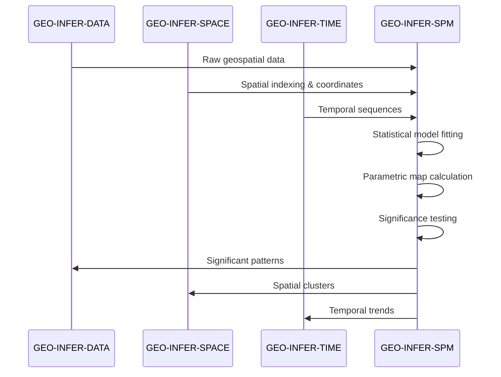
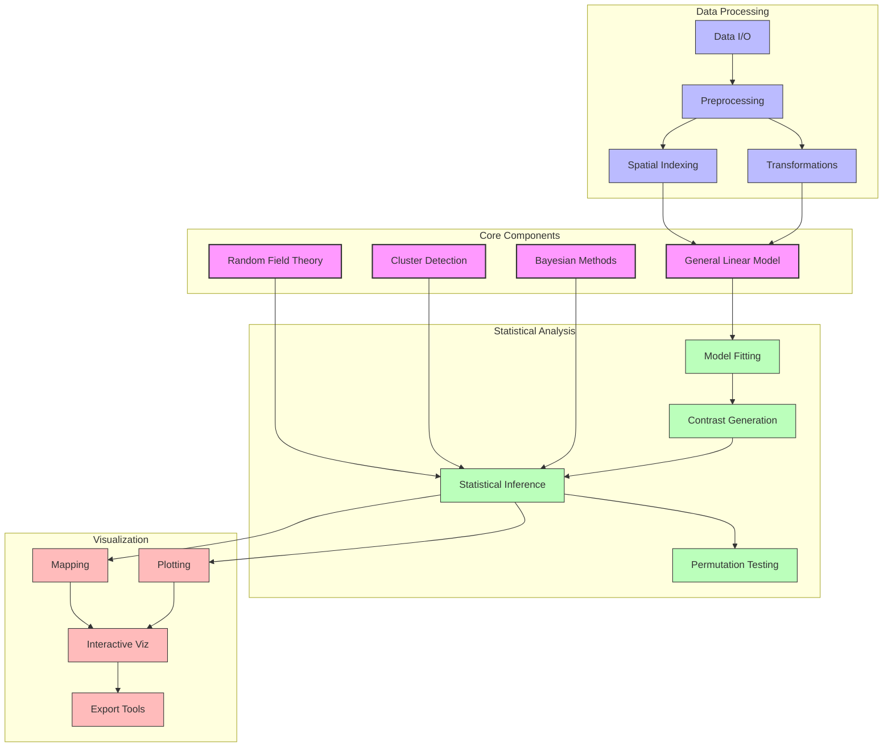

<div align="center">
  <h3><a href="../README.md">🌍 GEO-INFER Core</a></h3>
  <a href="../AGENTS.md">🤖 Agent Architecture</a> •
  <a href="../README.md#-module-overview">📦 Module Index</a> •
  <a href="../GEO-INFER-INTRA/README.md">📚 Documentation</a>
</div>

---


# GEO-INFER-SPM: Statistical Parametric Mapping for Geospatial Analysis

> **Purpose**: Provide statistical tools for analyzing spatially continuous data fields while preserving spatiotemporal relationships
>
> This module adapts Statistical Parametric Mapping methodology for geospatial analysis to identify statistically significant patterns in complex environmental, urban, and ecological datasets.

## Overview

Note: Code examples are illustrative; see `GEO-INFER-SPM/examples` for runnable scripts.

### Links
- Module README: ../../GEO-INFER-SPM/README.md
- Modules Overview: ../modules/index.md

Statistical Parametric Mapping (SPM) is a powerful statistical methodology for analyzing spatially or temporally continuous data fields. Originally developed for neuroimaging, SPM has been adapted in GEO-INFER to address the challenges of geospatial analysis while preserving the integrity of spatiotemporal relationships.

### Documentation
- Module page: ../GEO-INFER-INTRA/docs/modules/geo-infer-spm.md
- Modules index: ../GEO-INFER-INTRA/docs/modules/index.md

## Core Methodology

### General Linear Model (GLM)
The backbone of SPM is the General Linear Model, which relates experimental design matrices to observed geospatial data:

$$ Y = XB + e $$

where:
- $$ Y $$ = observed spatial or temporal data matrix
- $$ X $$ = design matrix encoding experimental conditions or covariates
- $$ B $$ = regression coefficients
- $$ e $$ = residuals

This framework enables the application of diverse statistical tests (t-tests, ANOVA, etc.) at each point in space or time.

### Random Field Theory (RFT)
SPM employs Random Field Theory to account for spatial dependencies between data points, providing rigorous control for multiple comparisons across continuous fields. RFT corrects for multiple comparisons by modeling:

- Spatial/temporal smoothness via gradient estimation
- Expected Euler characteristics of Gaussian random fields
- Cluster-level inference for supra-threshold clusters

### Statistical Inference
The module generates statistical maps (SPM{t}, SPM{F}) where each point's value represents a test statistic. These maps are thresholded using RFT-based expectations regarding smoothness and cluster size to determine statistical significance while controlling for family-wise error.

## Core Features

### Spatial Analysis Tools
- Multi-resolution spatial indexing and analysis
- Cluster-based inference for geospatial patterns
- Spatial autocorrelation modeling and correction
- Non-stationary field modeling for heterogeneous landscapes

### Temporal Analysis Capabilities
- Temporal trend detection with statistical confidence
- Event-related analysis for discrete temporal phenomena
- Sliding window analysis for dynamic processes
- Seasonal adjustment and cyclic pattern identification

### Bayesian Extensions
- Hierarchical models for spatial data
- Posterior probability mapping
- Bayesian model selection and comparison
- Spatial priors for geographically informed inference

### Visualization Components
- Interactive statistical parametric maps
- Threshold-dependent visualization
- Cluster-level annotated maps
- Time-series visualization with confidence intervals

## Applications

### Environmental Monitoring
- Detection of significant changes in ecological systems
- Climate anomaly mapping with statistical confidence
- Biodiversity hotspot identification
- Land use change analysis with uncertainty quantification

### Urban Analytics
- Spatiotemporal patterns in urban development
- Statistically significant infrastructure usage patterns
- Social-spatial clustering phenomena
- Transportation flow anomaly detection

### Resource Management
- Water quality spatial variability assessment
- Crop yield mapping with statistical boundaries
- Forest health monitoring and change detection
- Mineral exploration with confidence mapping

### Public Health
- Environmental health risk mapping
- Disease cluster detection and validation
- Spatiotemporal epidemiological analysis
- Exposure pathway significance testing

## Integration with GEO-INFER Framework

### Data Flow


### Module Connections
GEO-INFER-SPM integrates closely with:
- **GEO-INFER-SPACE**: For spatial indexing and coordinate systems
- **GEO-INFER-TIME**: For temporal sequence handling and time series analysis
- **GEO-INFER-DATA**: For data management and storage
- **GEO-INFER-BAYES**: For Bayesian statistical extensions
- **GEO-INFER-APP**: For visualization and interactive mapping
- **GEO-INFER-AI**: For machine learning integration and enhanced pattern detection

## Core Features

### 1. Statistical Parametric Mapping Engine
**Purpose**: Core SPM algorithms for detecting statistically significant spatial patterns.

```python
from geo_infer_spm.core import StatisticalParametricMapper

spm = StatisticalParametricMapper(
    statistical_model='glm',
    multiple_comparison_correction='fdr',
    spatial_regularization=True,
    temporal_modeling='ar1'
)

# Analyze spatial field data
results = spm.fit_and_test(
    data_matrix=X,  # n_voxels x n_timepoints
    design_matrix=Z,  # n_timepoints x n_regressors
    spatial_mask=brain_mask
)

significant_regions = spm.extract_clusters(results, threshold=0.05)
```

### 2. Random Field Theory Implementation
**Purpose**: Theoretical framework for correcting for multiple comparisons in spatial data.

```python
from geo_infer_spm.rft import RandomFieldTheory

rft = RandomFieldTheory(
    field_type='gaussian',
    spatial_smoothness=estimated_fwhm,
    search_volume=brain_volume_mm3
)

# Correct for multiple comparisons
corrected_p_values = rft.family_wise_error_correction(
    uncorrected_p_values,
    cluster_defining_threshold=0.001
)

# Calculate expected number of clusters
expected_clusters = rft.expected_clusters_under_null(
    cluster_size_threshold=100,
    statistical_field=spm_t_statistics
)
```

### 3. Bayesian SPM Extensions
**Purpose**: Probabilistic approaches to spatial statistical inference.

```python
from geo_infer_spm.bayesian import BayesianSPM

bspm = BayesianSPM(
    prior_type='spatial_shrinkage',
    inference_method='variational_bayes',
    spatial_correlation_model='exponential'
)

# Bayesian spatial analysis
posterior_samples = bspm.sample_posterior(
    observed_data=y,
    spatial_coordinates=coords,
    prior_parameters={'tau': 1.0, 'rho': 0.5}
)

bayesian_clusters = bspm.extract_posterior_clusters(
    posterior_samples,
    probability_threshold=0.95
)
```

## API Reference

### Core Classes

#### `StatisticalParametricMapper`
- `fit_and_test(data, design, mask)`: Fit GLM and perform statistical tests
- `extract_clusters(results, threshold)`: Extract statistically significant clusters
- `apply_multiple_comparison_correction(p_values)`: Correct for multiple comparisons

#### `RandomFieldTheory`
- `family_wise_error_correction(p_values, threshold)`: FWE correction
- `expected_clusters_under_null(size_threshold, field)`: Expected cluster count
- `resels_per_voxel()`: Calculate resels for spatial regularization

#### `BayesianSPM`
- `sample_posterior(data, coords, priors)`: Sample from posterior distribution
- `extract_posterior_clusters(samples, threshold)`: Extract posterior clusters
- `compute_bayes_factors(alternative, null)`: Compute Bayes factors

### Key Functions

```python
# Core SPM analysis pipeline
geo_infer_spm.analyze_spatial_field(
    data, design_matrix, spatial_mask,
    statistical_model='glm',
    correction_method='fdr'
)

# Random field theory utilities
geo_infer_spm.rft.expected_euler_characteristic(
    statistical_field, threshold, resels
)

# Bayesian spatial inference
geo_infer_spm.bayesian.spatial_posterior_probability(
    data, coordinates, prior_model
)
```

## Use Cases

### Climate Change Impact Analysis
**Scenario**: Detect statistically significant changes in temperature patterns across spatial regions.

```python
from geo_infer_spm.applications import ClimateChangeAnalyzer

climate_analyzer = ClimateChangeAnalyzer(
    temporal_resolution='monthly',
    spatial_resolution='1km',
    statistical_model='trend_analysis'
)

# Analyze climate data
climate_data = load_global_temperature_dataset()
trend_results = climate_analyzer.detect_temperature_trends(
    temperature_data=climate_data,
    time_period='1950-2023',
    significance_level=0.05
)

# Identify regions with significant warming
warming_regions = climate_analyzer.extract_significant_regions(
    trend_results,
    trend_threshold=0.1  # °C/decade
)
```

### Neuroimaging Research
**Scenario**: Identify brain regions activated during spatial cognition tasks.

```python
from geo_infer_spm.applications import NeuroimagingAnalyzer

brain_analyzer = NeuroimagingAnalyzer(
    imaging_modality='fMRI',
    statistical_model='mixed_effects',
    spatial_regularization='gaussian'
)

# Analyze fMRI data during spatial navigation task
fmri_data = load_brain_imaging_dataset()
activation_map = brain_analyzer.compute_activation_map(
    bold_signals=fmri_data,
    task_design_matrix=spatial_task_design,
    subject_ids=participant_list
)

# Find brain regions involved in spatial processing
spatial_regions = brain_analyzer.extract_activated_regions(
    activation_map,
    statistical_threshold='p<0.05_fwe'
)
```

### Environmental Monitoring
**Scenario**: Detect pollution hotspots and environmental degradation patterns.

```python
from geo_infer_spm.applications import EnvironmentalMonitor

env_monitor = EnvironmentalMonitor(
    pollutant_types=['NO2', 'PM2.5', 'O3'],
    temporal_aggregation='daily',
    spatial_interpolation='kriging'
)

# Monitor air quality patterns
air_quality_data = load_sensor_network_data()
pollution_analysis = env_monitor.analyze_pollution_patterns(
    measurements=air_quality_data,
    spatial_extent=city_bounds,
    time_window='2023-01-01_to_2023-12-31'
)

# Identify pollution hotspots
hotspots = env_monitor.detect_pollution_hotspots(
    analysis_results=pollution_analysis,
    significance_threshold=0.01,
    cluster_size_threshold=5  # km²
)
```

### Disease Surveillance
**Scenario**: Identify spatial patterns in disease incidence and transmission.

```python
from geo_infer_spm.applications import DiseaseSurveillance

disease_monitor = DiseaseSurveillance(
    disease_types=['COVID-19', 'influenza', 'malaria'],
    spatial_scale='county_level',
    temporal_resolution='weekly'
)

# Analyze disease spread patterns
epidemiological_data = load_disease_incidence_data()
transmission_analysis = disease_monitor.analyze_transmission_patterns(
    incidence_data=epidemiological_data,
    population_density=population_data,
    mobility_patterns=mobility_data
)

# Detect disease clusters
clusters = disease_monitor.detect_disease_clusters(
    analysis_results=transmission_analysis,
    statistical_method='spatial_scan',
    significance_level=0.05
)
```

## Getting Started

### Installation
```bash
uv pip install -e ./GEO-INFER-SPM
```

### Basic Usage
```python
import geo_infer_spm as gispm

# Load geospatial data
data = gispm.load_data("temperature_anomalies.tif")

# Create design matrix with covariates
design = gispm.design_matrix(
    factors=[("season", ["winter", "spring", "summer", "fall"])],
    covariates=["elevation", "distance_to_coast"]
)

# Fit GLM
model = gispm.fit_glm(data, design)

# Define contrast
contrast = gispm.contrast(model, "summer > winter")

# Generate statistical map with RFT correction
spm_map = gispm.compute_spm(model, contrast, correction="RFT")

# Visualize results
gispm.visualize(
    spm_map, 
    base_map="terrain",
    threshold=0.05,
    cluster_size_min=10,
    title="Summer vs Winter Temperature Anomalies"
)
```

## Advanced Examples

### Climate Change Pattern Detection
```python
# Multi-year climate analysis
climate_data = gispm.load_timeseries("climate_data.nc", 
                                   time_dimension="year", 
                                   spatial_dimensions=["lat", "lon"])

# Create temporal design with trend and oscillation terms
years = climate_data.get_years()
design = gispm.temporal_design(
    time_values=years,
    trend=True,
    seasonal={"period": 11, "type": "harmonic"}  # Solar cycle
)

# Fit model to detect trend
model = gispm.fit_timeseries_glm(climate_data, design)

# Get trend contrast
trend_contrast = gispm.trend_contrast(model)

# Compute SPM with FDR correction
trend_spm = gispm.compute_spm(
    model, 
    trend_contrast, 
    correction="FDR",
    q_value=0.05
)

# Visualize significant trends
gispm.visualize_map(
    trend_spm, 
    mask_non_significant=True,
    colormap="RdBu_r",
    title="Significant Climate Trends (q<0.05)"
)
```

### Urban Development Analysis
```python
# Analyzing urban growth with multiple factors
urban_data = gispm.load_spatial_panel(
    "urban_expansion.gpkg",
    time_field="year",
    response="built_area_pct"
)

socioeconomic = gispm.load_covariates(
    "socioeconomic.csv", 
    id_field="region_id",
    time_field="year"
)

# Join data
panel = gispm.join_panel_data(urban_data, socioeconomic, on=["region_id", "year"])

# Create panel design
design = gispm.panel_design(
    panel,
    fixed_effects=["region_id"],  # Control for region-specific baseline
    covariates=["population", "gdp_per_capita", "investment"]
)

# Fit fixed effects model
model = gispm.fit_panel_model(panel, design)

# Test GDP effect
gdp_contrast = gispm.contrast(model, "gdp_per_capita")

# Get spatial SPM of GDP effect
gdp_spm = gispm.spatial_effect_spm(model, gdp_contrast)

# Visualize
gispm.choropleth_map(
    gdp_spm,
    admin_boundaries="regions.geojson",
    id_field="region_id",
    title="GDP Impact on Urban Expansion",
    significance_level=0.05
)
```

## Implementation Details

### Software Architecture


### Performance Considerations
- Parallel processing for large datasets
- Memory-efficient algorithms for limited-resource environments
- GPU acceleration for computationally intensive operations
- Sparse matrix implementation for high-dimensional data

## References and Resources

### Key Scientific Papers
1. Friston, K.J., et al. (1994). Statistical parametric maps in functional imaging: a general linear approach. Human Brain Mapping, 2(4), 189-210.
2. Worsley, K.J., et al. (1996). A unified statistical approach for determining significant signals in images of cerebral activation. Human Brain Mapping, 4(1), 58-73.
3. Pataky, T.C., et al. (2016). On the use of Statistical Parametric Mapping in biomechanical time series analysis. Journal of Biomechanics, 49(14), 3216-3222.

### Software Documentation
- [SPM Official Website](https://www.fil.ion.ucl.ac.uk/spm/)
- [SPM1D for One-Dimensional Data](https://spm1d.org/)
- [Random Field Theory Primer](http://www.math.mcgill.ca/keith/BICstat/slides.pdf)

### Learning Resources
- [SPM Course Materials](https://www.fil.ion.ucl.ac.uk/spm/course/)
- [Statistical Parametric Mapping: The Analysis of Functional Brain Images](https://www.fil.ion.ucl.ac.uk/spm/doc/books/hbf2/)
- [Introduction to Statistical Parametric Mapping](https://andysbrainbook.readthedocs.io/en/latest/SPM/SPM_Overview.html)

## Contributing
Contributions to GEO-INFER-SPM are welcome! Please see our [Contributing Guidelines](../CONTRIBUTING.md) for details on how to participate in development.

## License
This module, as part of the GEO-INFER framework, is licensed under the Creative Commons Attribution-NoDerivatives-ShareAlike 4.0 International License (CC BY-ND-SA 4.0). Please see the `LICENSE` file in the root of the GEO-INFER repository for full details.
