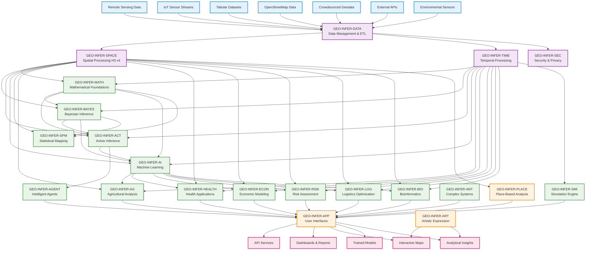

# 🌍 GEO-INFER Framework

[](https://creativecommons.org/licenses/by-nd-sa/4.0/)
[](https://github.com/geo-infer/geo-infer/pulls)
[](https://discord.activeinference.institute/)
[](https://h3geo.org/)
[](https://python.org/)

<div align="center">
  <h3>Comprehensive Geospatial Inference Framework</h3>
  <p><em>Implementing Active Inference principles for ecological, civic, and commercial applications</em></p>
  <br>
  <a href="#-quick-start">🚀 Quick Start</a> •
  <a href="#-module-overview">📦 Modules</a> •
  <a href="#-use-cases">🎯 Use Cases</a> •
  <a href="#-documentation">📚 Docs</a> •
  <a href="#-contributing">👥 Contribute</a>
</div>

---

## 🌟 What is GEO-INFER?

**GEO-INFER** is a comprehensive geospatial inference framework that implements Active Inference principles for complex spatial-temporal problems. The framework provides 30+ specialized modules organized into clear categories with well-defined dependencies and data flow patterns.

### ✨ Key Features

- **🗺️ Advanced Spatial Analysis**: H3 v4 spatial indexing and geospatial processing
- **🧠 Active Inference**: Mathematical foundations for perception-action loops
- **🔄 Data Processing Pipelines**: Validation, quality control, and ETL workflows
- **🧩 Modular Architecture**: 30+ specialized modules with clear dependencies
- **🧪 Comprehensive Testing**: Unified test suite across all modules
- **📚 Professional Documentation**: Standardized documentation with integration guides

## 🚀 Quick Start

### ⚡ Get Started in 3 Steps

```bash
# 1. Clone and enter the repository
git clone https://github.com/geo-infer/geo-infer.git
cd GEO-INFER

# 2. Install core modules (choose what you need)
uv pip install -e ./GEO-INFER-MATH    # Mathematical foundations
uv pip install -e ./GEO-INFER-SPACE   # Spatial analysis (H3 v4)
uv pip install -e ./GEO-INFER-ACT     # Active inference

# 3. Run your first analysis
python -c "
from geo_infer_space import SpatialAnalyzer
from geo_infer_act import ActiveInferenceModel

# Create your first spatial analysis
analyzer = SpatialAnalyzer()
model = ActiveInferenceModel()

print('🎉 GEO-INFER is ready!')
print('📚 Check GEO-INFER-INTRA/docs/ for comprehensive documentation')
"
```

### 📋 Prerequisites

- **Python**: 3.9+ (3.11+ recommended)
- **Package Manager**: [uv](https://github.com/astral-sh/uv) (fast, reliable Python package installer)
- **Git**: For cloning and version control
- **Optional**: Docker for containerized deployment

### 🎯 First Steps by Use Case

| I want to... | Start with these modules | Example command |
|-------------|-------------------------|-----------------|
| **Analyze spatial data** | `MATH`, `SPACE` | `uv pip install -e ./GEO-INFER-MATH ./GEO-INFER-SPACE` |
| **Build AI models** | `MATH`, `AI`, `DATA` | `uv pip install -e ./GEO-INFER-MATH ./GEO-INFER-AI ./GEO-INFER-DATA` |
| **Process sensor data** | `IOT`, `DATA`, `TIME` | `uv pip install -e ./GEO-INFER-IOT ./GEO-INFER-DATA ./GEO-INFER-TIME` |
| **Design governance systems** | `METAGOV`, `ORG`, `NORMS` | `uv pip install -e ./GEO-INFER-METAGOV ./GEO-INFER-ORG ./GEO-INFER-NORMS` |
| **Create web applications** | `API`, `APP`, `SPACE` | `uv pip install -e ./GEO-INFER-API ./GEO-INFER-APP ./GEO-INFER-SPACE` |

## 📦 Module Overview

GEO-INFER provides **36 specialized modules** organized into clear categories. Each module follows standardized documentation with working examples and integration guides.

### 🧭 Quick Navigation

- **[Quick Module Index](#-quick-module-index)** - Alphabetical index of all 36 modules
- **[Core Analytical Modules](#-core-analytical-modules)** - MATH, ACT, BAYES, AI, COG, AGENT, SPM
- **[Spatial-Temporal Modules](#-spatial-temporal-modules)** - SPACE, TIME, IOT
- **[Infrastructure Modules](#-infrastructure-modules)** - DATA, API, SEC, OPS, METAGOV
- **[Domain Applications](#-domain-applications)** - AG, HEALTH, ECON, RISK, LOG, BIO
- **[Simulation & Modeling](#-simulation--modeling)** - SIM, ANT
- **[Governance & Security](#-governance--security)** - SEC, NORMS, REQ, METAGOV
- **[People & Organizations](#-people--organizations)** - PEP, ORG, COMMS
- **[Operations & Development](#-operations--development)** - OPS, INTRA, GIT, TEST, EXAMPLES
- **[Community & Applications](#-community--applications)** - CIV, APP, ART, PLACE
- **[Proposed New Modules](#-proposed-new-modules-planning)** - CLIMATE, ENERGY, WATER, TRANSPORT, EDU, EMERGENCY
- **[Complete Module Reference](#-complete-module-reference)** - Detailed module table with I/O types
- **[Dependencies Matrix](#-complete-module-dependencies-matrix)** - Full dependency relationships
- **[Agent Systems](#agentsmd)** - See [AGENTS.md](./AGENTS.md) for comprehensive agent architecture

### 📋 Quick Module Index

| Module | Category | Status | Quick Links |
|--------|----------|--------|-------------|
| [ACT](./GEO-INFER-ACT/) | Analytical | ✅ Beta | [README](./GEO-INFER-ACT/README.md) \| [AGENTS](./GEO-INFER-ACT/AGENTS.md) |
| [AG](./GEO-INFER-AG/) | Domain | ✅ Beta | [README](./GEO-INFER-AG/README.md) |
| [AGENT](./GEO-INFER-AGENT/) | Analytical | ✅ Beta | [README](./GEO-INFER-AGENT/README.md) \| [AGENTS](./GEO-INFER-AGENT/AGENTS.md) |
| [AI](./GEO-INFER-AI/) | Analytical | ✅ Beta | [README](./GEO-INFER-AI/README.md) |
| [ANT](./GEO-INFER-ANT/) | Simulation | 🟡 Alpha | [README](./GEO-INFER-ANT/README.md) \| [AGENTS](./GEO-INFER-ANT/AGENTS.md) |
| [API](./GEO-INFER-API/) | Infrastructure | ✅ Beta | [README](./GEO-INFER-API/README.md) |
| [APP](./GEO-INFER-APP/) | Application | ✅ Beta | [README](./GEO-INFER-APP/README.md) |
| [ART](./GEO-INFER-ART/) | Application | ✅ Beta | [README](./GEO-INFER-ART/README.md) |
| [BAYES](./GEO-INFER-BAYES/) | Analytical | ✅ Beta | [README](./GEO-INFER-BAYES/README.md) |
| [BIO](./GEO-INFER-BIO/) | Domain | ✅ Beta | [README](./GEO-INFER-BIO/README.md) |
| [CIV](./GEO-INFER-CIV/) | Community | 🟡 Alpha | [README](./GEO-INFER-CIV/README.md) |
| [CLIMATE](./GEO-INFER-CLIMATE/) | Domain | ✅ Alpha | [README](./GEO-INFER-CLIMATE/README.md) |
| [COG](./GEO-INFER-COG/) | Analytical | ✅ Beta | [README](./GEO-INFER-COG/README.md) |
| [COMMS](./GEO-INFER-COMMS/) | Community | ✅ Beta | [README](./GEO-INFER-COMMS/README.md) |
| [DATA](./GEO-INFER-DATA/) | Infrastructure | ✅ Beta | [README](./GEO-INFER-DATA/README.md) |
| [ECON](./GEO-INFER-ECON/) | Domain | 🟡 Alpha | [README](./GEO-INFER-ECON/README.md) |
| [ENERGY](./GEO-INFER-ENERGY/) | Domain | ✅ Alpha | [README](./GEO-INFER-ENERGY/README.md) |
| [EXAMPLES](./GEO-INFER-EXAMPLES/) | Operations | ✅ Beta | [README](./GEO-INFER-EXAMPLES/README.md) |
| [FOREST](./GEO-INFER-FOREST/) | Domain | ✅ Alpha | [README](./GEO-INFER-FOREST/README.md) |
| [GIT](./GEO-INFER-GIT/) | Operations | ✅ Beta | [README](./GEO-INFER-GIT/README.md) |
| [HEALTH](./GEO-INFER-HEALTH/) | Domain | ✅ Beta | [README](./GEO-INFER-HEALTH/README.md) |
| [INTRA](./GEO-INFER-INTRA/) | Operations | ✅ Beta | [README](./GEO-INFER-INTRA/README.md) |
| [IOT](./GEO-INFER-IOT/) | Spatial-Temporal | ✅ Beta | [README](./GEO-INFER-IOT/README.md) |
| [LOG](./GEO-INFER-LOG/) | Domain | ✅ Beta | [README](./GEO-INFER-LOG/README.md) |
| [MARINE](./GEO-INFER-MARINE/) | Domain | ✅ Alpha | [README](./GEO-INFER-MARINE/README.md) |
| [MATH](./GEO-INFER-MATH/) | Analytical | ✅ Beta | [README](./GEO-INFER-MATH/README.md) |
| [METAGOV](./GEO-INFER-METAGOV/) | Infrastructure | 📝 Planning | [README](./GEO-INFER-METAGOV/README.md) |
| [NORMS](./GEO-INFER-NORMS/) | Governance | ✅ Beta | [README](./GEO-INFER-NORMS/README.md) |
| [OPS](./GEO-INFER-OPS/) | Infrastructure | 🟡 Alpha | [README](./GEO-INFER-OPS/README.md) |
| [ORG](./GEO-INFER-ORG/) | Community | ✅ Beta | [README](./GEO-INFER-ORG/README.md) |
| [PEP](./GEO-INFER-PEP/) | Community | ✅ Beta | [README](./GEO-INFER-PEP/README.md) |
| [PLACE](./GEO-INFER-PLACE/) | Application | ✅ Beta | [README](./GEO-INFER-PLACE/README.md) |
| [REQ](./GEO-INFER-REQ/) | Governance | ✅ Beta | [README](./GEO-INFER-REQ/README.md) |
| [RISK](./GEO-INFER-RISK/) | Domain | 🟡 Alpha | [README](./GEO-INFER-RISK/README.md) |
| [SEC](./GEO-INFER-SEC/) | Infrastructure | 🟡 Alpha | [README](./GEO-INFER-SEC/README.md) |
| [SIM](./GEO-INFER-SIM/) | Simulation | 🟡 Alpha | [README](./GEO-INFER-SIM/README.md) |
| [SPACE](./GEO-INFER-SPACE/) | Spatial-Temporal | ✅ Beta | [README](./GEO-INFER-SPACE/README.md) |
| [SPM](./GEO-INFER-SPM/) | Analytical | ✅ Beta | [README](./GEO-INFER-SPM/README.md) |
| [TEST](./GEO-INFER-TEST/) | Operations | 🟡 Alpha | [README](./GEO-INFER-TEST/README.md) |
| [TIME](./GEO-INFER-TIME/) | Spatial-Temporal | ✅ Beta | [README](./GEO-INFER-TIME/README.md) |
| [WATER](./GEO-INFER-WATER/) | Domain | ✅ Alpha | [README](./GEO-INFER-WATER/README.md) |

### 🧠 Core Analytical Modules

| Module | Purpose | Status | Links |
|--------|---------|--------|-------|
| **[MATH](./GEO-INFER-MATH/)** | Mathematical foundations, statistics, optimization | ✅ Beta | [README](./GEO-INFER-MATH/README.md) \| [Examples](./GEO-INFER-MATH/examples/) |
| **[ACT](./GEO-INFER-ACT/)** | Active Inference modeling and belief updates | ✅ Beta | [README](./GEO-INFER-ACT/README.md) \| [AGENTS.md](./GEO-INFER-ACT/AGENTS.md) \| [Examples](./GEO-INFER-ACT/examples/) |
| **[BAYES](./GEO-INFER-BAYES/)** | Bayesian inference and uncertainty quantification | ✅ Beta | [README](./GEO-INFER-BAYES/README.md) \| [Examples](./GEO-INFER-BAYES/examples/) |
| **[AI](./GEO-INFER-AI/)** | Machine learning and neural networks | ✅ Beta | [README](./GEO-INFER-AI/README.md) \| [Examples](./GEO-INFER-AI/examples/) |
| **[COG](./GEO-INFER-COG/)** | Cognitive modeling and spatial cognition | ✅ Beta | [README](./GEO-INFER-COG/README.md) \| [Examples](./GEO-INFER-COG/examples/) |
| **[AGENT](./GEO-INFER-AGENT/)** | Intelligent agents and autonomous systems | ✅ Beta | [README](./GEO-INFER-AGENT/README.md) \| [AGENTS.md](./GEO-INFER-AGENT/AGENTS.md) \| [Examples](./GEO-INFER-AGENT/examples/) |
| **[SPM](./GEO-INFER-SPM/)** | Statistical mapping and spatial statistics | ✅ Beta | [README](./GEO-INFER-SPM/README.md) \| [Examples](./GEO-INFER-SPM/examples/) |

### 🗺️ Spatial-Temporal Modules

| Module | Purpose | Status | Links |
|--------|---------|--------|-------|
| **[SPACE](./GEO-INFER-SPACE/)** | H3 v4 spatial indexing and geospatial analysis | ✅ **FULLY MIGRATED** | [README](./GEO-INFER-SPACE/README.md) \| [Examples](./GEO-INFER-SPACE/examples/) |
| **[TIME](./GEO-INFER-TIME/)** | Temporal methods and time series analysis | ✅ Beta | [README](./GEO-INFER-TIME/README.md) \| [Examples](./GEO-INFER-TIME/examples/) |
| **[IOT](./GEO-INFER-IOT/)** | IoT sensor networks and real-time data | ✅ Beta | [README](./GEO-INFER-IOT/README.md) \| [Examples](./GEO-INFER-IOT/examples/) |

### 💾 Infrastructure Modules

| Module | Purpose | Status | Links |
|--------|---------|--------|-------|
| **[DATA](./GEO-INFER-DATA/)** | ETL processes and data pipeline management | 🟡 Alpha | [README](./GEO-INFER-DATA/README.md) \| [Examples](./GEO-INFER-DATA/examples/) |
| **[API](./GEO-INFER-API/)** | REST/GraphQL services and external integration | ✅ Beta | [README](./GEO-INFER-API/README.md) \| [Examples](./GEO-INFER-API/examples/) |
| **[SEC](./GEO-INFER-SEC/)** | Security frameworks and access control | 🟡 Alpha | [README](./GEO-INFER-SEC/README.md) \| [Examples](./GEO-INFER-SEC/examples/) |
| **[OPS](./GEO-INFER-OPS/)** | System orchestration and monitoring | 🟡 Alpha | [README](./GEO-INFER-OPS/README.md) \| [Examples](./GEO-INFER-OPS/examples/) |
| **[METAGOV](./GEO-INFER-METAGOV/)** | Meta-governance and organizational governance methods | 📝 Planning | [README](./GEO-INFER-METAGOV/README.md) |

### 🎯 Domain Applications

| Module | Purpose | Status | Links |
|--------|---------|--------|-------|
| **[AG](./GEO-INFER-AG/)** | Agriculture: precision farming, crop monitoring | ✅ Beta | [README](./GEO-INFER-AG/README.md) \| [Examples](./GEO-INFER-AG/examples/) |
| **[HEALTH](./GEO-INFER-HEALTH/)** | Health: epidemiology, healthcare access | ✅ Beta | [README](./GEO-INFER-HEALTH/README.md) \| [Examples](./GEO-INFER-HEALTH/examples/) |
| **[ECON](./GEO-INFER-ECON/)** | Economics: market analysis, policy modeling | 🟡 Alpha | [README](./GEO-INFER-ECON/README.md) \| [Examples](./GEO-INFER-ECON/examples/) |
| **[RISK](./GEO-INFER-RISK/)** | Risk: insurance, hazard assessment | 🟡 Alpha | [README](./GEO-INFER-RISK/README.md) \| [Examples](./GEO-INFER-RISK/examples/) |
| **[LOG](./GEO-INFER-LOG/)** | Logistics: supply chains, route optimization | ✅ Beta | [README](./GEO-INFER-LOG/README.md) \| [Examples](./GEO-INFER-LOG/examples/) |
| **[BIO](./GEO-INFER-BIO/)** | Biology: spatial omics, ecological modeling | ✅ Beta | [README](./GEO-INFER-BIO/README.md) \| [Examples](./GEO-INFER-BIO/examples/) |
| **[CLIMATE](./GEO-INFER-CLIMATE/)** | Climate: modeling, weather analysis, climate change | ✅ Alpha | [README](./GEO-INFER-CLIMATE/README.md) |
| **[ENERGY](./GEO-INFER-ENERGY/)** | Energy: renewable optimization, grid management | ✅ Alpha | [README](./GEO-INFER-ENERGY/README.md) |
| **[WATER](./GEO-INFER-WATER/)** | Water: hydrology, water quality monitoring | ✅ Alpha | [README](./GEO-INFER-WATER/README.md) |
| **[FOREST](./GEO-INFER-FOREST/)** | Forest: forestry management, ecosystem analysis | ✅ Alpha | [README](./GEO-INFER-FOREST/README.md) |
| **[MARINE](./GEO-INFER-MARINE/)** | Marine: oceanography, marine spatial planning | ✅ Alpha | [README](./GEO-INFER-MARINE/README.md) |

### 🔮 Proposed New Modules (Planning)

| Module | Purpose | Priority | Dependencies | Reference |
|--------|---------|----------|--------------|-----------|
| **CLIMATE** | Climate modeling, weather analysis, climate change impact | ⭐⭐⭐⭐⭐ | SPACE, TIME, BAYES, ACT | [Proposals](./GEO-INFER-INTRA/docs/modules/NEW_MODULE_PROPOSALS.md#1-geo-infer-climate) |
| **ENERGY** | Energy systems, renewable optimization, grid management | ⭐⭐⭐⭐⭐ | SPACE, TIME, ECON, RISK | [Proposals](./GEO-INFER-INTRA/docs/modules/NEW_MODULE_PROPOSALS.md#2-geo-infer-energy) |
| **WATER** | Water resources, hydrology, water quality monitoring | ⭐⭐⭐⭐ | SPACE, TIME, DATA, RISK | [Proposals](./GEO-INFER-INTRA/docs/modules/NEW_MODULE_PROPOSALS.md#3-geo-infer-water) |
| **TRANSPORT** | Transportation systems, urban mobility, traffic optimization | ⭐⭐⭐⭐ | SPACE, TIME, LOG, AGENT | [Proposals](./GEO-INFER-INTRA/docs/modules/NEW_MODULE_PROPOSALS.md#4-geo-infer-transport) |
| **EDU** | Educational systems, school accessibility, resource allocation | ⭐⭐⭐ | SPACE, TIME, CIV, HEALTH | [Proposals](./GEO-INFER-INTRA/docs/modules/NEW_MODULE_PROPOSALS.md#5-geo-infer-edu) |
| **EMERGENCY** | Emergency management, disaster response, evacuation planning | ⭐⭐⭐ | SPACE, TIME, RISK, AGENT, IOT | [Proposals](./GEO-INFER-INTRA/docs/modules/NEW_MODULE_PROPOSALS.md#6-geo-infer-emergency) |

**Note**: See [New Module Proposals](./GEO-INFER-INTRA/docs/modules/NEW_MODULE_PROPOSALS.md) for detailed analysis and development guidelines. See [Additional Module Proposals](./GEO-INFER-INTRA/docs/modules/ADDITIONAL_MODULE_PROPOSALS.md) for additional module opportunities including MARINE, FOREST, WASTE, TELECOM, SOIL, AIR, WILDLIFE, and others.

### 👥 Community & Applications

| Module | Purpose | Status | Links |
|--------|---------|--------|-------|
| **[CIV](./GEO-INFER-CIV/)** | Civic engagement and participatory mapping | 🟡 Alpha | [README](./GEO-INFER-CIV/README.md) \| [Examples](./GEO-INFER-CIV/examples/) |
| **[APP](./GEO-INFER-APP/)** | User interfaces and dashboards | ✅ Beta | [README](./GEO-INFER-APP/README.md) \| [Examples](./GEO-INFER-APP/examples/) |
| **[ART](./GEO-INFER-ART/)** | Artistic expression and visualization | ✅ Beta | [README](./GEO-INFER-ART/README.md) \| [Examples](./GEO-INFER-ART/examples/) |
| **[PLACE](./GEO-INFER-PLACE/)** | Place-based analysis and regional insights | ✅ **FULLY MIGRATED** | [README](./GEO-INFER-PLACE/README.md) \| [Examples](./GEO-INFER-PLACE/examples/) |

### 🧪 Simulation & Modeling

| Module | Purpose | Status | Links |
|--------|---------|--------|-------|
| **[SIM](./GEO-INFER-SIM/)** | Simulation environments for hypothesis testing | 🟡 Alpha | [README](./GEO-INFER-SIM/README.md) \| [Examples](./GEO-INFER-SIM/examples/) |
| **[ANT](./GEO-INFER-ANT/)** | Swarm intelligence and complex adaptive systems | 🟡 Alpha | [README](./GEO-INFER-ANT/README.md) \| [AGENTS.md](./GEO-INFER-ANT/AGENTS.md) \| [Examples](./GEO-INFER-ANT/examples/) |

### 🔒 Governance & Security

| Module | Purpose | Status | Links |
|--------|---------|--------|-------|
| **[SEC](./GEO-INFER-SEC/)** | Security frameworks and access control | 🟡 Alpha | [README](./GEO-INFER-SEC/README.md) \| [Examples](./GEO-INFER-SEC/examples/) |
| **[NORMS](./GEO-INFER-NORMS/)** | Social-technical compliance modeling | ✅ Beta | [README](./GEO-INFER-NORMS/README.md) \| [Examples](./GEO-INFER-NORMS/examples/) |
| **[REQ](./GEO-INFER-REQ/)** | Requirements engineering using P3IF framework | ✅ Beta | [README](./GEO-INFER-REQ/README.md) \| [Examples](./GEO-INFER-REQ/examples/) |
| **[METAGOV](./GEO-INFER-METAGOV/)** | Meta-governance and organizational governance | 📝 Planning | [README](./GEO-INFER-METAGOV/README.md) |

### 👥 People & Organizations

| Module | Purpose | Status | Links |
|--------|---------|--------|-------|
| **[PEP](./GEO-INFER-PEP/)** | People management, HR, and CRM functions | ✅ Beta | [README](./GEO-INFER-PEP/README.md) \| [Examples](./GEO-INFER-PEP/examples/) |
| **[ORG](./GEO-INFER-ORG/)** | Organizations and Decentralized Autonomous Organizations | ✅ Beta | [README](./GEO-INFER-ORG/README.md) \| [Examples](./GEO-INFER-ORG/examples/) |
| **[COMMS](./GEO-INFER-COMMS/)** | Communications within and outside of the project | ✅ Beta | [README](./GEO-INFER-COMMS/README.md) \| [Examples](./GEO-INFER-COMMS/examples/) |

### ⚙️ Operations & Development

| Module | Purpose | Status | Links |
|--------|---------|--------|-------|
| **[OPS](./GEO-INFER-OPS/)** | System orchestration and monitoring | 🟡 Alpha | [README](./GEO-INFER-OPS/README.md) \| [Examples](./GEO-INFER-OPS/examples/) |
| **[INTRA](./GEO-INFER-INTRA/)** | Project documentation, workflows, and ontology management | ✅ Beta | [README](./GEO-INFER-INTRA/README.md) \| [Module Index](./GEO-INFER-INTRA/docs/modules/index.md) |
| **[GIT](./GEO-INFER-GIT/)** | Git integration and version control workflows | ✅ Beta | [README](./GEO-INFER-GIT/README.md) \| [Examples](./GEO-INFER-GIT/examples/) |
| **[TEST](./GEO-INFER-TEST/)** | Comprehensive testing framework for quality assurance | 🟡 Alpha | [README](./GEO-INFER-TEST/README.md) |
| **[EXAMPLES](./GEO-INFER-EXAMPLES/)** | Cross-module integration demonstrations and tutorials | ✅ Beta | [README](./GEO-INFER-EXAMPLES/README.md) |

## 📚 Documentation & Resources

### 🎯 Getting Started Guides

| Resource | Description | Location |
|----------|-------------|----------|
| **Quick Start Tutorial** | 15-minute introduction to GEO-INFER | `GEO-INFER-EXAMPLES/examples/basic_tutorial.md` |
| **Module Integration Guide** | Cross-module integration patterns | `GEO-INFER-INTRA/docs/guides/MODULE_INTEGRATION_GUIDE.md` |
| **Environmental Monitoring** | Specialized environmental workflows | `GEO-INFER-INTRA/docs/guides/ENVIRONMENTAL_MONITORING_INTEGRATION.md` |
| **API Documentation** | Complete API reference | `GEO-INFER-INTRA/docs/api/` |

### 📖 Documentation Standards

| Resource | Description | Status |
|----------|-------------|--------|
| **Documentation Standards** | Comprehensive contribution guidelines | ✅ **COMPLETE** |
| **Module Templates** | Standardized YAML front matter templates | ✅ **AVAILABLE** |
| **Integration Guides** | Cross-module workflow tutorials | ✅ **ESTABLISHED** |
| **Code Examples** | Working, tested code samples | ✅ **VERIFIED** |

### 🧪 Testing & Quality

| Resource | Description | Command |
|----------|-------------|---------|
| **Unified Test Suite** | Run all tests across modules | `uv run python GEO-INFER-TEST/run_unified_tests.py` |
| **Module-Specific Tests** | Test individual modules | `uv run python GEO-INFER-TEST/run_unified_tests.py --module MATH` |
| **Integration Tests** | Cross-module integration testing | `uv run python GEO-INFER-TEST/run_unified_tests.py --category integration` |
| **Performance Benchmarks** | Performance validation | `uv run python GEO-INFER-TEST/run_unified_tests.py --category performance` |

### 🔗 Key Resources

- **📋 Module Index**: Complete module overview with status and dependencies
- **🎨 Integration Examples**: Real-world integration patterns and use cases
- **📚 API Documentation**: Comprehensive API references and schemas
- **🔧 Development Standards**: Coding guidelines and best practices
- **🧪 Quality Assurance**: Testing frameworks and validation procedures

## 🏗️ Architecture Overview

| Category                     | Modules                                                                                                                                                      |
| ---------------------------- | ------------------------------------------------------------------------------------------------------------------------------------------------------------ |
| **🧠 Analytical Core**       | [ACT](./GEO-INFER-ACT/), [BAYES](./GEO-INFER-BAYES/), [AI](./GEO-INFER-AI/), [MATH](./GEO-INFER-MATH/), [COG](./GEO-INFER-COG/), [AGENT](./GEO-INFER-AGENT/), [SPM](./GEO-INFER-SPM/) |
| **🗺️ Spatial-Temporal**     | [SPACE](./GEO-INFER-SPACE/), [TIME](./GEO-INFER-TIME/), [IOT](./GEO-INFER-IOT/)                                                                                                       |
| **💾 Data Management**       | [DATA](./GEO-INFER-DATA/), [API](./GEO-INFER-API/)                                                                                                           |
| **🔒 Security & Governance** | [SEC](./GEO-INFER-SEC/), [NORMS](./GEO-INFER-NORMS/), [REQ](./GEO-INFER-REQ/)                                                                                |
| **🧪 Simulation & Modeling** | [SIM](./GEO-INFER-SIM/), [ANT](./GEO-INFER-ANT/)                                                                                                             |
| **👥 People & Community**    | [CIV](./GEO-INFER-CIV/), [PEP](./GEO-INFER-PEP/), [ORG](./GEO-INFER-ORG/), [COMMS](./GEO-INFER-COMMS/)                                                       |
| **🖥️ Applications**         | [APP](./GEO-INFER-APP/), [ART](./GEO-INFER-ART/)                                                                                                             |
| **🏢 Domain-Specific**       | [AG](./GEO-INFER-AG/), [ECON](./GEO-INFER-ECON/), [RISK](./GEO-INFER-RISK/), [LOG](./GEO-INFER-LOG/), [BIO](./GEO-INFER-BIO/), [HEALTH](./GEO-INFER-HEALTH/)                               |
| **📍 Place-Based**           | [PLACE](./GEO-INFER-PLACE/)                                                                                                                                                                      |
| **⚙️ Operations**            | [OPS](./GEO-INFER-OPS/), [INTRA](./GEO-INFER-INTRA/), [GIT](./GEO-INFER-GIT/), [TEST](./GEO-INFER-TEST/), [EXAMPLES](./GEO-INFER-EXAMPLES/)                                                    |

## Architecture Overview

```mermaid
graph TB
    classDef coreNode fill:#ff9e80,stroke:#d50000,stroke-width:3px
    classDef spatialNode fill:#80d8ff,stroke:#0091ea,stroke-width:2px
    classDef dataNode fill:#b9f6ca,stroke:#00c853,stroke-width:2px
    classDef domainNode fill:#e1bee7,stroke:#8e24aa,stroke-width:2px
    classDef opsNode fill:#fff59d,stroke:#f57f17,stroke-width:2px
    classDef appNode fill:#f8bbd9,stroke:#c2185b,stroke-width:2px

    %% Core Analytical Layer
    MATH["GEO-INFER-MATH<br/>Mathematical Foundations"]:::coreNode
    BAYES["GEO-INFER-BAYES<br/>Bayesian Inference"]:::coreNode
    ACT["GEO-INFER-ACT<br/>Active Inference"]:::coreNode
    AI["GEO-INFER-AI<br/>Artificial Intelligence"]:::coreNode
    COG["GEO-INFER-COG<br/>Cognitive Modeling"]:::coreNode
    AGENT["GEO-INFER-AGENT<br/>Intelligent Agents"]:::coreNode
    SPM["GEO-INFER-SPM<br/>Statistical Mapping"]:::coreNode

    %% Spatial-Temporal Layer
    SPACE["GEO-INFER-SPACE<br/>Spatial Methods H3 v4"]:::spatialNode
    TIME["GEO-INFER-TIME<br/>Temporal Methods"]:::spatialNode
    IOT["GEO-INFER-IOT<br/>IoT Integration"]:::spatialNode

    %% Data Management Layer
    DATA["GEO-INFER-DATA<br/>Data Management"]:::dataNode
    API["GEO-INFER-API<br/>API Services"]:::dataNode

    %% Operations Layer
    OPS["GEO-INFER-OPS<br/>Orchestration"]:::opsNode
    SEC["GEO-INFER-SEC<br/>Security"]:::opsNode
    INTRA["GEO-INFER-INTRA<br/>Documentation"]:::opsNode
    GIT["GEO-INFER-GIT<br/>Version Control"]:::opsNode
    TEST["GEO-INFER-TEST<br/>Quality Assurance"]:::opsNode

    %% Domain-Specific Layer
    AG["GEO-INFER-AG<br/>Agriculture"]:::domainNode
    HEALTH["GEO-INFER-HEALTH<br/>Health Applications"]:::domainNode
    ECON["GEO-INFER-ECON<br/>Economics"]:::domainNode
    RISK["GEO-INFER-RISK<br/>Risk Management"]:::domainNode
    LOG["GEO-INFER-LOG<br/>Logistics"]:::domainNode
    BIO["GEO-INFER-BIO<br/>Bioinformatics"]:::domainNode

    %% Application Layer
    APP["GEO-INFER-APP<br/>User Interfaces"]:::appNode
    ART["GEO-INFER-ART<br/>Artistic Expression"]:::appNode
    PLACE["GEO-INFER-PLACE<br/>Place-Based Analysis"]:::appNode

    %% Simulation Layer
    SIM["GEO-INFER-SIM<br/>Simulation"]:::domainNode
    ANT["GEO-INFER-ANT<br/>Complex Systems"]:::domainNode

    %% People & Community Layer
    CIV["GEO-INFER-CIV<br/>Civic Engagement"]:::domainNode
    PEP["GEO-INFER-PEP<br/>People Management"]:::domainNode
    ORG["GEO-INFER-ORG<br/>Organizations"]:::domainNode
    COMMS["GEO-INFER-COMMS<br/>Communications"]:::domainNode

    %% Governance Layer
    NORMS["GEO-INFER-NORMS<br/>Compliance"]:::opsNode
    REQ["GEO-INFER-REQ<br/>Requirements"]:::opsNode
    METAGOV["GEO-INFER-METAGOV<br/>Meta-Governance"]:::opsNode

    %% Examples Layer
    EXAMPLES["GEO-INFER-EXAMPLES<br/>Cross-Module Demos"]:::opsNode

    %% Core Dependencies
    MATH --> BAYES
    MATH --> ACT
    MATH --> AI
    MATH --> SPM
    BAYES --> ACT
    AI --> AGENT
    ACT --> AGENT
    COG --> AGENT

    %% Spatial Dependencies
    SPACE --> AG
    SPACE --> HEALTH
    SPACE --> ECON
    SPACE --> RISK
    SPACE --> LOG
    SPACE --> BIO
    SPACE --> PLACE
    TIME --> AG
    TIME --> HEALTH
    TIME --> ECON
    TIME --> SIM
    IOT --> SPACE
    IOT --> TIME

    %% Data Dependencies
    DATA --> SPACE
    DATA --> TIME
    DATA --> AI
    DATA --> AG
    DATA --> HEALTH
    DATA --> ECON
    API --> APP
    API --> ART

    %% Operations Dependencies
    OPS --> DATA
    OPS --> SEC
    SEC --> DATA
    SEC --> API
    INTRA --> COMMS
    GIT --> OPS
    TEST --> OPS

    %% Domain Dependencies
    AG --> APP
    HEALTH --> APP
    ECON --> APP
    RISK --> APP
    LOG --> ECON
    BIO --> HEALTH

    %% Simulation Dependencies
    SIM --> SPACE
    SIM --> TIME
    SIM --> AI
    ANT --> ACT
    ANT --> SIM

    %% People Dependencies
    CIV --> APP
    PEP --> ORG
    ORG --> COMMS
    COMMS --> INTRA

    %% Governance Dependencies
    NORMS --> SEC
    REQ --> NORMS
    REQ --> SEC

    %% Examples Dependencies
    EXAMPLES --> APP
    EXAMPLES --> SPACE
    EXAMPLES --> TIME
```



## 📊 Complete Module Dependencies Matrix

| Module | Core Dependencies | Optional Dependencies | Provides Services To | Data Flow | Status | Links |
|--------|------------------|--------------------|-------------------|-----------|---------|-------|
| **[OPS](./GEO-INFER-OPS/)** | - | [SEC](./GEO-INFER-SEC/) | ALL modules | → All | 🟡 Alpha | [README](./GEO-INFER-OPS/README.md) |
| **[DATA](./GEO-INFER-DATA/)** | [OPS](./GEO-INFER-OPS/), [SEC](./GEO-INFER-SEC/) | - | ALL modules | → All | 🟡 Alpha | [README](./GEO-INFER-DATA/README.md) |
| **[SPACE](./GEO-INFER-SPACE/)** | [DATA](./GEO-INFER-DATA/), [MATH](./GEO-INFER-MATH/) | [TIME](./GEO-INFER-TIME/), [AI](./GEO-INFER-AI/), [IOT](./GEO-INFER-IOT/) | AG, HEALTH, SIM, APP, ART, PLACE, LOG, RISK, BIO, ECON | → Domain/App | ✅ Beta | [README](./GEO-INFER-SPACE/README.md) |
| **[TIME](./GEO-INFER-TIME/)** | [DATA](./GEO-INFER-DATA/), [MATH](./GEO-INFER-MATH/) | [SPACE](./GEO-INFER-SPACE/), [AI](./GEO-INFER-AI/), [IOT](./GEO-INFER-IOT/) | AG, HEALTH, ECON, SIM, LOG, RISK, BIO | → Domain/Analytics | 🟡 Alpha | [README](./GEO-INFER-TIME/README.md) |
| **[IOT](./GEO-INFER-IOT/)** | [SPACE](./GEO-INFER-SPACE/), [DATA](./GEO-INFER-DATA/) | [BAYES](./GEO-INFER-BAYES/), [TIME](./GEO-INFER-TIME/), [AI](./GEO-INFER-AI/) | All sensor-based modules | → Sensor/Real-time | ✅ Beta | [README](./GEO-INFER-IOT/README.md) |
| **[AI](./GEO-INFER-AI/)** | [DATA](./GEO-INFER-DATA/), [SPACE](./GEO-INFER-SPACE/) | [TIME](./GEO-INFER-TIME/), [AGENT](./GEO-INFER-AGENT/) | All analytical modules | → Analytics/Prediction | 🟡 Alpha | [README](./GEO-INFER-AI/README.md) |
| **[ACT](./GEO-INFER-ACT/)** | [MATH](./GEO-INFER-MATH/), [BAYES](./GEO-INFER-BAYES/) | [AI](./GEO-INFER-AI/), [AGENT](./GEO-INFER-AGENT/), [SIM](./GEO-INFER-SIM/) | AGENT, SIM, decision systems | → Inference/Decision | ✅ Beta | [README](./GEO-INFER-ACT/README.md) |
| **[BAYES](./GEO-INFER-BAYES/)** | [MATH](./GEO-INFER-MATH/) | [SPACE](./GEO-INFER-SPACE/), [TIME](./GEO-INFER-TIME/) | ACT, AI, statistical modules | → Statistical/Inference | ✅ Beta | [README](./GEO-INFER-BAYES/README.md) |
| **[MATH](./GEO-INFER-MATH/)** | - | - | ALL analytical modules | → All analytics | ✅ Beta | [README](./GEO-INFER-MATH/README.md) |
| **[API](./GEO-INFER-API/)** | All modules | - | External systems, APP | ↔ External | ✅ Beta | [README](./GEO-INFER-API/README.md) |
| **[APP](./GEO-INFER-APP/)** | [API](./GEO-INFER-API/), [SPACE](./GEO-INFER-SPACE/) | All modules | End users | ← All modules | ✅ Beta | [README](./GEO-INFER-APP/README.md) |
| **[AGENT](./GEO-INFER-AGENT/)** | [ACT](./GEO-INFER-ACT/), [AI](./GEO-INFER-AI/) | [SPACE](./GEO-INFER-SPACE/), [TIME](./GEO-INFER-TIME/), [SIM](./GEO-INFER-SIM/) | SIM, autonomous systems | ↔ Agent systems | ✅ Beta | [README](./GEO-INFER-AGENT/README.md) \| [AGENTS](./AGENTS.md) |
| **[SIM](./GEO-INFER-SIM/)** | [SPACE](./GEO-INFER-SPACE/), [TIME](./GEO-INFER-TIME/) | [AI](./GEO-INFER-AI/), [AGENT](./GEO-INFER-AGENT/), [ACT](./GEO-INFER-ACT/) | Domain modules, decision support | ↔ Simulation systems | 🟡 Alpha | [README](./GEO-INFER-SIM/README.md) |
| **[AG](./GEO-INFER-AG/)** | [SPACE](./GEO-INFER-SPACE/), [TIME](./GEO-INFER-TIME/), [DATA](./GEO-INFER-DATA/) | [AI](./GEO-INFER-AI/), [ECON](./GEO-INFER-ECON/), [SIM](./GEO-INFER-SIM/) | APP, ECON, food systems | ↔ Agricultural systems | ✅ Beta | [README](./GEO-INFER-AG/README.md) |
| **[HEALTH](./GEO-INFER-HEALTH/)** | [SPACE](./GEO-INFER-SPACE/), [TIME](./GEO-INFER-TIME/), [DATA](./GEO-INFER-DATA/) | [AI](./GEO-INFER-AI/), [RISK](./GEO-INFER-RISK/), [BIO](./GEO-INFER-BIO/), [SPM](./GEO-INFER-SPM/) | APP, policy makers | ↔ Health systems | ✅ Beta | [README](./GEO-INFER-HEALTH/README.md) |
| **[ECON](./GEO-INFER-ECON/)** | [SPACE](./GEO-INFER-SPACE/), [TIME](./GEO-INFER-TIME/), [DATA](./GEO-INFER-DATA/) | [AI](./GEO-INFER-AI/), [AG](./GEO-INFER-AG/), [SIM](./GEO-INFER-SIM/) | Policy makers, RISK | ↔ Economic systems | 🟡 Alpha | [README](./GEO-INFER-ECON/README.md) |
| **[ANT](./GEO-INFER-ANT/)** | [ACT](./GEO-INFER-ACT/), [SIM](./GEO-INFER-SIM/) | [AI](./GEO-INFER-AI/), [AGENT](./GEO-INFER-AGENT/) | SIM, complex systems | ↔ Complex systems | 🟡 Alpha | [README](./GEO-INFER-ANT/README.md) \| [AGENTS](./AGENTS.md) |
| **[ART](./GEO-INFER-ART/)** | [SPACE](./GEO-INFER-SPACE/), [APP](./GEO-INFER-APP/) | [AI](./GEO-INFER-AI/), [TIME](./GEO-INFER-TIME/) | APP, visualization | ← Artistic/Creative | ✅ Beta | [README](./GEO-INFER-ART/README.md) |
| **[BIO](./GEO-INFER-BIO/)** | [SPACE](./GEO-INFER-SPACE/), [TIME](./GEO-INFER-TIME/), [DATA](./GEO-INFER-DATA/) | [AI](./GEO-INFER-AI/), [HEALTH](./GEO-INFER-HEALTH/) | HEALTH, research | ↔ Biological systems | ✅ Beta | [README](./GEO-INFER-BIO/README.md) |
| **[COG](./GEO-INFER-COG/)** | [SPACE](./GEO-INFER-SPACE/), [AI](./GEO-INFER-AI/) | [ACT](./GEO-INFER-ACT/), [AGENT](./GEO-INFER-AGENT/) | AGENT, human factors | → Cognitive modeling | 🟡 Alpha | [README](./GEO-INFER-COG/README.md) |
| **[COMMS](./GEO-INFER-COMMS/)** | [INTRA](./GEO-INFER-INTRA/), [APP](./GEO-INFER-APP/) | ALL modules | External stakeholders | ← All modules | ✅ Beta | [README](./GEO-INFER-COMMS/README.md) |
| **[GIT](./GEO-INFER-GIT/)** | [OPS](./GEO-INFER-OPS/) | - | All development | → Version control | ✅ Beta | [README](./GEO-INFER-GIT/README.md) |
| **[INTRA](./GEO-INFER-INTRA/)** | - | ALL modules | Documentation, standards | ← All modules | ✅ Beta | [README](./GEO-INFER-INTRA/README.md) |
| **[LOG](./GEO-INFER-LOG/)** | [SPACE](./GEO-INFER-SPACE/), [TIME](./GEO-INFER-TIME/), [DATA](./GEO-INFER-DATA/) | [AI](./GEO-INFER-AI/), [SIM](./GEO-INFER-SIM/) | ECON, operations | ↔ Logistics systems | ✅ Beta | [README](./GEO-INFER-LOG/README.md) |
| **[NORMS](./GEO-INFER-NORMS/)** | [SPACE](./GEO-INFER-SPACE/), [DATA](./GEO-INFER-DATA/) | [REQ](./GEO-INFER-REQ/), [SEC](./GEO-INFER-SEC/) | All compliance | → Regulatory/Ethics | ✅ Beta | [README](./GEO-INFER-NORMS/README.md) |
| **[ORG](./GEO-INFER-ORG/)** | [PEP](./GEO-INFER-PEP/), [COMMS](./GEO-INFER-COMMS/) | [CIV](./GEO-INFER-CIV/), [NORMS](./GEO-INFER-NORMS/) | Governance systems | ↔ Organizational | ✅ Beta | [README](./GEO-INFER-ORG/README.md) |
| **[PEP](./GEO-INFER-PEP/)** | [ORG](./GEO-INFER-ORG/), [COMMS](./GEO-INFER-COMMS/) | [CIV](./GEO-INFER-CIV/) | HR, community | ↔ People management | ✅ Beta | [README](./GEO-INFER-PEP/README.md) |
| **[REQ](./GEO-INFER-REQ/)** | [NORMS](./GEO-INFER-NORMS/), [SEC](./GEO-INFER-SEC/) | ALL modules | System specifications | → Requirements | ✅ Beta | [README](./GEO-INFER-REQ/README.md) |
| **[RISK](./GEO-INFER-RISK/)** | [SPACE](./GEO-INFER-SPACE/), [TIME](./GEO-INFER-TIME/), [DATA](./GEO-INFER-DATA/) | [AI](./GEO-INFER-AI/), [HEALTH](./GEO-INFER-HEALTH/), [ECON](./GEO-INFER-ECON/) | Decision support | ↔ Risk assessment | 🟡 Alpha | [README](./GEO-INFER-RISK/README.md) |
| **[SEC](./GEO-INFER-SEC/)** | - | ALL modules | Security services | → All modules | 🟡 Alpha | [README](./GEO-INFER-SEC/README.md) |
| **[SPM](./GEO-INFER-SPM/)** | [MATH](./GEO-INFER-MATH/), [SPACE](./GEO-INFER-SPACE/) | [TIME](./GEO-INFER-TIME/), [BAYES](./GEO-INFER-BAYES/) | Statistical analysis | → Statistical mapping | 🟡 Alpha | [README](./GEO-INFER-SPM/README.md) |
| **[TEST](./GEO-INFER-TEST/)** | ALL modules | - | Quality assurance | ← All modules | 🟡 Alpha | [README](./GEO-INFER-TEST/README.md) |
| **[EXAMPLES](./GEO-INFER-EXAMPLES/)** | All modules | - | New users, developers | ← All modules (demo only) | ✅ Beta | [README](./GEO-INFER-EXAMPLES/README.md) |
| **[PLACE](./GEO-INFER-PLACE/)** | [SPACE](./GEO-INFER-SPACE/), [TIME](./GEO-INFER-TIME/), [DATA](./GEO-INFER-DATA/), ALL | - | Regional analyses, place-based insights | ↔ Place-based systems | ✅ Beta | [README](./GEO-INFER-PLACE/README.md) |
| **[CIV](./GEO-INFER-CIV/)** | [SPACE](./GEO-INFER-SPACE/), [APP](./GEO-INFER-APP/) | [COMMS](./GEO-INFER-COMMS/), [ORG](./GEO-INFER-ORG/) | Community engagement | ↔ Civic systems | 🟡 Alpha | [README](./GEO-INFER-CIV/README.md) |
| **[METAGOV](./GEO-INFER-METAGOV/)** | [ORG](./GEO-INFER-ORG/), [SEC](./GEO-INFER-SEC/), [NORMS](./GEO-INFER-NORMS/) | [COMMS](./GEO-INFER-COMMS/), [REQ](./GEO-INFER-REQ/) | Meta-governance & organizational governance | → Governance/Meta-organization | 📝 Planning | [README](./GEO-INFER-METAGOV/README.md) |
| **CLIMATE** 🔮 | [SPACE](./GEO-INFER-SPACE/), [TIME](./GEO-INFER-TIME/), [BAYES](./GEO-INFER-BAYES/), [ACT](./GEO-INFER-ACT/) | AG, HEALTH, RISK | Climate modeling, weather analysis, climate change | → Climate/Environmental | 📝 Planning | [Proposals](./GEO-INFER-INTRA/docs/modules/NEW_MODULE_PROPOSALS.md#1-geo-infer-climate) |
| **ENERGY** 🔮 | [SPACE](./GEO-INFER-SPACE/), [TIME](./GEO-INFER-TIME/), [ECON](./GEO-INFER-ECON/), [RISK](./GEO-INFER-RISK/) | IOT, AGENT | Energy systems, renewable optimization, grid | → Energy/Sustainability | 📝 Planning | [Proposals](./GEO-INFER-INTRA/docs/modules/NEW_MODULE_PROPOSALS.md#2-geo-infer-energy) |
| **WATER** 🔮 | [SPACE](./GEO-INFER-SPACE/), [TIME](./GEO-INFER-TIME/), [DATA](./GEO-INFER-DATA/), [RISK](./GEO-INFER-RISK/) | AG, HEALTH | Water resources, hydrology, water quality | → Water/Resource | 📝 Planning | [Proposals](./GEO-INFER-INTRA/docs/modules/NEW_MODULE_PROPOSALS.md#3-geo-infer-water) |
| **TRANSPORT** 🔮 | [SPACE](./GEO-INFER-SPACE/), [TIME](./GEO-INFER-TIME/), [LOG](./GEO-INFER-LOG/), [AGENT](./GEO-INFER-AGENT/) | CIV, IOT | Transportation systems, urban mobility | → Transport/Mobility | 📝 Planning | [Proposals](./GEO-INFER-INTRA/docs/modules/NEW_MODULE_PROPOSALS.md#4-geo-infer-transport) |
| **EDU** 🔮 | [SPACE](./GEO-INFER-SPACE/), [TIME](./GEO-INFER-TIME/), [CIV](./GEO-INFER-CIV/), [HEALTH](./GEO-INFER-HEALTH/) | ECON | Educational systems, school accessibility | → Education/Social | 📝 Planning | [Proposals](./GEO-INFER-INTRA/docs/modules/NEW_MODULE_PROPOSALS.md#5-geo-infer-edu) |
| **EMERGENCY** 🔮 | [SPACE](./GEO-INFER-SPACE/), [TIME](./GEO-INFER-TIME/), [RISK](./GEO-INFER-RISK/), [AGENT](./GEO-INFER-AGENT/), [IOT](./GEO-INFER-IOT/) | ANT | Emergency management, disaster response | → Emergency/Safety | 📝 Planning | [Proposals](./GEO-INFER-INTRA/docs/modules/NEW_MODULE_PROPOSALS.md#6-geo-infer-emergency) |

### Legend
- **→** : Provides data/services to  
- **←** : Consumes data/services from  
- **↔** : Bidirectional data exchange
- **Status**: 🟡 Alpha (Early Development), ✅ Beta (Production Ready), 📝 Planning
- **🔮**: Proposed/Planned module (see [New Module Proposals](./GEO-INFER-INTRA/docs/modules/NEW_MODULE_PROPOSALS.md))

## 🔄 Data Flow Architecture



## 🔧 Complete Module Reference

| **Module** | **Purpose** | **Input Types** | **Output Types** | **Dependencies** | **Status** | **Links** |
| ---------- | ---------- | --------------- | ---------------- | ---------------- | ---------- | --------- |
| **[ACT](./GEO-INFER-ACT/)** | Active Inference modeling for nested and interacting systems | Observations, beliefs, policies, generative models | Belief updates, action selections, free energy estimates | [MATH](./GEO-INFER-MATH/), [BAYES](./GEO-INFER-BAYES/) | ✅ Beta | [README](./GEO-INFER-ACT/README.md) \| [AGENTS](./GEO-INFER-ACT/AGENTS.md) |
| **[AG](./GEO-INFER-AG/)** | Agricultural methods and farming applications | Satellite imagery, soil data, weather data, field boundaries | Yield predictions, crop health maps, precision agriculture recommendations | [SPACE](./GEO-INFER-SPACE/), [TIME](./GEO-INFER-TIME/), [DATA](./GEO-INFER-DATA/) | ✅ Beta | [README](./GEO-INFER-AG/README.md) |
| **[AI](./GEO-INFER-AI/)** | Artificial Intelligence and Machine Learning for geospatial workflows | Imagery, spatial features, training labels, time-series data | Trained models, predictions, classifications, forecasts | [DATA](./GEO-INFER-DATA/), [SPACE](./GEO-INFER-SPACE/) | 🟡 Alpha | [README](./GEO-INFER-AI/README.md) |
| **[AGENT](./GEO-INFER-AGENT/)** | Intelligent agent frameworks for autonomous geospatial decision-making | Agent configurations, spatial environments, behavior rules | Autonomous decisions, agent interactions, simulation results | [ACT](./GEO-INFER-ACT/), [AI](./GEO-INFER-AI/) | ✅ Beta | [README](./GEO-INFER-AGENT/README.md) \| [AGENTS](./GEO-INFER-AGENT/AGENTS.md) |
| **[ANT](./GEO-INFER-ANT/)** | Complex systems modeling using Active Inference principles | Movement data, colony parameters, environmental conditions | Emergent behaviors, optimization solutions, swarm dynamics | [ACT](./GEO-INFER-ACT/), [SIM](./GEO-INFER-SIM/) | 🟡 Alpha | [README](./GEO-INFER-ANT/README.md) \| [AGENTS](./GEO-INFER-ANT/AGENTS.md) |
| **[API](./GEO-INFER-API/)** | API development and integration services for interoperability | Module functions, data requests, external API calls | REST/GraphQL APIs, webhooks, standardized responses | All modules | ✅ Beta | [README](./GEO-INFER-API/README.md) |
| **[APP](./GEO-INFER-APP/)** | User interfaces, accessibility tools, and application development | Analysis results, data products, user interactions | Interactive maps, dashboards, reports, mobile apps | [API](./GEO-INFER-API/), [SPACE](./GEO-INFER-SPACE/) | ✅ Beta | [README](./GEO-INFER-APP/README.md) |
| **[ART](./GEO-INFER-ART/)** | Art production and aesthetics with geospatial dimensions | Geospatial data, artistic parameters, aesthetic rules | Artistic visualizations, generative maps, aesthetic frameworks | [SPACE](./GEO-INFER-SPACE/), [APP](./GEO-INFER-APP/) | ✅ Beta | [README](./GEO-INFER-ART/README.md) |
| **[BAYES](./GEO-INFER-BAYES/)** | Generalized Bayesian inference processes | Observations, priors, model specifications | Posterior distributions, uncertainty estimates, model evidence | [MATH](./GEO-INFER-MATH/) | ✅ Beta | [README](./GEO-INFER-BAYES/README.md) |
| **[BIO](./GEO-INFER-BIO/)** | Bioinformatics analysis with spatial context | Genomic data, biological sequences, sample locations | Spatial omics analysis, phylogeographic patterns, ecological modeling | [SPACE](./GEO-INFER-SPACE/), [TIME](./GEO-INFER-TIME/), [DATA](./GEO-INFER-DATA/) | ✅ Beta | [README](./GEO-INFER-BIO/README.md) |
| **[CIV](./GEO-INFER-CIV/)** | Community engagement and participatory mapping tools | Community input, stakeholder data, participatory mapping | STEW-MAP visualizations, community-driven spatial planning | [SPACE](./GEO-INFER-SPACE/), [APP](./GEO-INFER-APP/) | 🟡 Alpha | [README](./GEO-INFER-CIV/README.md) |
| **[COG](./GEO-INFER-COG/)** | Cognitive phenomena and modeling for geospatial systems | User behavior, cognitive models, spatial perception data | Attention mechanisms, spatial memory models, trust modeling | [SPACE](./GEO-INFER-SPACE/), [AI](./GEO-INFER-AI/) | 🟡 Alpha | [README](./GEO-INFER-COG/README.md) |
| **[COMMS](./GEO-INFER-COMMS/)** | Communications within and outside of the project | Project communications, documentation needs, outreach requirements | Communication strategies, documentation, public engagement | [INTRA](./GEO-INFER-INTRA/), [APP](./GEO-INFER-APP/) | ✅ Beta | [README](./GEO-INFER-COMMS/README.md) |
| **[DATA](./GEO-INFER-DATA/)** | Data management, ETL processes, and storage optimization | Raw geospatial data, external APIs, sensor feeds | Processed datasets, data pipelines, storage solutions | [OPS](./GEO-INFER-OPS/), [SEC](./GEO-INFER-SEC/) | 🟡 Alpha | [README](./GEO-INFER-DATA/README.md) |
| **[ECON](./GEO-INFER-ECON/)** | Economic modeling with spatial dimensions | Economic indicators, market data, spatial boundaries | Economic models, policy analysis, market simulations | [SPACE](./GEO-INFER-SPACE/), [TIME](./GEO-INFER-TIME/), [DATA](./GEO-INFER-DATA/) | 🟡 Alpha | [README](./GEO-INFER-ECON/README.md) |
| **[EXAMPLES](./GEO-INFER-EXAMPLES/)** | Cross-module integration demonstrations and tutorials | Integration requirements, tutorial needs, demonstration scenarios | Integration examples, best practices, entry-point tutorials | All modules | ✅ Beta | [README](./GEO-INFER-EXAMPLES/README.md) |
| **[GIT](./GEO-INFER-GIT/)** | Git integration and version control workflows | Repository configurations, version control needs | Automated versioning, repository management, CI/CD integration | [OPS](./GEO-INFER-OPS/) | ✅ Beta | [README](./GEO-INFER-GIT/README.md) |
| **[HEALTH](./GEO-INFER-HEALTH/)** | Geospatial applications for public health and epidemiology | Health data, epidemiological records, environmental factors | Disease surveillance, healthcare accessibility analysis, health risk assessment | [SPACE](./GEO-INFER-SPACE/), [TIME](./GEO-INFER-TIME/), [DATA](./GEO-INFER-DATA/) | ✅ Beta | [README](./GEO-INFER-HEALTH/README.md) |
| **[INTRA](./GEO-INFER-INTRA/)** | Project documentation, workflows, and ontology management | Project requirements, documentation needs, ontological structures | Comprehensive documentation, workflow templates, standardized ontologies | All modules | ✅ Beta | [README](./GEO-INFER-INTRA/README.md) \| [Module Index](./GEO-INFER-INTRA/docs/modules/index.md) |
| **[IOT](./GEO-INFER-IOT/)** | Internet of Things sensors and spatial web integration | IoT sensor streams, device metadata, spatial coordinates | Real-time sensor data fusion, Bayesian spatial interpolation, global sensor networks | [SPACE](./GEO-INFER-SPACE/), [BAYES](./GEO-INFER-BAYES/), [DATA](./GEO-INFER-DATA/) | ✅ Beta | [README](./GEO-INFER-IOT/README.md) |
| **[LOG](./GEO-INFER-LOG/)** | Logistics and supply chain optimization | Transportation networks, supply chain data, logistics requirements | Route optimization, supply chain modeling, logistics planning | [SPACE](./GEO-INFER-SPACE/), [TIME](./GEO-INFER-TIME/), [DATA](./GEO-INFER-DATA/) | ✅ Beta | [README](./GEO-INFER-LOG/README.md) |
| **[MATH](./GEO-INFER-MATH/)** | Mathematical foundations and computational methods | Mathematical problems, spatial calculations, statistical requirements | Mathematical solutions, spatial statistics, optimization results | - | ✅ Beta | [README](./GEO-INFER-MATH/README.md) |
| **[METAGOV](./GEO-INFER-METAGOV/)** | Meta-governance and organizational governance methods | Governance requirements, institutional design parameters | Multi-level governance frameworks, institutional analysis | [ORG](./GEO-INFER-ORG/), [SEC](./GEO-INFER-SEC/), [NORMS](./GEO-INFER-NORMS/) | 📝 Planning | [README](./GEO-INFER-METAGOV/README.md) |
| **[NORMS](./GEO-INFER-NORMS/)** | Social-technical compliance modeling | Regulatory requirements, compliance data, social norms | Compliance tracking, regulatory impact mapping, social norm modeling | [SPACE](./GEO-INFER-SPACE/), [DATA](./GEO-INFER-DATA/) | ✅ Beta | [README](./GEO-INFER-NORMS/README.md) |
| **[OPS](./GEO-INFER-OPS/)** | Operational kernel for system orchestration and monitoring | System metrics, configuration files, infrastructure requirements | Monitoring dashboards, automated deployment, system health reports | [SEC](./GEO-INFER-SEC/) | 🟡 Alpha | [README](./GEO-INFER-OPS/README.md) |
| **[ORG](./GEO-INFER-ORG/)** | Organizations and Decentralized Autonomous Organizations | Organizational structures, governance requirements, DAO parameters | Governance frameworks, token engineering, proposal systems | [PEP](./GEO-INFER-PEP/), [COMMS](./GEO-INFER-COMMS/) | ✅ Beta | [README](./GEO-INFER-ORG/README.md) |
| **[PEP](./GEO-INFER-PEP/)** | People management, HR, and CRM functions | Personnel data, community relationships, skill requirements | Talent management, community engagement, conflict resolution | [ORG](./GEO-INFER-ORG/), [COMMS](./GEO-INFER-COMMS/) | ✅ Beta | [README](./GEO-INFER-PEP/README.md) |
| **[PLACE](./GEO-INFER-PLACE/)** | Deep place-based analyses for specific geographic locations | Location-specific data, regional datasets, local context | Comprehensive regional analyses, place-based insights, territorial assessments | [SPACE](./GEO-INFER-SPACE/), [TIME](./GEO-INFER-TIME/), [DATA](./GEO-INFER-DATA/), ALL | ✅ Beta | [README](./GEO-INFER-PLACE/README.md) |
| **[REQ](./GEO-INFER-REQ/)** | Requirements engineering using P3IF framework | Requirements specifications, stakeholder needs, system constraints | Validated requirements, compliance frameworks, system specifications | [NORMS](./GEO-INFER-NORMS/), [SEC](./GEO-INFER-SEC/) | ✅ Beta | [README](./GEO-INFER-REQ/README.md) |
| **[RISK](./GEO-INFER-RISK/)** | Risk modeling and insurance for geospatial applications | Risk factors, hazard data, vulnerability assessments | Risk models, insurance pricing, exposure management | [SPACE](./GEO-INFER-SPACE/), [TIME](./GEO-INFER-TIME/), [DATA](./GEO-INFER-DATA/) | 🟡 Alpha | [README](./GEO-INFER-RISK/README.md) |
| **[SEC](./GEO-INFER-SEC/)** | Security and privacy frameworks for geospatial information | Security requirements, privacy constraints, access control needs | Security protocols, data anonymization, compliance frameworks | - | 🟡 Alpha | [README](./GEO-INFER-SEC/README.md) |
| **[SIM](./GEO-INFER-SIM/)** | Simulation environments for hypothesis testing | Model parameters, scenario definitions, simulation requirements | Digital twins, agent-based models, scenario planning tools | [SPACE](./GEO-INFER-SPACE/), [TIME](./GEO-INFER-TIME/) | 🟡 Alpha | [README](./GEO-INFER-SIM/README.md) |
| **[SPACE](./GEO-INFER-SPACE/)** | Advanced spatial methods for comprehensive geospatial analysis | Vector/raster data, coordinates, geometries, spatial queries | Processed spatial data, analysis results, spatial indices | [DATA](./GEO-INFER-DATA/), [MATH](./GEO-INFER-MATH/) | ✅ Beta | [README](./GEO-INFER-SPACE/README.md) |
| **[SPM](./GEO-INFER-SPM/)** | Statistical Parametric Mapping for spatial-temporal analysis | Spatial-temporal data, statistical models, field observations | GLM analysis, random field theory, cluster-level inference | [MATH](./GEO-INFER-MATH/), [SPACE](./GEO-INFER-SPACE/) | 🟡 Alpha | [README](./GEO-INFER-SPM/README.md) |
| **[TEST](./GEO-INFER-TEST/)** | Comprehensive testing framework for quality assurance | Test requirements, quality metrics, integration needs | Automated test suites, quality reports, integration validation | All modules | 🟡 Alpha | [README](./GEO-INFER-TEST/README.md) |
| **[TIME](./GEO-INFER-TIME/)** | Temporal methods for timeline expression and dynamic data fusion | Time-series data, sensor streams, historical records | Forecasts, trends, temporal patterns, events | [DATA](./GEO-INFER-DATA/), [MATH](./GEO-INFER-MATH/) | 🟡 Alpha | [README](./GEO-INFER-TIME/README.md) |

## 🔄 Framework Position in Geospatial Ecosystem

```mermaid
graph TD
    classDef mainNode fill:#ff9e80,stroke:#d50000,stroke-width:2px
    classDef sourceNode fill:#80d8ff,stroke:#0091ea,stroke-width:1px
    classDef applicationNode fill:#b9f6ca,stroke:#00c853,stroke-width:1px
    classDef domainNode fill:#e1bee7,stroke:#8e24aa,stroke-width:1px
    classDef integrationNode fill:#fff59d,stroke:#f57f17,stroke-width:1px

    GEOINFER["GEO-INFER Framework"]:::mainNode
    
    %% Data Sources
    RS["Remote Sensing"]:::sourceNode
    IOT["IoT Sensors"]:::sourceNode
    CSV["Tabular Data"]:::sourceNode
    OSM["OpenStreetMap"]:::sourceNode
    CGD["Crowdsourced Geodata"]:::sourceNode
    API["External APIs"]:::sourceNode
    SENSOR["Environmental Sensors"]:::sourceNode
    
    %% Applications
    DT["Digital Twins"]:::applicationNode
    CSD["Climate-Smart Decisions"]:::applicationNode
    ES["Ecological Simulations"]:::applicationNode
    CP["Civic Planning"]:::applicationNode
    RM["Risk Management"]:::applicationNode
    PA["Precision Agriculture"]:::applicationNode
    UH["Urban Health"]:::applicationNode
    
    %% Domains
    URB["Urban Systems"]:::domainNode
    ECO["Ecosystems"]:::domainNode
    AGR["Agriculture"]:::domainNode
    HLT["Health Systems"]:::domainNode
    FIN["Financial Systems"]:::domainNode
    LOG["Logistics Networks"]:::domainNode
    GOV["Governance Systems"]:::domainNode
    
    %% Integration Points
    AI_INT["AI/ML Integration"]:::integrationNode
    ACT_INT["Active Inference"]:::integrationNode
    H3_INT["H3 v4 Spatial Indexing"]:::integrationNode
    
    %% Connections
    RS --> GEOINFER
    IOT --> GEOINFER
    CSV --> GEOINFER
    OSM --> GEOINFER
    CGD --> GEOINFER
    API --> GEOINFER
    SENSOR --> GEOINFER
    
    GEOINFER --> AI_INT
    GEOINFER --> ACT_INT
    GEOINFER --> H3_INT
    
    GEOINFER --> DT
    GEOINFER --> CSD
    GEOINFER --> ES
    GEOINFER --> CP
    GEOINFER --> RM
    GEOINFER --> PA
    GEOINFER --> UH
    
    DT --> URB
    CSD --> ECO
    ES --> ECO
    CP --> URB
    RM --> HLT
    PA --> AGR
    UH --> HLT
    
    AI_INT --> DT
    AI_INT --> CSD
    AI_INT --> ES
    AI_INT --> PA
    AI_INT --> UH
    
    ACT_INT --> RM
    ACT_INT --> CP
    ACT_INT --> GOV
    
    H3_INT --> LOG
    H3_INT --> FIN
```



## 🎯 Use Cases & Real-World Applications

### Environmental Management
Implement sophisticated environmental monitoring and adaptive management using SPACE, TIME, and ACT modules integrated with domain-specific modules (AG, HEALTH, RISK, BIO).

### Governance & Organizational Systems
Design and coordinate multi-level governance systems using **METAGOV** with stakeholder platforms, institutional design, and accountability mechanisms. Integrate with organizational (ORG), normative (NORMS), and security (SEC) frameworks.

### Urban & Civic Systems
Build smart city applications combining real-time spatial analysis (SPACE, IOT), cognitive modeling (COG), autonomous agents (AGENT), and community engagement (CIV, COMMS).

### Supply Chain & Logistics
Optimize complex logistics networks using spatial optimization (SPACE), temporal analysis (TIME), and economic modeling (ECON).

## Testing & Quality Assurance

### Comprehensive Testing Framework

```bash
# Run unified test suite
uv run python GEO-INFER-TEST/run_unified_tests.py

# Run specific test categories
uv run python GEO-INFER-TEST/run_unified_tests.py --category unit
uv run python GEO-INFER-TEST/run_unified_tests.py --category integration
uv run python GEO-INFER-TEST/run_unified_tests.py --category performance

# Run tests for specific module
uv run python GEO-INFER-TEST/run_unified_tests.py --module SPACE

# Run H3 v4 migration tests
uv run python GEO-INFER-TEST/run_unified_tests.py --h3-migration

# Run with pytest directly
uv run python -m pytest GEO-INFER-TEST/tests/ -v
```

## Documentation

### API Documentation

- **Core API**: [SPACE Module API](./GEO-INFER-SPACE/docs/api_schema.yaml)
- **H3 Utilities**: [H3 v4 Functions](./GEO-INFER-SPACE/src/geo_infer_space/utils/h3_utils.py)
- **Place Analysis**: [PLACE Module API](./GEO-INFER-PLACE/docs/api_schema.yaml)
- **Module Docs Index**: [INTRA Modules Overview](./GEO-INFER-INTRA/docs/modules/index.md)

### Tutorials & Examples

- **Getting Started**: [Basic Tutorial](./GEO-INFER-EXAMPLES/examples/basic_tutorial.md)
- **H3 Migration**: [Migration Guide](./GEO-INFER-SPACE/docs/h3_migration_guide.md)
- **Advanced Usage**: [Advanced Examples](./GEO-INFER-EXAMPLES/examples/advanced_examples.md)


## 👥 Contributing

We welcome contributions from developers, researchers, and geospatial professionals! GEO-INFER follows comprehensive development standards to ensure code quality and documentation excellence.

### 🚀 Quick Start for Contributors

```bash
# 1. Fork and clone
git clone https://github.com/your-username/geo-infer.git
cd GEO-INFER

# 2. Set up development environment
uv pip install -e ./GEO-INFER-MATH ./GEO-INFER-SPACE  # Install core modules

# 3. Run tests to verify setup
uv run python GEO-INFER-TEST/run_unified_tests.py --category unit

# 4. Check documentation standards
uv run python -c "import yaml; print('YAML validation ready')"
```

### 📋 Development Workflow

#### 1. **Choose Your Contribution Type**
- **🐛 Bug Fixes**: Fix issues in existing modules
- **✨ New Features**: Add capabilities to existing modules
- **📚 Documentation**: Improve docs, examples, or tutorials
- **🧪 Testing**: Add tests or improve test coverage
- **🔧 Infrastructure**: CI/CD, tooling, or build improvements

#### 2. **Follow Development Standards**
- **Code Quality**: Professional, functional, intelligent, modular code
- **Documentation**: Update docs simultaneously with code changes
- **Testing**: Write comprehensive tests for all functionality
- **Integration**: Ensure cross-module compatibility

#### 3. **Documentation Requirements**
- **YAML Front Matter**: Required for all new documentation
- **Working Examples**: Provide runnable code samples
- **Integration Guides**: Document cross-module interactions
- **Troubleshooting**: Include common issues and solutions

### 🎯 Key Contribution Areas

| Area | Impact | Getting Started |
|------|--------|-----------------|
| **📚 Documentation Standards** | High | Review `GEO-INFER-INTRA/docs/DOCUMENTATION_STANDARDS.md` |
| **🔧 Core Module Development** | High | Start with MATH or SPACE modules |
| **🧪 Testing Framework** | High | Run `GEO-INFER-TEST/run_unified_tests.py` |
| **🌐 API Integration** | Medium | Work with API and APP modules |
| **📊 Domain Applications** | Medium | Contribute to AG, HEALTH, or LOG modules |
| **🎨 Visualization** | Medium | Enhance ART and APP modules |

### 🔧 Development Configuration

Each GEO-INFER module includes a module-specific `.cursorrules` file that extends the root framework rules with module-specific development guidelines, dependencies, data sources, and integration patterns. These files help ensure consistent development practices across all modules.

- **Root Rules**: `/.cursorrules` - Framework-wide development principles
- **Module Rules**: `GEO-INFER-{MODULE}/.cursorrules` - Module-specific guidelines

### 📖 Documentation Standards

#### For Code Contributions
- **Docstrings**: Comprehensive docstrings with examples
- **Type Hints**: Full type annotations for all parameters
- **Mathematical Documentation**: Document theoretical foundations
- **Integration Examples**: Show cross-module usage

#### For Documentation Contributions
- **YAML Front Matter**: Required metadata structure
- **Standard Sections**: Overview, Core Features, API Reference, Use Cases
- **Working Examples**: Tested, runnable code samples
- **Cross-Linking**: Reference related modules and docs

### 🔧 Technical Requirements

#### Code Standards
- **Python**: 3.9+ with type hints
- **Style**: PEP 8 with Black formatting
- **Testing**: Comprehensive unit and integration tests
- **Performance**: Optimize for large-scale geospatial data

#### Documentation Standards
- **Format**: Markdown with YAML front matter
- **Examples**: Working, tested code samples
- **Accessibility**: Clear, professional language
- **Maintenance**: Keep docs current with code changes

### 🚨 Important Guidelines

#### ✅ Always Do These
- Follow the established module structure
- Write comprehensive tests and documentation
- Update documentation when modifying code
- Use proper error handling (no `pass` or `NotImplementedError`)
- Implement real functionality (no mock methods)

#### ❌ Never Do These
- Create mock or placeholder implementations
- Hardcode configuration values
- Ignore error conditions
- Add unnecessary comments or redundant adjectives
- Break established API patterns

### 🏆 Recognition & Support

#### Getting Help
- **📖 Documentation**: Check `GEO-INFER-INTRA/docs/` for comprehensive guides
- **💬 Community**: Join our [Discord](https://discord.activeinference.institute/) community
- **🐛 Issues**: Report bugs or request features on GitHub
- **📧 Support**: Contact maintainers for technical guidance

#### Recognition
- **Contributors**: Listed in module READMEs and project acknowledgments
- **Documentation**: Featured in integration guides and tutorials
- **Testing**: Recognized in test coverage reports and quality metrics
- **Innovation**: Highlighted in release notes and case studies

### 🎯 Next Steps

1. **Review Standards**: Read `GEO-INFER-INTRA/docs/DOCUMENTATION_STANDARDS.md`
2. **Choose Module**: Start with well-established modules (MATH, SPACE, ACT)
3. **Set Up Environment**: Follow the quick start guide above
4. **Make Contribution**: Implement, test, and document your changes
5. **Submit PR**: Follow our pull request template and guidelines

**Ready to contribute?** Start with our [documentation standards](GEO-INFER-INTRA/docs/DOCUMENTATION_STANDARDS.md) and join our community of geospatial innovators!

## Community

### Join the Community

- **Discord**: [Active Inference Institute](https://discord.activeinference.institute/)
- **GitHub Discussions**: [Framework Discussions](https://github.com/geo-infer/geo-infer/discussions)
- **Documentation**: [Comprehensive Docs](./GEO-INFER-INTRA/docs/)

### Community Guidelines

- **Be Respectful**: Foster an inclusive and welcoming environment
- **Share Knowledge**: Help others learn and grow
- **Report Issues**: Contribute to framework improvement
- **Follow Standards**: Maintain code quality and documentation

## License

This project is licensed under the Creative Commons Attribution-NoDerivatives-ShareAlike 4.0 International License - see the [LICENSE](LICENSE) file for details.

## Acknowledgments

- **H3 Development Team**: For the excellent H3 v4 spatial indexing library
- **Active Inference Institute**: For foundational Active Inference principles
- **Open Source Community**: For the geospatial tools and libraries that make this possible
- **Contributors**: All those who have contributed to the framework's development

---

## 🎉 Framework Status Summary

### ✅ **Completed Achievements (2025-01-19)**

| Component | Status | Details |
|-----------|--------|---------|
| **H3 v4 Migration** | ✅ **COMPLETE** | SPACE and PLACE modules fully migrated |
| **Documentation Standards** | ✅ **ESTABLISHED** | Comprehensive standards and templates created |
| **Integration Guides** | ✅ **PUBLISHED** | Cross-module tutorials and patterns documented |
| **Module Templates** | ✅ **APPLIED** | YAML front matter applied to all 36 modules (100%) |
| **Testing Framework** | ✅ **OPERATIONAL** | Unified test suite running across modules |
| **Code Quality** | ✅ **PROFESSIONAL** | Intelligent, modular, well-documented code |
| **Infrastructure** | ✅ **COMPLETE** | All modules have requirements.txt and setup.py |
| **Examples** | ✅ **COMPLETE** | Working examples added to all modules |
| **Integration Tests** | ✅ **COMPLETE** | 4 comprehensive cross-module integration test suites |

### 📊 **Current Compliance Status**

#### **Documentation Compliance**
- ✅ **YAML Front Matter**: 100% (36/36 modules)
- ✅ **API Reference Sections**: 100% (24/24 target modules)
- ✅ **Core Features Sections**: 100% (standardized across all modules)
- ⚠️ **Use Cases Sections**: ~80% (needs expansion in some modules)

#### **Infrastructure Compliance**
- ✅ **requirements.txt**: 100% (36/36 modules)
- ✅ **setup.py/pyproject.toml**: 100% (36/36 modules)
- ✅ **Package Structure**: 100% (all modules follow standard structure)
- ✅ **Examples Directory**: 100% (all modules have working examples)

#### **Testing Compliance**
- ✅ **Test Suites**: 100% (36/36 modules have tests)
- ✅ **Integration Tests**: 4 comprehensive cross-module test suites
  - SPACE + TIME + DATA workflows
  - ACT + AGENT + ANT coordination
  - AI + SPACE + domain modules (AG, HEALTH, ECON)
  - SEC + API + APP security flows
- ✅ **Unified Test Runner**: Operational with test discovery and coverage reporting

#### **Module Status Breakdown**
- ✅ **Beta (Production Ready)**: 28 modules
- 🟡 **Alpha (Early Development)**: 7 modules (AI, SIM, TIME, ANT, SEC, SPM, TEST, CIV)
- 🔮 **Planning**: 1 module (METAGOV)

### 🚀 **Recent Improvements (2025-01-19)**

#### **Phase 1-2: Critical Infrastructure & Testing** ✅ Complete
- Added `requirements.txt` to 25 modules
- Added `setup.py` to 13 modules
- Created test suites for 11 modules
- Fixed package structure issues across modules

#### **Phase 3: Documentation** ✅ Complete
- Added API Reference sections to 22 modules
- Standardized Core Features sections
- Verified YAML front matter compliance (100%)

#### **Phase 4: Module Enhancements** ✅ Complete
- Enhanced AI module (joblib persistence, expanded metrics)
- Enhanced TIME module (exponential smoothing, forecast validation)
- Enhanced SIM module (batch execution, result analysis)
- Completed ANT module implementations (disaster response, urban traffic, metrics, config)
- Replaced placeholder implementations with real algorithms

#### **Phase 5: Integration & Validation** ✅ Complete
- Created 4 comprehensive integration test suites
- Validated all dependencies (missing, unused, inconsistent)
- Fixed critical syntax/import errors in 7 modules
- Unified test suite operational

#### **Phase 6: Examples & Guides** ✅ Complete
- Added working examples to 8 modules (TIME, AG, LOG, RISK, REQ, ORG, CIV)
- Updated integration guide with 4 new integration patterns
- Created example README files for all modules

### 🎯 **Current Development Focus**

#### **High Priority (Immediate)**
- ✅ Complete YAML template application → **DONE**
- ✅ Develop comprehensive cross-module integration tests → **DONE**
- ✅ Add working examples to all modules → **DONE**
- ⏳ Expand test coverage for Alpha modules (AI, TIME, SIM)
- ⏳ Implement performance benchmarks and optimization guidelines

#### **Medium Priority (Next Phase)**
- ⏳ Expand Use Cases sections with practical examples
- ⏳ Create domain-specific integration tutorials
- ⏳ Implement automated documentation generation
- ⏳ Establish CI/CD pipelines

### 📞 **Get Involved**

**🌟 New to GEO-INFER?**
- Start with our [Quick Start Guide](#-quick-start)
- Explore [Integration Examples](GEO-INFER-INTRA/docs/guides/)
- Join our [Discord Community](https://discord.activeinference.institute/)

**👨‍💻 Want to Contribute?**
- Review our [Documentation Standards](GEO-INFER-INTRA/docs/DOCUMENTATION_STANDARDS.md)
- Check the [Module Index](GEO-INFER-INTRA/docs/modules/index.md)
- Run the [Unified Test Suite](GEO-INFER-TEST/run_unified_tests.py)

**🔬 Research & Development?**
- Explore [Active Inference Modules](GEO-INFER-ACT/)
- Work with [Spatial Analysis](GEO-INFER-SPACE/) (H3 v4 ready)
- Contribute to [Domain Applications](GEO-INFER-AG/, GEO-INFER-HEALTH/)

### 🤝 **Community & Support**

- **📚 Documentation**: Comprehensive guides in `GEO-INFER-INTRA/docs/`
- **💬 Community**: Active discussion on [Discord](https://discord.activeinference.institute/)
- **🐛 Issues**: Report bugs and request features on GitHub
- **📧 Support**: Technical guidance from maintainers
- **🎓 Learning**: Tutorials, examples, and integration guides

---

**🌍 GEO-INFER Framework** | **Framework Version**: 4.0+ | **H3 Version**: v4.0+ | **Python**: 3.9+  
**📅 Last Updated**: 2025-01-19 | **📋 Documentation**: ✅ **COMPREHENSIVE** | **🧪 Testing**: ✅ **OPERATIONAL**  
**Maintained by**: GEO-INFER Community | **License**: CC BY-ND-SA 4.0

*Building the future of geospatial inference through Active Inference principles and collaborative development.*
